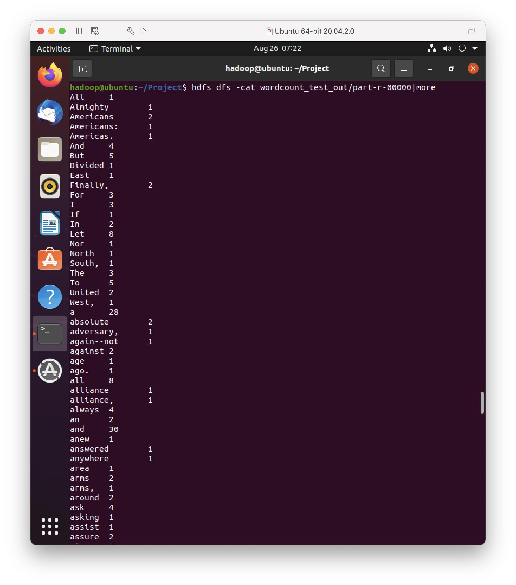
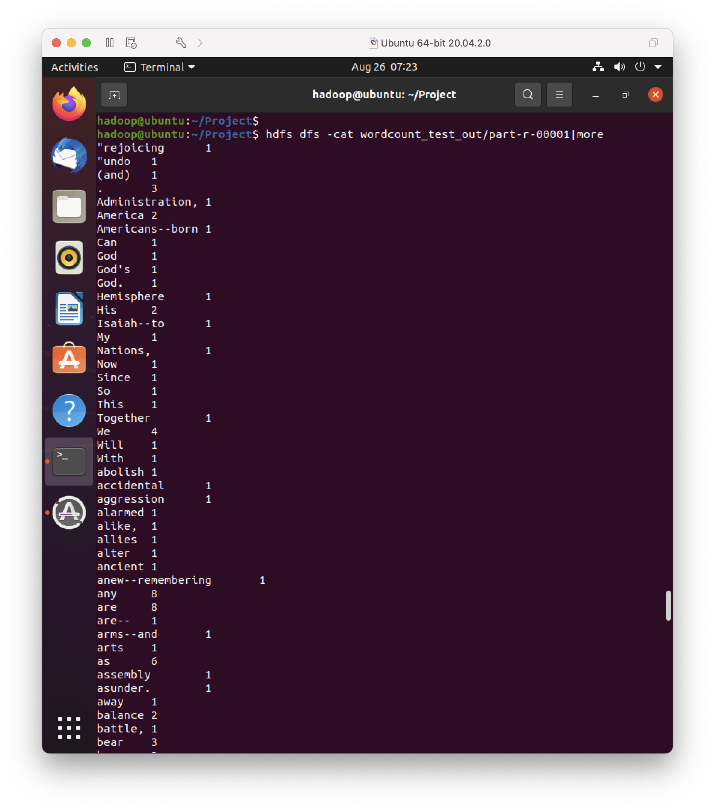
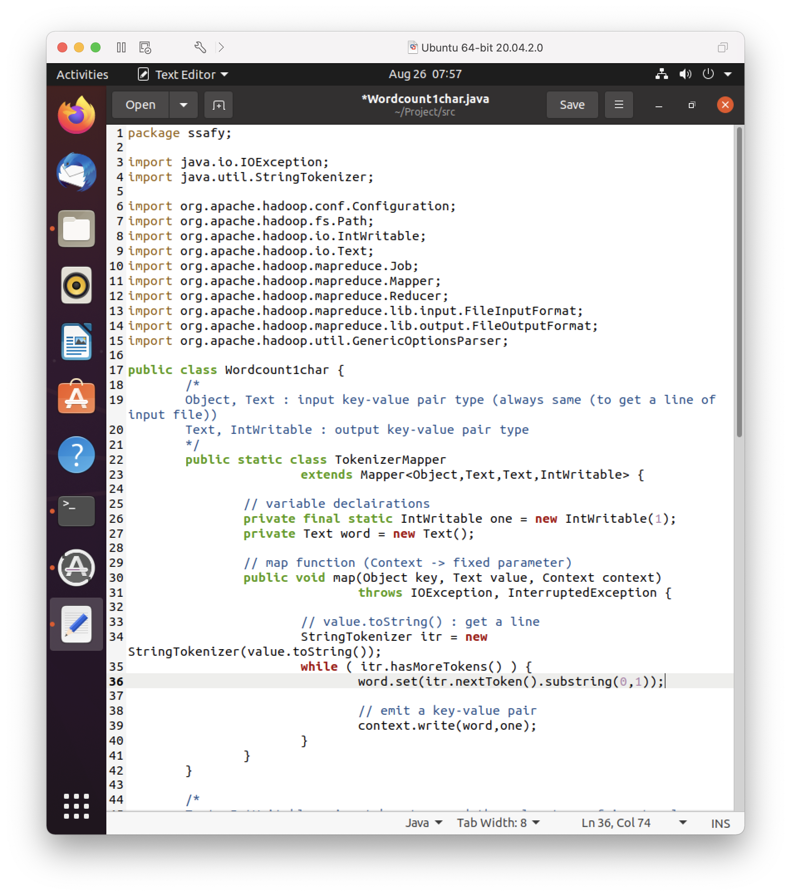
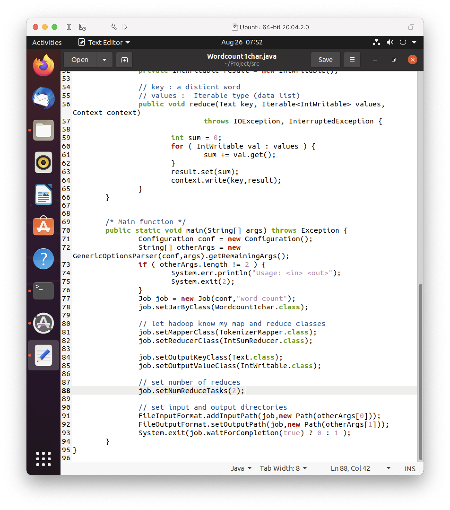
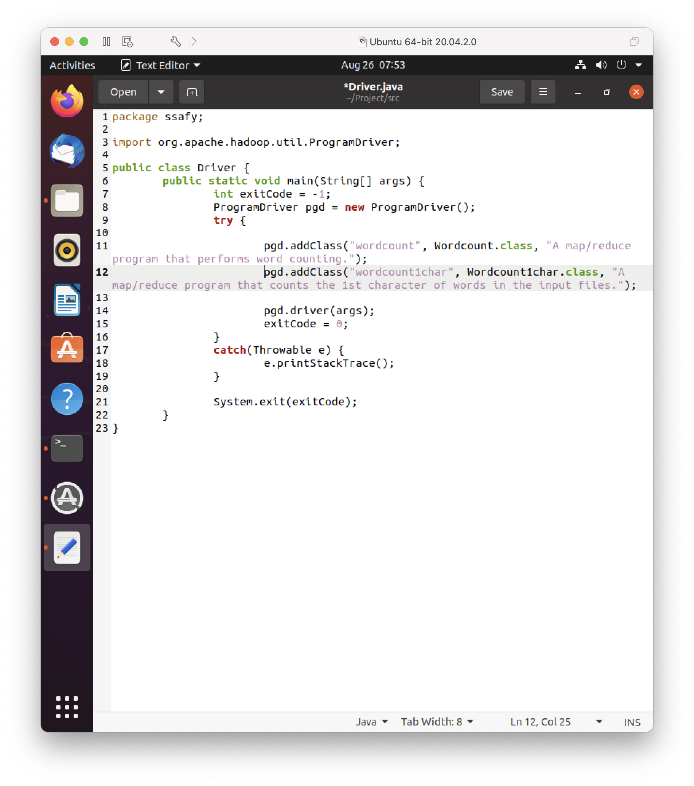
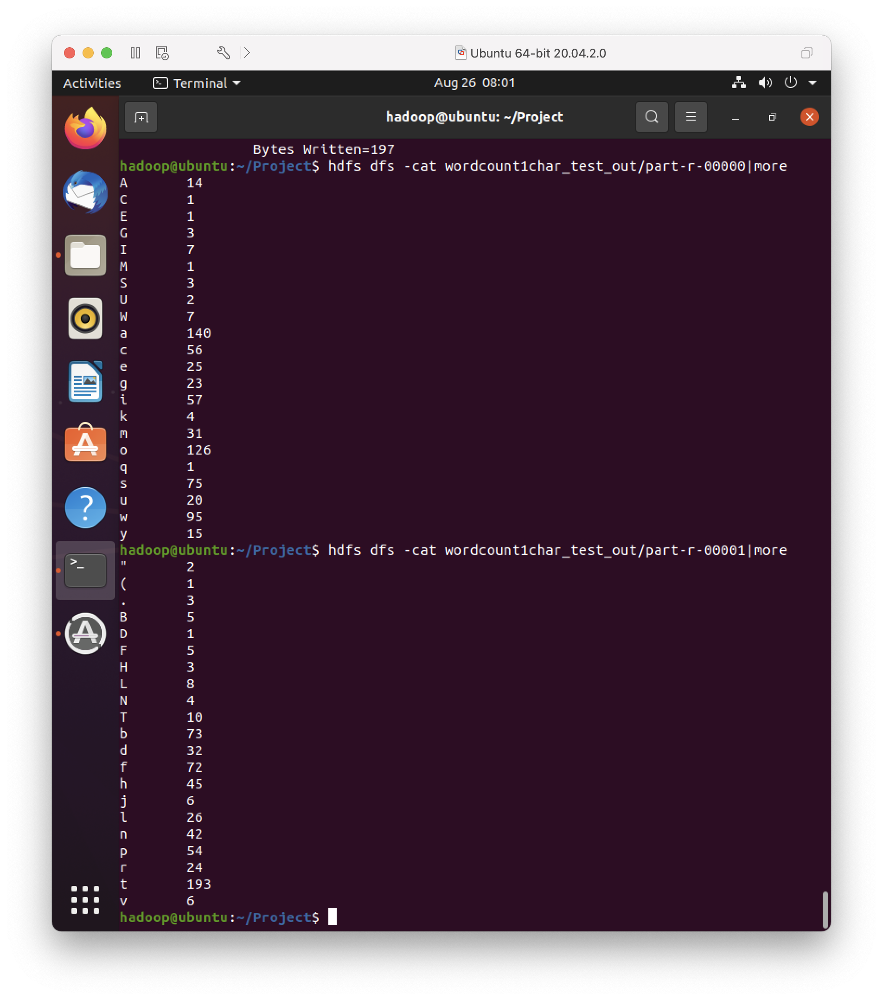

# day1

> 특화 PJT 빅데이터(분석) 사전학습 
>
> 1강 과제 제출

 

### ✅ 예제

| Wordcount 예제 결과 1 | Wordcount 예제 결과 2 |
| :-------------------: | :-------------------: |
|   |   |

 

### ✅ 과제

|            Wordcount1char.java 코드 수정 1             |       Wordcount1char.java 코드 수정 2        |
| :----------------------------------------------------: | :------------------------------------------: |
|  |  |
|               **Driver.java 코드 수정**                |                **과제 결과**                 |
|                         |                          |

