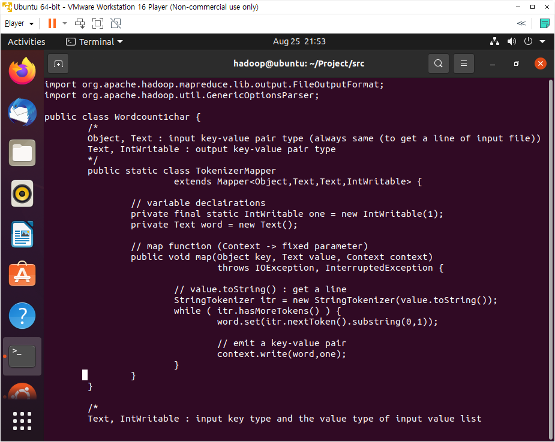
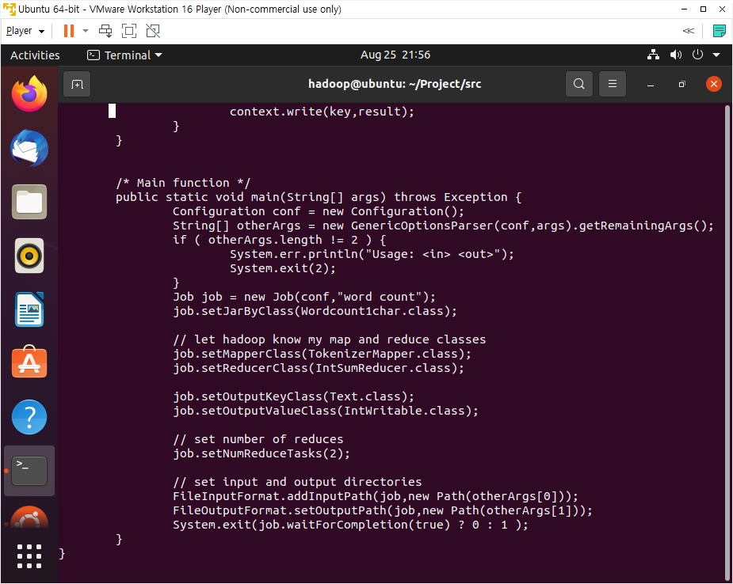
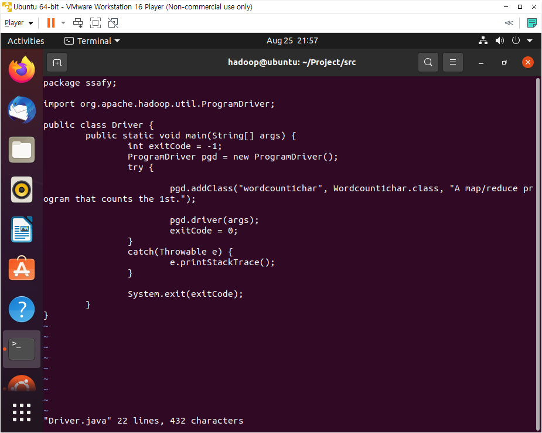
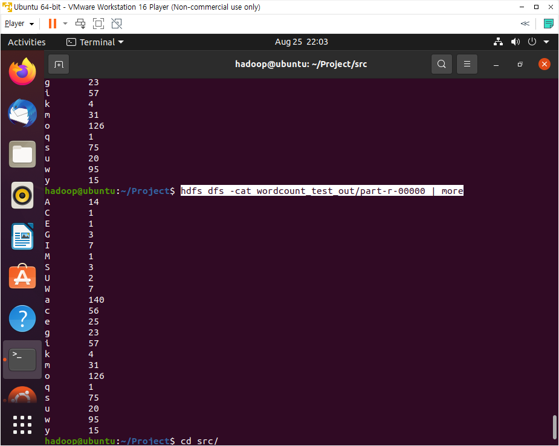

## 빅데이터(분석) 사전학습 과제 1

> 각 데이터에서 가장 앞 글자(char)를 기준으로 MapReduce 구현하기


+ Wordcount1char.java를 만들어준다.
  + 클래스명은 Wordcount1char로 설정한다.
  + 기존의 Wordcount.java의 내용을 그대로 사용하면서, while문 내부의 `word.set(itr.nextToken())`을 `word.set(itr.nextToken().substring(0, 1))`로 수정한다.
    + 기존의 코드는 Map 처리를 맨 앞의 한 단어를 기준으로 하겠다는 것이며, substring을 붙인 것은 그 단어에서도 0번째 인덱스~1번째 인덱스 전, 즉 첫 글자를 기준으로 하겠다는 것이다.



<br/>

+ main 함수에서도 Wordcount.class를 Wordcount1char.class로 바꿔준다.



<br/>

+ Driver.java에서 방금 작성한 Wordcount1char를 사용해서 MapReduce를 진행할 것이므로, `pgd.addClass()`의 인자 부분을 수정해준다.



<br/>

+ 하둡 실행을 위해 다음의 커맨드를 순서대로 입력한다.

  ```
  // dfs 켜기
  $ start-dfs.sh
  ```

  ```
  // Project 디렉토리로 이동해서 맵리듀스 코드 컴파일
  $ cd /home/hadoop/Project/
  $ ant
  ```

  ```
  // Linux의 data 디렉토리에 있는 wordcount-data.txt 파일을 하둡의 wordcount_test 디렉토리에 보냄
  $ hdfs dfs -put data/wordcount-data.txt wordcount_test
  ```

  ```
  // 기존에 맵리듀스를 실행하여 결과물이 있다면 이를 삭제
  $ hdfs dfs -rm -r wordcount_test_out
  ```

  ```
  // 맵리듀스 알고리즘 코드 실행
  $ hadoop jar ssafy.jar wordcount1char wordcount_test wordcount_test_out
  ```

<br/>

+ 결과 확인

  ```
  $ hdfs dfs -cat wordcount_test_out/part-r-00000 | more
  ```



