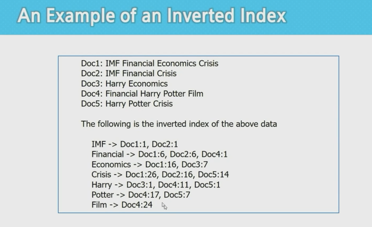

# 빅데이터 하둡 2

> 병렬 분산 알고리즘 구현이 가능한 맵리듀스 프레임워크를 이해한다.
>
> 맵리듀스 프레임워크를 사용할 수 있는 Hadoop설치 및 맵리듀스 알고리즘 코드를 실행한다.
>
> 하둡을 이용하여 빅데이터 분석 및 처리용 맵리듀스 알고리즘을 구현하는데 필요한 지식과 코딩 능력을 배양한다.

 

 

## Partitioner Class 변경 코딩

Map 함수의 출력인 (key, value) 쌍이 key에 의해서 어느 Reducer(머신)으로 보내질 것인지를 정해지는데, 이러한 결정을 정의하는 Class

하둡의 기본 타입은 Hash 함수가 Default로 제공되고 있어서 key에 대한 해시 값에 따라 어느 Reducer로 보낼지를 결정한다.

+ 하둡의 기본 타입
  + Text
  + IntWritable
  + LongWritable
  + FloatWritable
  + DoubleWritable

 

Map 함수의 출력인 (key, value) 쌍이 key는 IntWritable 타입이고 value는 Text 타입일 때 Partitioner를 수정하여 아래와 같이 각 reducer에 가게 하려면 Partitioner class를 수정해야 한다.

 

### MyPartitioner for IntWritable (새로운 클래스 생성)

Partitioner 클래스를 상속받아 `getPartition()`함수를 오버라이딩 하면 된다.

+ IntWritable.get()을 하면 Java 상의 int값이 뽑아져나온다.

 

### 이를 활용해 ASCII 코드 상으로 문장의 첫 글자 a 이전/이후로 reducer 나누기

WordCount.java를 변형하여 아래와 같은 일을 하도록 Wordcountsort.java 파일 이름으로 작성한다.

+ Reducer의 개수를 2개로 설정
+ 각 단어의 첫 글자가 ASCII 코드 순서로 a보다 앞에 오는 경우 reducer 0으로 (결과가 part-r-00000에 찍히도록)
+ 나머지(특수문자 등)는 reducer 1로 (part-r-00001)

필요한 함수

+ value.toString()
  + 하둡의 Text 타입에서 Java의 string 타입으로 변환하여 리턴
+ charAt()
  + 첫 번째 character를 리턴

 

이후 실행을 위해 다음 절차 수행

+ Project/src/Driver.java 수정
  + pgd.addClass("wordcountsort", Wordcountsort.class, "설명");
+ Project 디렉토리에서 다음 명령어들 실행
  + ant
  + hdfs dfs -rm -r wordcount_test_out
  + hadoop jar ssafy.jar wordcountsort wordcount_test wordcount_test_out
  + hdfs dfs -cat wordcount_test_out/part-r-00000 | more
  + hdfs dfs -cat wordcount_test_out/part-r-00001 | more

 

 

## Inverted Index

+ value가 1이 아닌 문서의 이름과 단어의 첫 위치를 저장하게 된다.

+ reducer에서는 그대로 출력하면 되는데 formatting만 수행

 

### 예제 시행

+ 이후 작업

 

 

### 세부 내용

+ 기존 Map

+ InvertedIndex Map

+ 기존 Reduce

+ InvertedIndex Reduce

+ InvertedIndex Main

+ Driver.java

 

 

## Matrix Addition 연산

 

### 구현

