# 빅데이터 하둡 3

> 병렬 분산 알고리즘 구현이 가능한 맵리듀스 프레임워크를 이해한다.
>
> 맵리듀스 프레임워크를 사용할 수 있는 Hadoop설치 및 맵리듀스 알고리즘 코드를 실행한다.
>
> 하둡을 이용하여 빅데이터 분석 및 처리용 맵리듀스 알고리즘을 구현하는데 필요한 지식과 코딩 능력을 배양한다.

 

 

## Matrix Multiplication

행렬의 곱 계산

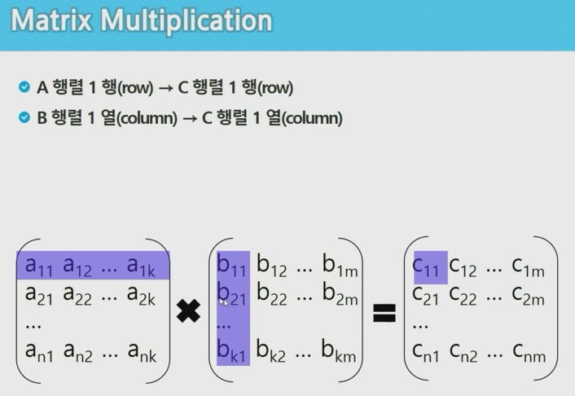

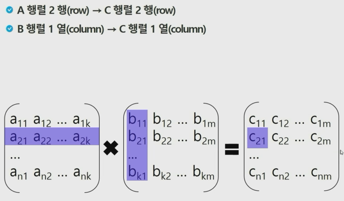

결론

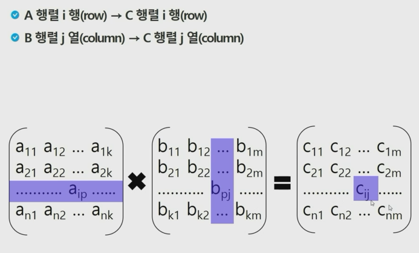

 

 

### 1-Phase Matrix Multiplcation

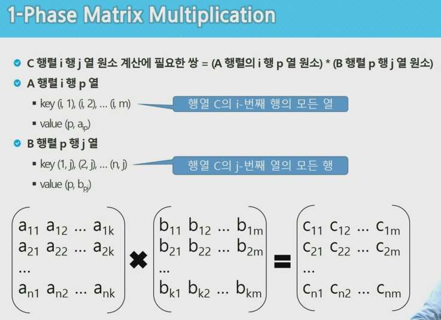

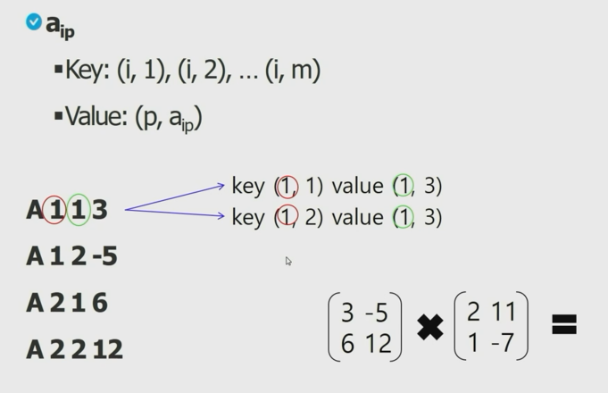

+ 행을 기준으로 열의 개수만큼 duplicate 한다.

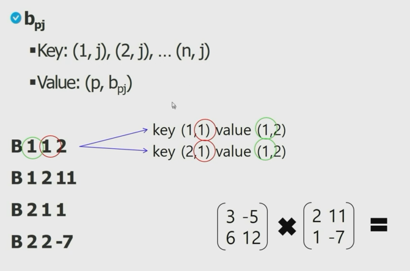

+ 열을 기준으로 행의 개수만큼 duplicate한다.

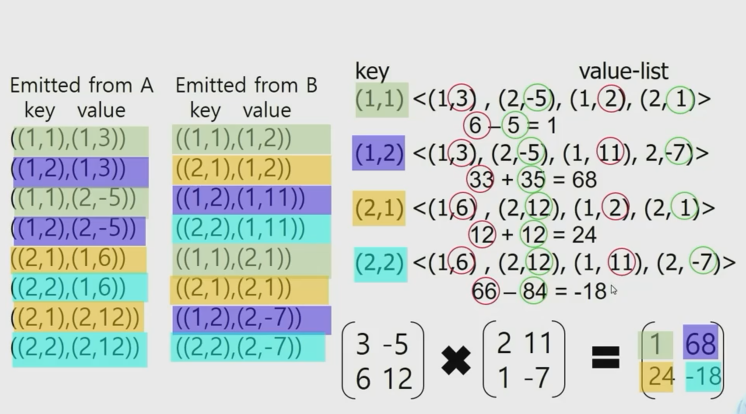

+ value-list에서 앞이 같은 것 끼리 곱함(위의 예에서는 1끼리, 2끼리)

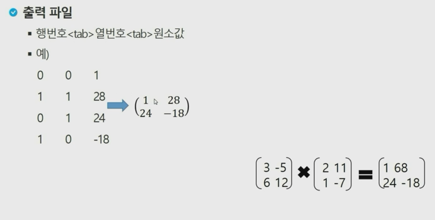

+ 결론

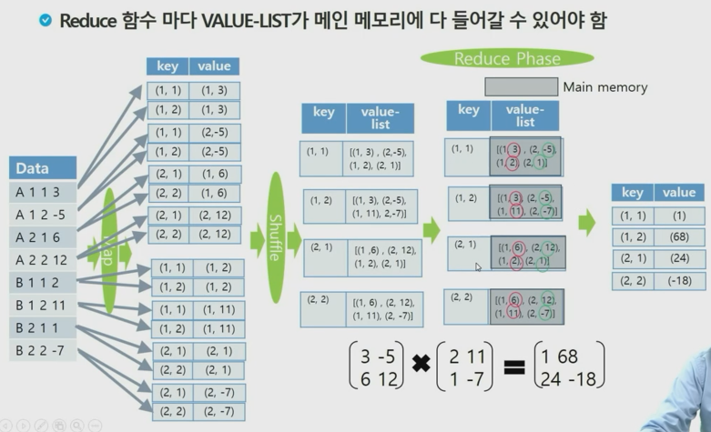

 

 

### 2-Phase Matrix Multiplication

+ 1-Phase에서는 value-list가 메인 메모리에 다 들어갈 수 있어야 하는데, 메인 메모리가 작다면 불가능하다. 이를 해결하기 위한 방법.
+ value-list의 크기가 줄어든다. 하나를 key로 옮김

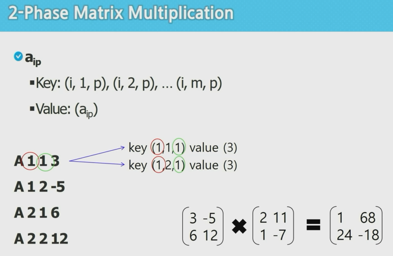

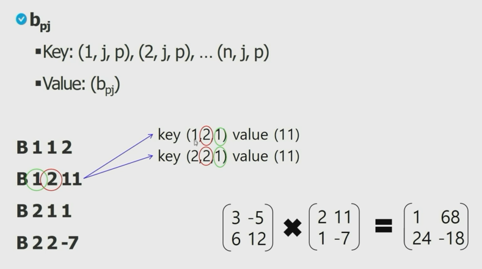

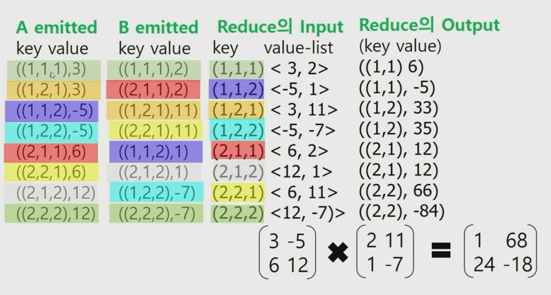

+ 첫 Reduce에서 key의 앞 두 개만 뽑아내 새로운 key로 value를 내보낸다. (1, 1, 1) 이라면 (1, 1)로 내보냄.
+ 이후 두 번째 phase에서 다시 같이 key끼리 더해줌

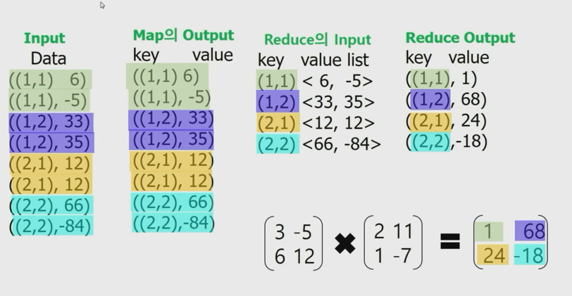

+ 결론

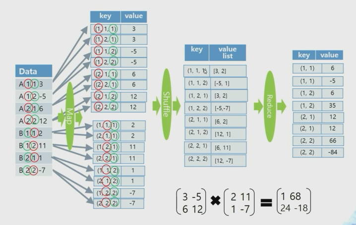

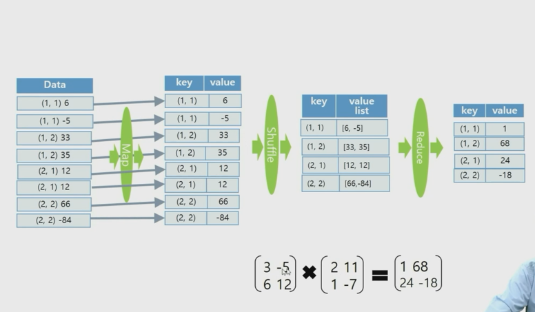

 

 

### 1-Phase 실습

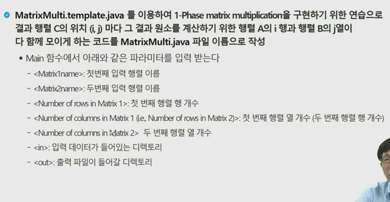

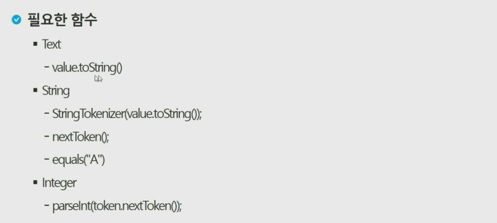

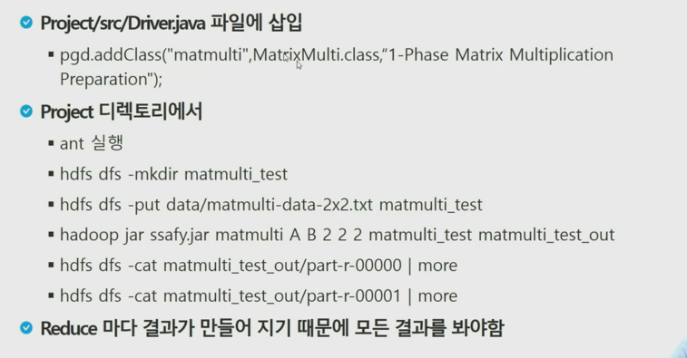

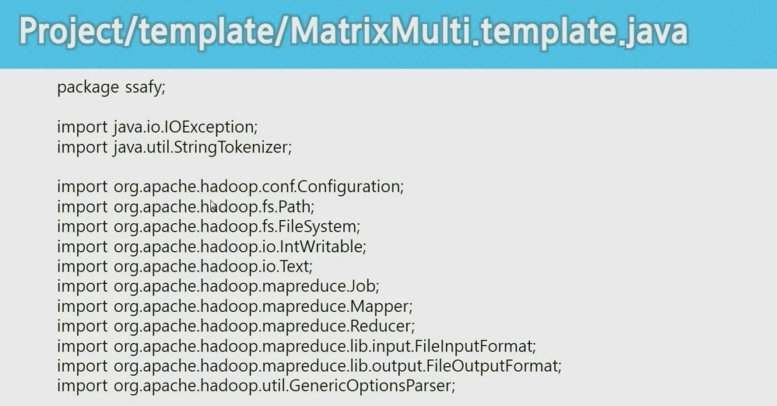

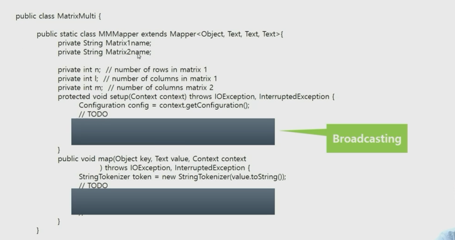

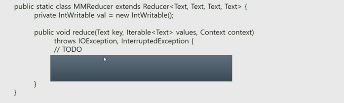

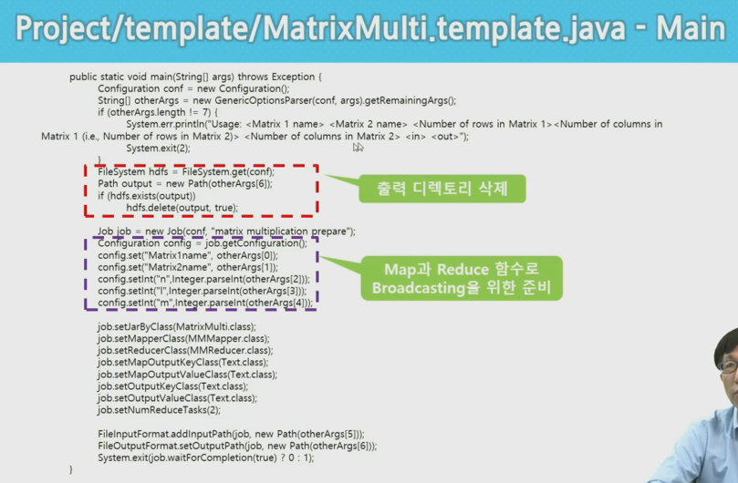

