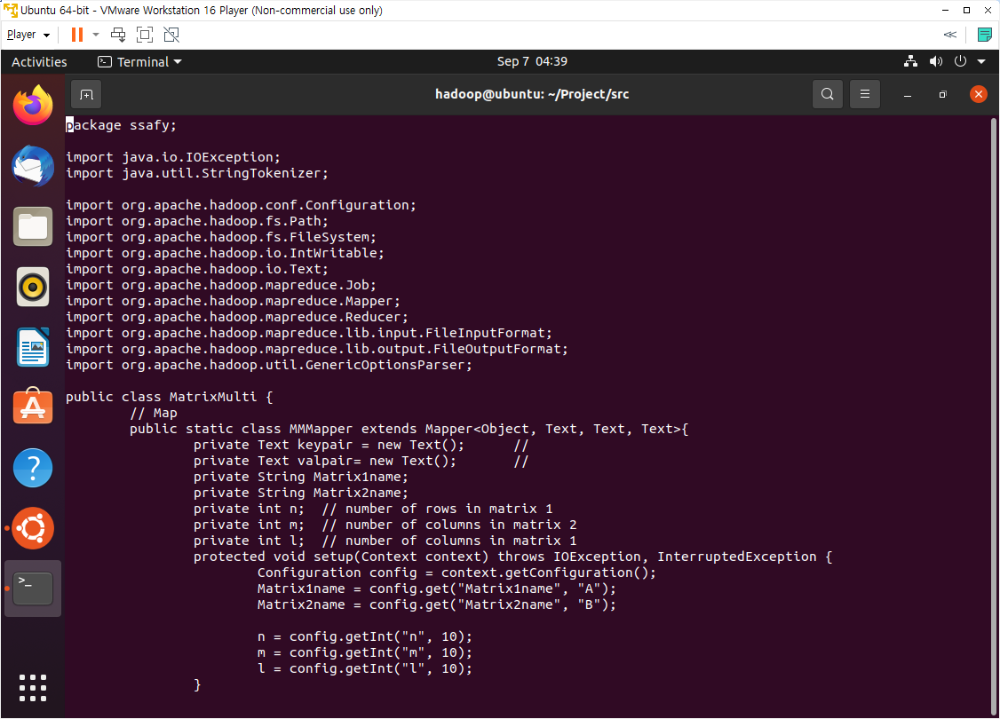
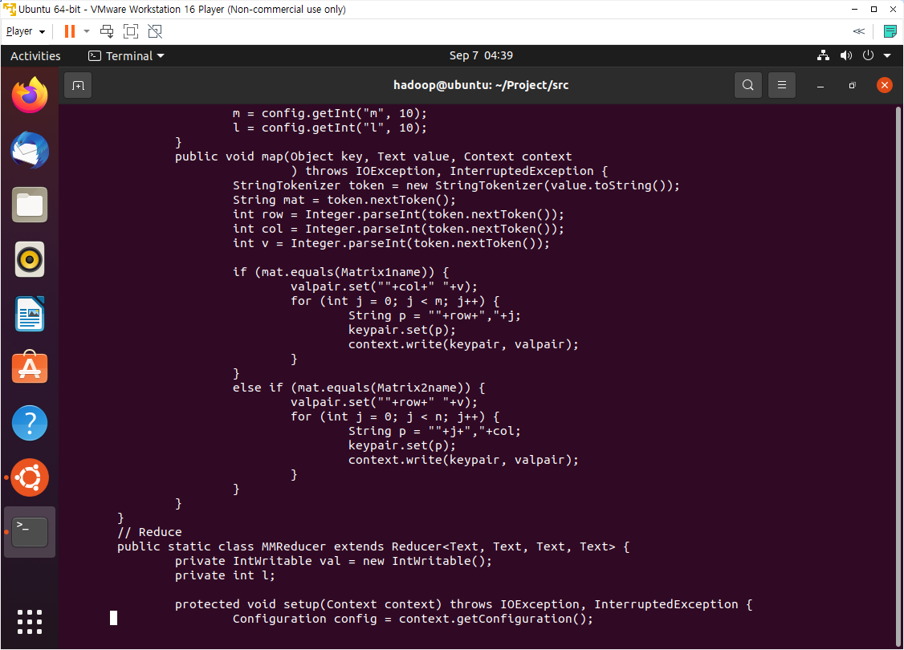
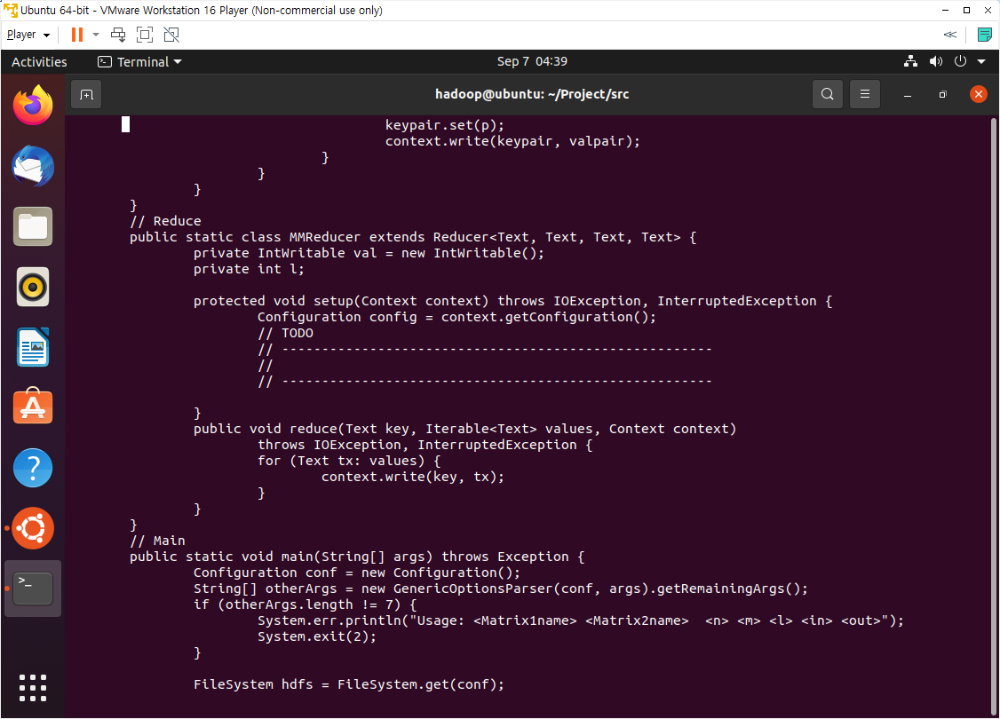
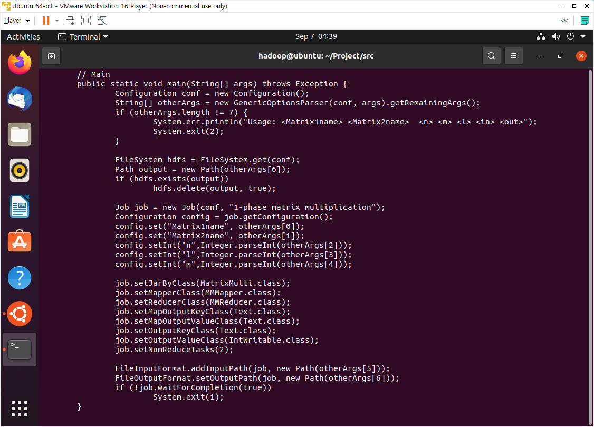
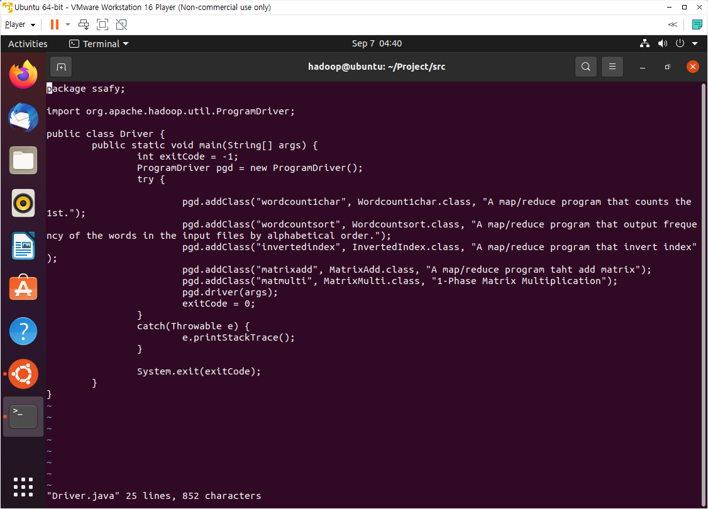

## 빅데이터(분석) 사전학습 과제 3

> Matrix Multiplication

## Matrix Multiplication

+ MatrixMulti.java

 

 

+ Driver.java
  + `pgd.addClass("matmulti", MatrixMulti.class, "1-Phase Matrix Multiplication");` 추가

