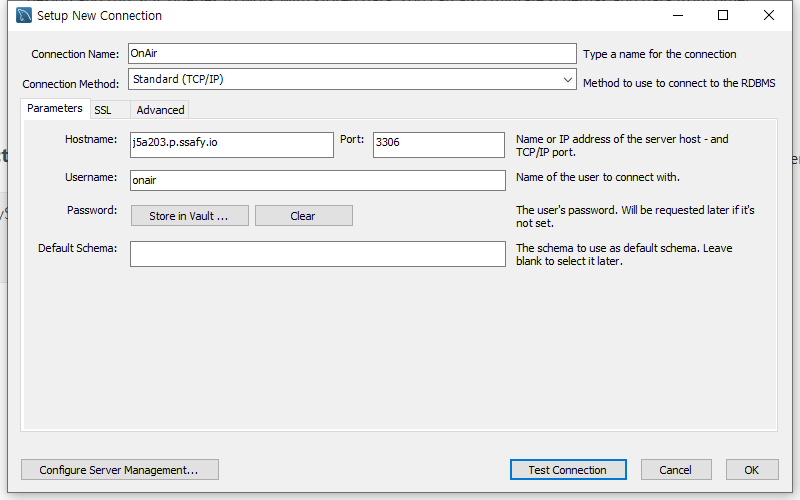
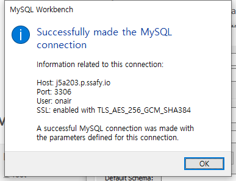
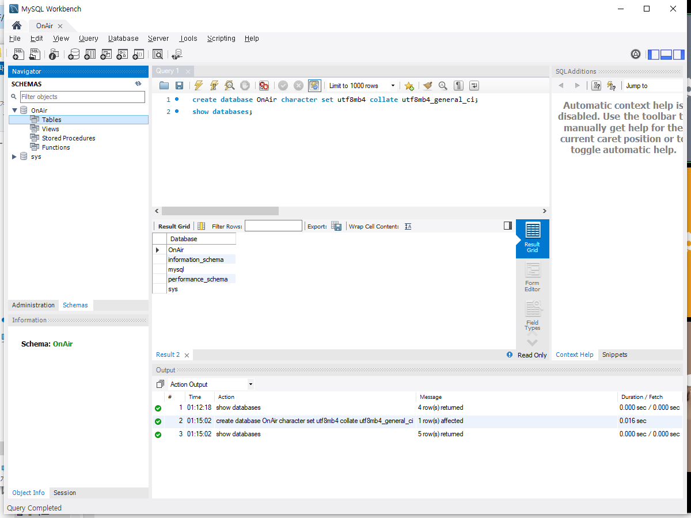

### EC2 연결

+ MobaXterm으로 EC2서버에 접속하여 다음 과정 실행

  > https://devkingdom.tistory.com/84

  + `sudo apt-get update`
  + `sudo apt-get install mysql-server` : mysql 설치
  + `sudo systemctl start mysql.service` : mysql 구동
    + `ps -ef | grep mysql` : 구동 확인
  + `cd /etc/mysql/mysql.conf.d`
  + `sudo vi mysqld.cnf`
    + `bind-address`의 값을 `0.0.0.0` (any)로 수정
  + `sudo service mysql restart` : 재시작
  + `sudo mysql -u root -p` : root로 키기
  + `CREATE USER 'username'@'%' IDENTIFIED BY 'password';` : username과 password 설정
  + `GRANT ALL PRIVILEGES ON *.* TO 'onair'@'%';` : username에 권한주기
  + `FLUSH PRIVILEGES;` : 사용자 추가, 삭제, 권한 변경 등을 바로 반영

+ MySQL Workbench에서 새로운 Connection 생성



+ Hostname: onair

+ Password: 비밀
+ Test Connection으로 확인



<br/>

## 기본 MySQL 설정



<br/>

## Django 연결

+ `pip install mysqlclient` : django mysqlclient 설치
+ `pip install python-decouple` : .env파일에 있는 MySQL user와 password를 가져오기 위한 라이브러리

+ settings.py에서 `DATABASES`부분 수정

  ```python
  from decouple import config
  
  
  ...
  DATABASES = {
      'default': {
          'ENGINE': 'django.db.backends.mysql',
          'NAME':'OnAir',
          'USER':config('MYSQL_USER'),
          'PASSWORD':config('MYSQL_PASSWORD'),
          'HOST':'j5a203.p.ssafy.io',
          'PORT':'3306',
      }
  }
  ```
