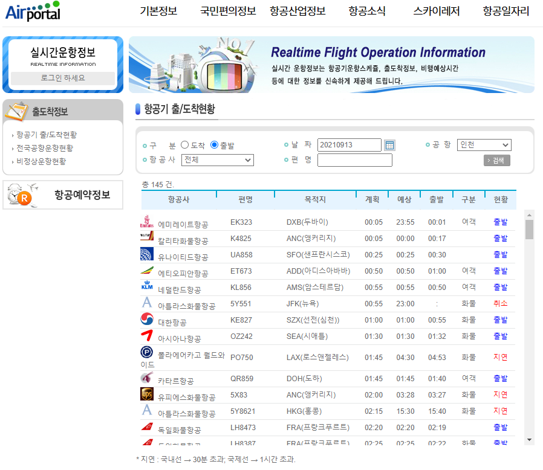
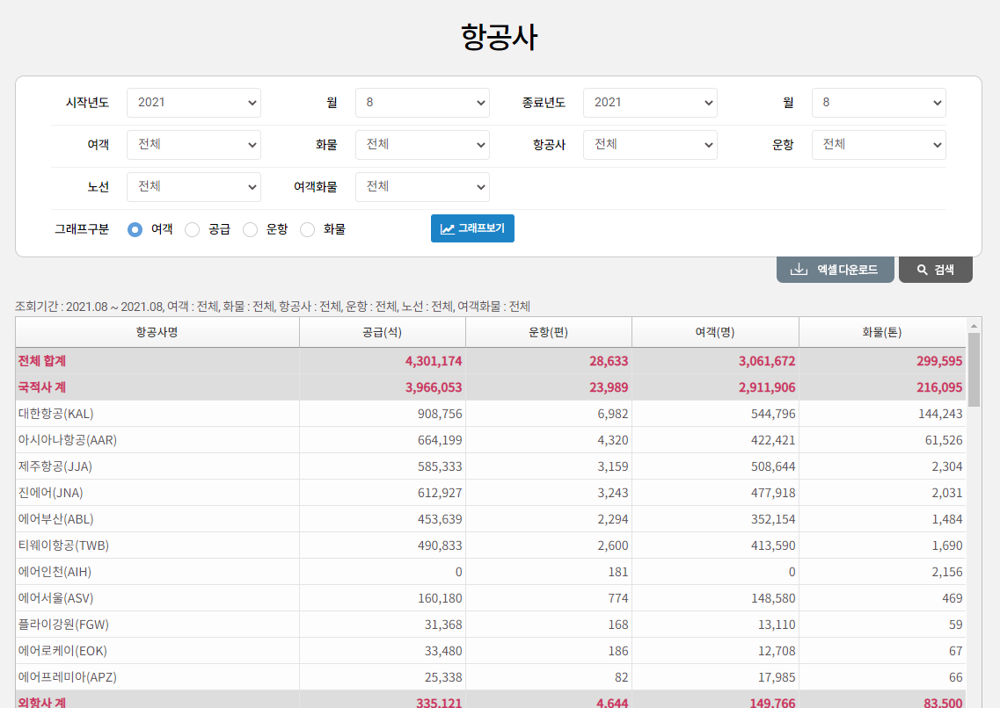

# 예측 분석(항공) 데이터

> 항공기 출/도착 데이터
>
> 항공사별 월 여객 이용자수 데이터

## 항공기 출/도착 데이터

https://www.airportal.go.kr/life/airinfo/RbHanFrmMain.jsp

**여객** 건의 출발 데이터를 기준으로, 인천 공항에서 **출발**하여 특정 **목적지**로 가는 각 **항공사**의 **계획 시간**과 **출발 시간**의 차이를 통해 **지연 정도**를 구한다.

+ | 날짜     | 출발 | 목적지      | 항공사   | 계획 시간 | 출발 시간 | 현황 | 지연 시간 | 지연 사유 |
  | -------- | ---- | ----------- | -------- | --------- | --------- | ---- | --------- | --------- |
  | 20210913 | 인천 | DXB(두바이) | 대한항공 | 00:05     | 01:31     | 지연 | 1:26      | 기상-비   |

  

 

 

## 항공사별 월 여객 이용자수 데이터

https://www.airportal.go.kr/knowledge/statsnew/air/airline.jsp#

데이터로 취급할 주요 항공사의 월별 이용자수 데이터

+ 월별 이용자수 데이터를 통해 연간 이용자수를 구하고, 이를 통해 각 월별 성수기 지수를 구한다.
+ 출/도착 데이터를 이용하여 월별 지연 정도를 구하고, 성수기 지수와 지연률을 상관 변수로 하여 선형회귀분석으로 머신러닝 모델을 만들 것이다.
+ 사용자가 정한 출발지, 도착지에 대해 각 항공사가 1월 ~ 12월 어느정도의 지연률을 갖게 되는지를 예측하는 그래프를 시각화하여 보여줄 것이다.

