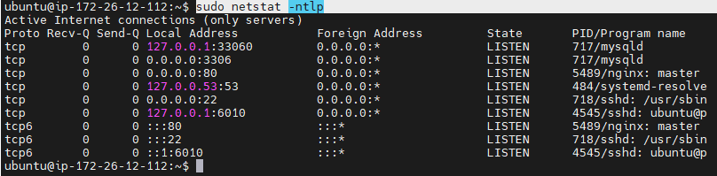
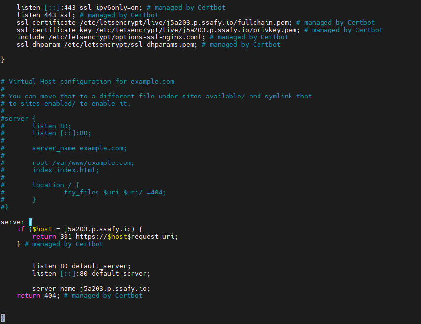

## EC2에 Nginx 설치 및 HTTPS 설정

> https://blog.jjlovechoco.com/11 nginx 설치
>
> https://www.sunny-son.space/AWS/HTTPS%20%EC%84%A4%EC%A0%95%ED%95%98%EA%B8%B0/ https 설정

### EC2 Nginx 설치

+ `sudo apt-get update`

+ `sudo apt-get install net-tools `: 기본적으로 netstat을 사용하기 위해 net-tools설치

+ `sudo apt-get install nginx` : nginx 설치
+ `sudo service nginx start` : niginx 구동
+ `sudo systemctl status nginx.service` : nginx 구동 확인
+ `sudo netstat -ntlp` : 현재 netstat 확인, nginx의 포트 확인
  + 아래 그림을 보면 80번 포트를 사용함을 알 수 있음

+ `sudo service nginx stop` : nginx 중단

### HTTPS 설정

+ `sudo apt-get update`

+ `sudo apt-add-repository -r ppa:certbot/certbot` : certbot 저장소 추가
+ `sudo apt-get install certbot python3-certbot-nginx` : certbot 설치

+ ` sudo vi /etc/nginx/sites-available/default`
  + `server_name 도메인주소`로 편집

+ `sudo nginx -t`
+ `sudo systemctl restart nginx` : nginx를 재시작하여 변경내용 적용
+ `sudo certbot --nginx -d 도메인주소` : SSL 인증 획득
  + email : 본인 이메일
  + agree
  + n
  + 2번의 redirect 선택(HTTP연결을 HTTPS로 리다이렉트)

+ `sudo vi /etc/nginx/sites-available/default`
  + 다시 열어보면 기존에 없었던 HTTPS 설정이 추가되어 있다.

