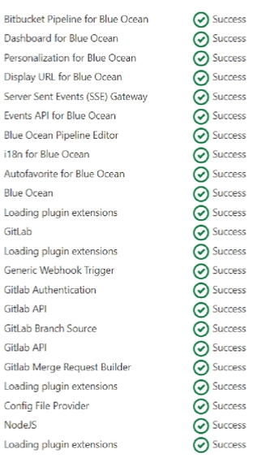
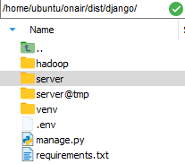

## 배포

> https://nachwon.github.io/django-deploy-8-docker/

### Nginx 세팅

+ `cd /etc/nginx/sites-available`로 이동하면 default만 있을 것이다.

  + 이전 Nginx 설치와 HTTPS 설정까지 마친 상태의 default
  + 여기서 이제 우리는 front와 back을 따로 nginx에 돌릴 것이기 때문에 default는 없애고, front.conf, back.conf를 각각 만들어줄 것이다. **(뒤에 Django 배포를 하면서 이 부분 수정이 있을 것!! 일단 이 방식으로 Nginx를 이해해보자)**
  + `sudo cp -r /etc/nginx/sites-available/ /etc/nginx/sites-available-origin` : default만 있는 상태를 백업
  + `sudo cp -r /etc/nginx/sites-enabled/ /etc/nginx/sites-enabled-origin` : 심볼릭 링크 백업
  + ` sudo rm /etc/nginx/sites-available/default` : default 삭제
  + `sudo rm /etc/nginx/sites-enabled/default` : default 심볼릭 링크 삭제
  + `sudo touch /etc/nginx/sites-available/front.conf` : front용 conf 생성
  +  `sudo touch /etc/nginx/sites-available/back.conf` : back용 conf 생성

+ front는 기존의 default 설정을 가져와서 HTTPS로 사용한다. back은 front와 포트가 겹치면 안되기 때문에 그냥 HTTP의 다른 포트로 설정을 해준다.

  + HTTPS인 443포트는 하나밖에 사용을 못하는 듯 하다.

  + 이 코드는 나중에 배포작업이 마무리 될 때 그때 상황에 맞춰 다시 수정해야 한다.

  + ```nginx
    # front.conf
    server {
    
      root   /var/www/front; # 이 파일에서 읽는다. 즉, 빌드된 파일이 있는 곳을 가리켜야 한다.
      index  index.html index.htm; # index.html을
      server_name j5a203.p.ssafy.io;
        
      location / {
        try_files $uri $uri/ =404;
      }
        
      # url이 back이 붙으면 proxy_pass
      location /back/ {
        proxy_pass http://localhost:8091/;
      }
        
      listen [::]:443 ssl ipv6only=on; # managed by Certbot
      listen 443 ssl; # managed by Certbot
      ssl_certificate /etc/letsencrypt/live/j5a203.p.ssafy.io/fullchain.pem; # managed by Certbot
      ssl_certificate_key /etc/letsencrypt/live/j5a203.p.ssafy.io/privkey.pem; # managed by Certbot
      include /etc/letsencrypt/options-ssl-nginx.conf; # managed by Certbot
      ssl_dhparam /etc/letsencrypt/ssl-dhparams.pem; # managed by Certbot
    }
    
    server {
        if ($host = j5a203.p.ssafy.io) {
            return 301 https://$host$request_uri;
        } # managed by Certbot
    
    
            listen 80 default_server;
            listen [::]:80 default_server;
    
            server_name j5a203.p.ssafy.io;
        return 404; # managed by Certbot
    
    
    }
    ```
    
  + ```nginx
    # back.conf
    server {
      listen 8091;
      location / {
        root   /var/www/back;
        index  index.html index.htm;
        try_files $uri /index.html;
      }
    }
    ```
  
+ 심볼릭 링크 생성
  + `sudo ln -s /etc/nginx/sites-available/back.conf /etc/nginx/sites-enabled/back.conf`
  + `sudo ln -s /etc/nginx/sites-available/front.conf /etc/nginx/sites-enabled/front.conf`

<br/>

### EC2 Docker 세팅

+ `sudo apt-get update`
+ `sudo apt-get upgrade`
+ `sudo apt install npm` : npm 설치

+ `curl https://get.docker.com | sudo sh` : docker 설치

+ `sudo service docker start` : docker 시작

+ `sudo docker container ps` : 구동중인 컨테이너 확인

<br/>

### Jenkins 설치 및 기본 세팅

+ `sudo docker run -d -u root -p 9090:8080 --name=jenkins -v /home/ubuntu/onair/dist/:/var/jenkins_home/dist jenkins/jenkins`
  + 9090 포트 사용
  + `/home/ubuntu/onair/dist/` : Jenkins의 `/var/jenkins_home/dist`에 생기는 폴더 및 파일을 넣을 곳
    + 이 주소를 통해 nginx의 각 sites-availabe의 파일에서 접근해 실행을 하게 된다.
+ `sudo docker logs jenkins`
  + Jenkins의 접속 비밀번호
+ 9090번 포트로 접속해서 Jenkins 페이지로 들어간다.

+ 기본 플러그인 설치, 기본 어드민 설정

#### Gitlab 연동

+ Gitlab의 Repository - AccessToken을 발행한다. Jenkins에서 깃랩에 접근하려면 필수적
  + 적당히 Name과 Expires at을 설정해주고 Scopes는 api로 체크해서 Create한다. 이 토큰은 잘 복사해서 저장해둔다.
+ 젠킨스에서 필요한 플러그인을 설치해준다. DashBoard > Manager Jenkins > Plugin Manager
  + NodeJS, Blue Ocean, Gitlab 관련



+ 젠킨스의 시스템 설정 > Gitlab
  + 적절한 Connection name과 Gitlab host URL을 입력해준다.
  + Gitlab host URL은 깃랩의 호스트를 쓰면 된다. (ex. https://lab.ssafy.com/)
  + Credentials - Add를 눌러서 Jenkins 선택, Kind는 Global API token으로 설정하고 API token을 깃랩에서 생성한 Access token 값을 넣어준다. ID는 깃랩에 로그인할 때 쓰는 ID를 써준다. 이후 Add
  + 오른쪽 Test Connection을 클릭해서 Success가 나오면 성공
  + 적용 후 Save

<br/>

+ 젠킨스에서 새로운 Item을 Pipeline으로 생성한다.
+ 깃랩에서 Jenkins에 트리거를 전송하려면 Jenkins에서 제공하는 secret token이 필요하다. 이 코드는 생성된 작업 아이템 설정에서 Build Trigger 섹션중 Build when a change is pushed to GitLab. GitLab webhook URL: ~ 를 클릭 --> '고급' 버튼을 누르면 생성할 수 있다. Secret token을 Generate하고 생성된 토큰을 복사, 저장을 눌러 저장하고 빠져 나온다.

+ 이제 소스코드가 있는 깃랩 서버에서 push 이벤트에 대한 trigger를 만들어줘야 한다. 깃랩 페이지에서 Settings --> Webhooks에 접속, Jenkins의 Build Trigger에 있는 Jenkins Serever URL 주소와 생성된 Secret Token을 넣고, 원하는 트리거들을 선택한 뒤 완료한다. test 버튼을 눌러서 테스트해볼 수 있다.

+ 이제 Pipeline을 작성하면 된다.

  + Configuration에서 NodeJS를 node로 등록해놓고 파이프라인에서 사용한다.

    + https://withhamit.tistory.com/285 참고

  + Pipeline Syntax에서 git:git을 선택하여 credentials를 만든다. username: 깃랩 아이디 password: 깃랩 비밀번호 ID: 파이프라인에서 쓸 아이디

  + frontend(Vue) 빌드 예시 파이프라인

  + ```
    pipeline {
    	agent any // 삭제하지 말 것
    	tools {
    		// 도구명 사용 선언
    		nodejs "node"
    	}
    	
    	stages {
    		stage('prepare') {
    			steps {
    				// Git pulling 및 빌드를 위한 npm install로 라이브러리 다운로드
    				git branch: 'jenkins', credentialsId: 'gitlab-ssafy', url: '깃랩주소'
    				sh 'npm install'
    			}
    		}
    		stage('build') {
    			steps {
    				// 빌드 작업
                    sh 'npm run build'
    			}
    			post {
    				success {
    					// 빌드 성공 후 작업 -> 파이프라인 워크 스페이스에서 내 dist로 복사
    					sh 'cp -r /var/jenkins_home/workspace/onair_pipeline/dist /var/jenkins_home/dist'
    				}
    			}
    		}
    	}
    }
    ```

  + 파이프라인에서 Build Now를 해보며 테스트할 수 있다.
  + Django 백엔드 빌드를 알아보아야 한다.

<br/>

### Django 배포

> sudo chown -R ubuntu:ubuntu . -> 현재 위치에 파일 업로드 가능

+ `sudo apt-get install python3-dev python3-venv python3-pip` : Python 관련 패키지 설치
+ `pip install Django`
+ `sudo apt install gunicorn` : gunicorn을 사용하여 배포할 예정
  + 단순한 `python manage.py runserver`는 개발환경에서 서버를 구동시키는 가장 간단한 방법이지만, 배포에서는 맞지 않는 방법이다. Django는 자체 웹서버가 따로 존재하지 않는데, WSGI가 그 웹서버의 역할을 해준다고 한다. uwsgi와 gunicorn으로 구현이 가능하며, gunicorn이 대세이고 사용하기 쉽다고 하여 gunicorn을 사용한다.

+ `sudo mkdir /home/ubuntu/onair/dist/django` : Django 배포를 위한 폴더 생성(/home/ubuntu/onair/dist/django가 되며, onair/dist에는 빌드된 frontend(Vue) 파일이 또 들어올 예정)
+ `sudo python3 -m venv /home/ubuntu/onair/dist/django/venv` : 가상 환경을 소스코드 폴더 밑에 생성
+ 로컬의 `.env` 파일을 django 폴더에 업로드한다.



+ 여기까지 하면 앞으로 django 폴더에는 EC2만의 venv와 .env가 있는 상태에서 나머지만 계속 git push를 할 때마다 jenkins가 자동 업데이트 해줄 것이다.

+ 프로젝트 폴더에서 `source venv/bin/activate` : 가상환경 켜기

+ requirements.txt에 있는 것들 설치하기

  + `sudo apt-get install libmysqlclient-dev` (초기에 mysqlclient가 설치안되었을 때만)
  + `sudo pip install -r requirements.txt`

+ gunicorn 실행

  + `gunicorn`은 `nginx`가 프록시하여 로컬호스트로 던져주는 request들을 받아 처리하게 된다. 컨벤션에 따라 8000번 포트를 사용하도록 하자. 따라서 `gunicorn`서비스는 `127.0.0.1:8000`에 바인딩되어야 한다.
  +  `gunicorn --bind 0.0.0.0:8000 프로젝트이름.wsgi:application --daemon`
    + daemon 모드로 실행시키고 싶은 경우 `--daemon`옵션을 준다. gunicorn이 실행되고 터미널을 바로 사용가능하다.

  + `ps -ax | grep gunicorn` : gunicorn 프로세스 확인

+ gunicorn 끄기
  + `pkill gunicorn`

#### 이전에 만들었던 front.conf, back.conf 수정

+ 우리는 Django가 별도로 서버 구동이 안될 것으로 예상, nginx로 front와 back을 모두 구동해야 하는줄 알고 두 개의 conf를 만든 것이었다. 하지만, 위의 과정을 통해 우리는 gunicorn으로 django 서버를 8000포트에 띄울 수 있게 되었다.

+ 기존의 /etc/nginx/sites-available/front.conf에 있던 코드를 다음과 같이 수정한다. 물론, 우리는 REST API를 쓸 것이기 때문에 /back/도 나중에 /api/v1/과 같이 바뀔 것이다.

  + ```nginx
    location /back/ {
        proxy_pass http://localhost:8000/;
    }
    ```

  + /etc/nginx/sites-enabled에 있는 front.conf의 심볼릭 링크를 삭제하고 다시 설정해주자
    + `sudo ln -s /etc/nginx/sites-available/front.conf /etc/nginx/sites-enabled/front.conf`
  + 그다음 nginx restart하고, gunicorn도 restart

+ 기존의 back.conf는 완전히 필요가 없게 되었다. 심볼릭 링크까지 다 삭제하자.

<br/>

### Vue CLI 설치

+ `npm install -g @vue/cli`
+ `vue create 프로젝트이름`
  + vue 2버전 선택

<br/>

### 최종 Jenkins 자동 배포 구성

+ Vue와 Django 세팅이 끝났으므로 Jenkins의 파이프라인 Script를 작성하여 자동배포를 구현한다.
+ 우리의 목표 다음과 같다.
  + Vue 프로젝트를 build하여 완성된 dist를 EC2의 dist에 올리기
  + Django는 git pull 받은 것 그 자체를 EC2의 dist/django에 올리기

```
pipeline {
	agent any // 삭제하지 말 것
	tools {
		// 도구명 사용 선언
		nodejs "node"
		git 'Default'
	}
	
	stages {
		stage('prepare') {
		    steps {
        		git branch: 'develop', credentialsId: 'onair-gitlab', url: 'https://lab.ssafy.com/s05-bigdata-dist/S05P21A203.git'
        		dir('Project/client') {
                    sh 'npm install'
                }
        		sh 'cp -r /var/jenkins_home/workspace/onair_pipeline/Project/server/* /var/jenkins_home/dist/django'
		    }
		}
		stage('build') {
			steps {
			    dir('Project/client') {
                    // 빌드 작업
                    sh 'npm run build'
                }
			}
			post {
				success {
					// 빌드 성공 후 작업 -> 파이프라인 워크 스페이스에서 EC2 dist로 복사
					sh 'cp -r /var/jenkins_home/workspace/onair_pipeline/Project/client/dist /var/jenkins_home/dist'
				}
			}
		}
	}
}
```

#### 이후 서버는 수동으로 가상환경 시작, 추가된 라이브러리 설치, gunicorn 구동을 해줘야 한다.

+ `source venv/bin/activate`
+ `sudo pip install -r requirements.txt`

+ `gunicorn --bind 0.0.0.0:8000 server.wsgi:application --daemon` 으로

