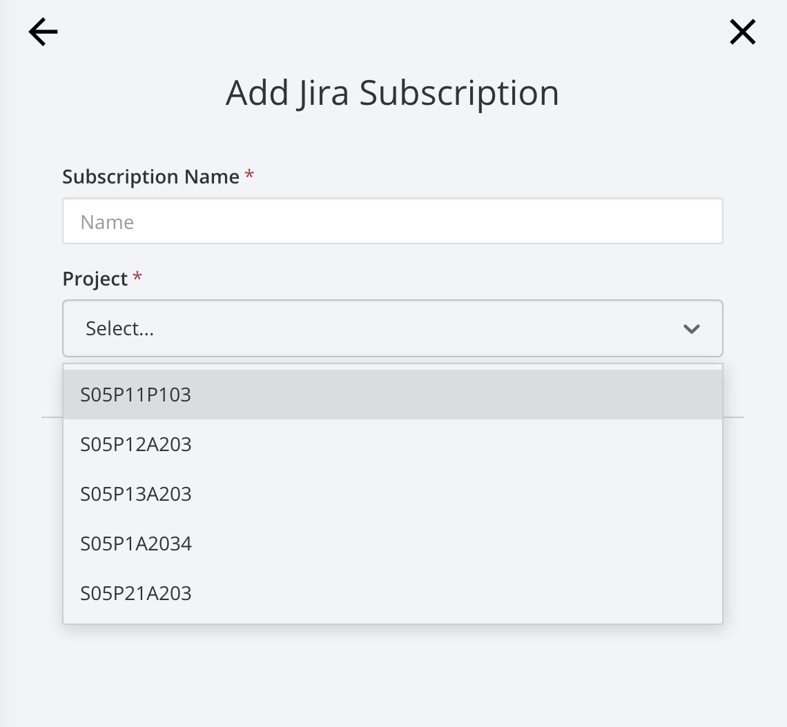

# Mattermost | Jira Plugin

작성자: 박지우

*Google Chrome을 기준으로 작성되었습니다.*


## Jira Connect

```
/jira connect
```

Slash command 입력. 

내  Jira 로그인 화면이 뜨며 Allow / Deny 선택이 주어진다.

Allow로 진행.


## Jira Subscribe

```
/jira subscribe
```

마찬가지로 slash command 입력.




이제 여기서 Project를 선택한다. 나는 특화 프로젝트 Sub PJT I을 선택한다. (S05P21A203)

간략하게 Name, Filter 등을 지정해주고 넘어가면 저장이 된다.

연결 중에서 가장 간편했다. 바로 알림이 온다.