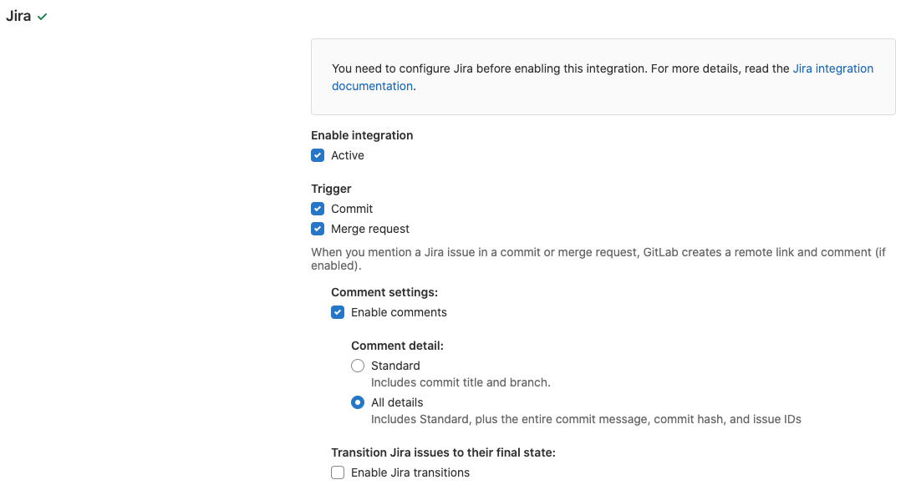
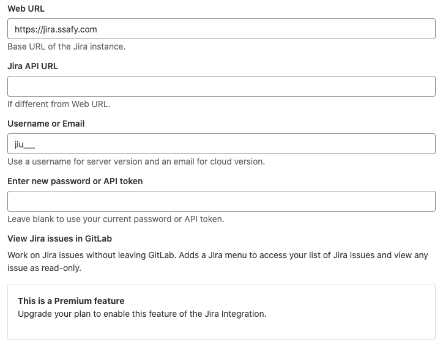
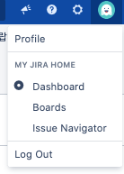
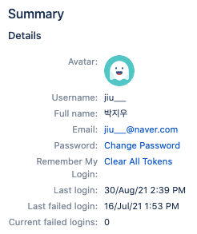
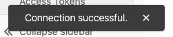
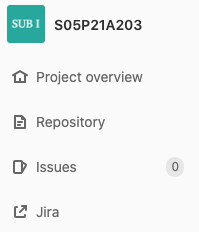
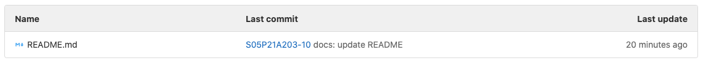
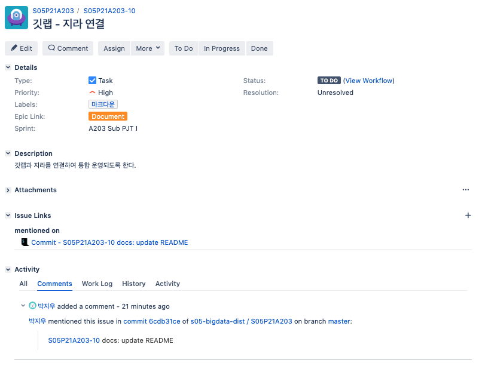

# [A203] Connect GitLab &  Jira 

작성자: 박지우

Google Chrome을 기준으로 작성되었습니다.


## In GitLab

`Settings` -> `Integrations` -> **Jira** 선택



위 사진은 설정 예시입니다. 우리 팀은 Comment detail 옵션에서 All details를 선택했지만 Standard로 설정해도 무방합니다.




우리는 SSAFY Jira를 이용하므로 Web URL은 저렇게 고정해줍니다. (Project 주소 X)

Server version을 이용하므로 Username, password로 로그인해야 합니다.

##### <center>Username, Password 확인 방법</center>



<center>프로필에 들어가서 Summary에 적힌 내용을 확인합니다.</center>




Test settings를 눌렀을 때 Connection Successful이 뜨면 성공입니다.




프로젝트 왼쪽 탭에 Jira가 생긴 것을 볼 수 있습니다.




## Jira integration issue management

https://docs.gitlab.com/ee/integration/jira/issues.html#reference-jira-issues


### How to reference Jira issues when you commit\

###### Example

```bash
git commit -m "S05P21A203-10 docs: update README"
```

###### Convention

```
<ISSUE_KEY> <optional COMMAND_ARGUMENTS>
```

양식에 맞추어 커밋하면 그 즉시 깃랩과 지라에서 확인할 수 있다.





