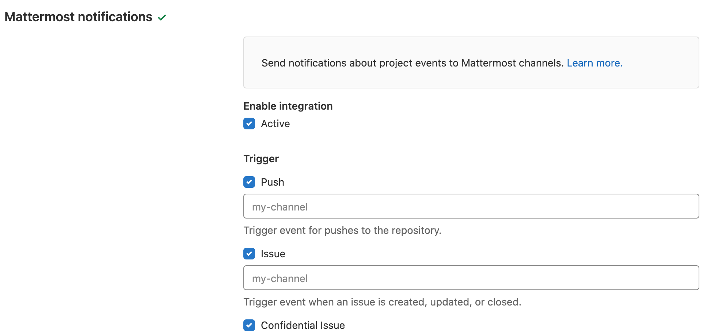
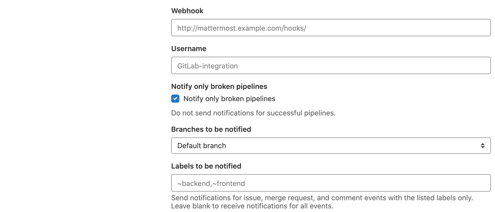
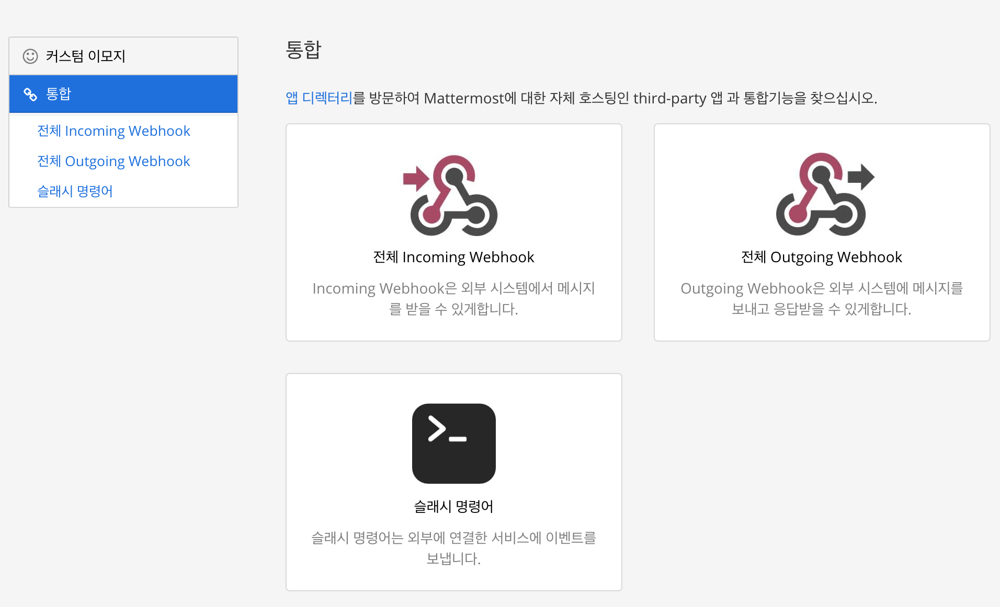
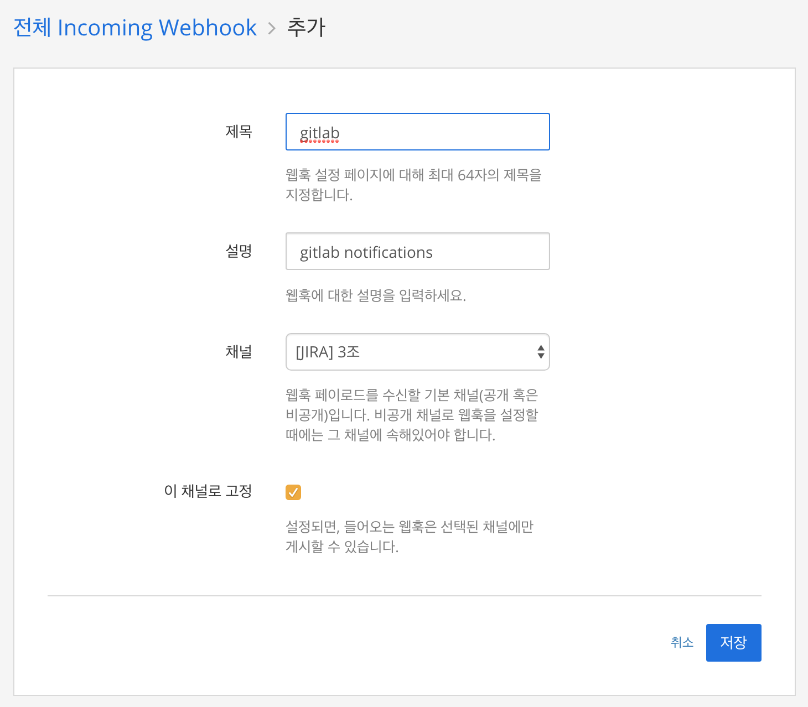
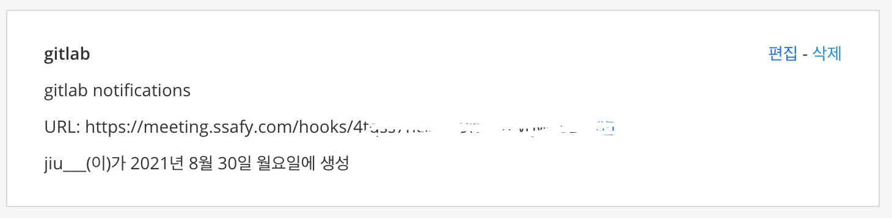
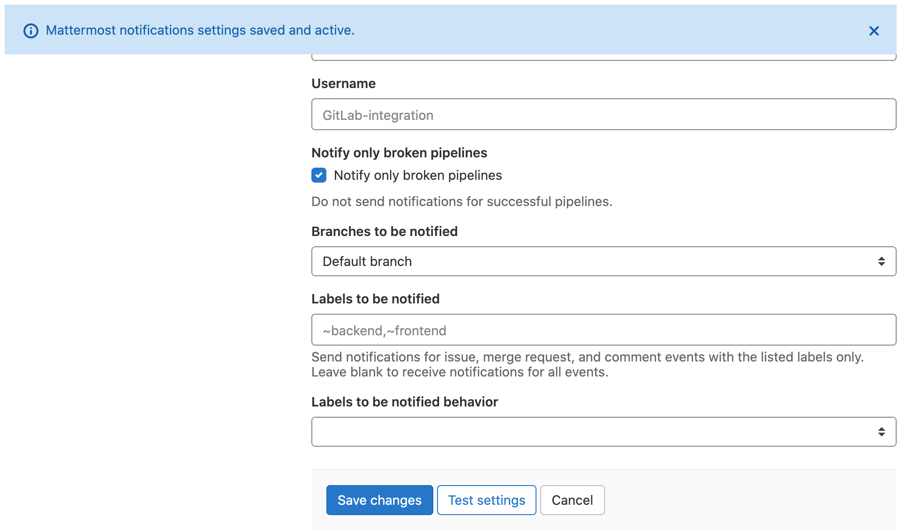
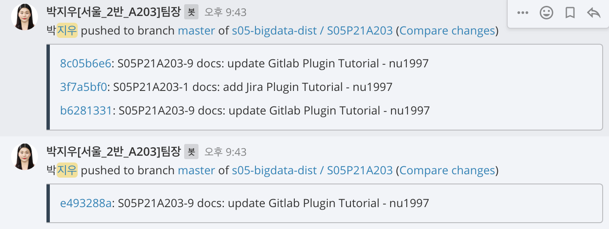

# Mattermost | Gitlab Plugin

작성자: 박지우

*Google Chrome을 기준으로 작성되었습니다.*


## Mattermost slash commands

https://docs.gitlab.com/ee/user/project/integrations/mattermost_slash_commands.html

- `/gitlab connect` - Connect your Mattermost account to your GitLab account
- `/gitlab disconnect` - Disconnect your Mattermost account from your GitLab account
- `/gitlab todo` - Get a list of unread messages and merge requests awaiting your review
- `/gitlab subscribe list` - Will list the current channel subscriptions
- `/gitlab subscribe owner[/repo] [features]` - Subscribe the current channel to receive notifications about opened merge requests and issues for a group or repository
  - `features` is a comma-delimited list of one or more the following:
    - issues - includes new and closed issues
    - merges - includes new and closed merge requests
    - pushes - includes pushes
    - issue_comments - includes new issue comments
    - merge_request_comments - include new merge-request comments
    - pipeline - include pipeline
    - tag - include tag creation
    - pull_reviews - includes merge request reviews
    - label:"`<labelname>`" - must include "merges" or "issues" in feature list when using a label
    - Defaults to "merges,issues,tag"
- `/gitlab unsubscribe owner/repo` - Unsubscribe the current channel from a repository
- `/gitlab me` - Display the connected GitLab account
- `/gitlab settings [setting] [value]` - Update your user settings`setting` can be "notifications" or "reminders"`value` can be "on" or "off"


## 연결 방법

Mattermost 채널에서 바로 입력하는 것으로 별도의 설치 없이 (원래는 설치를 해야 하지만 SSAFY Mattermost 서버에 이미 설치가 되어 있는 것으로 보인다.) Gitlab 플러그인을 이용할 수 있다.

1. 

```
/gitlab connect
```

연결 커맨드를 입력하면 깃랩 로그인 창이 뜬다. 팀장의 계정으로 연결한다.


2. 

```
/gitlab subscribe <owner>[/<repo]
```

처음엔 이게 조금 헷갈렸는데 owner 개념 때문이었다. 여태까지 내 레포지토리는 항상 내가 owner였기 때문에 내 아이디를 입력해야 하는건가 생각했는데 그게 아니었다. 제대로 된 확인 방법은 아래와 같다.

`Settings` -> `Integrations` -> **Mattermost slash commands** 클릭


**Display name**이 Gitlab / owner / repo 의 형태이다. 따라서 뒤에서 두번째부터 입력하면 된다.


입력예시

```
/gitlab subscribe s05-bigdata-dist/S05P21A203
```


##### 연결이 완료되었다.


## Feature에 관하여

맨 처음 Gitlab slash commands를 입력하여 subscribe 하면 issues와 merges, tags가 발생하면 알림이 오도록 설정된다. 나는 Push가 발생해도 알림이 오도록 변경하고 싶다. 이를 변경하기 위해서는 `comma-delimited list`, 즉 공백없이 쉼표로 구분된 리스트를 입력하여 변경할 수 있다.

예시

```
/gitlab subscribe s05-bigdata-dist/S05P21A203 merges,pushes,issue_comments,merge_request_comments,pipeline,tag,pull_reviews
```


##### 연결이 잘 되었다.

근데 왜 알림이 안 올까? 😰


## Webhook 기능

알림이 안 온다. 그래도 좌절하지 말자. 진정한 개발자는 다른 방법을 빠르게 찾는 법... 하...

이유를 추측해보았을 때 Mattermost측에는 알림 기능이 활성화되었지만 Gitlab측에서 알림을 보내지 않는 것으로 생각되어서 (어디까지나 뇌피셜) Gitlab에서 Integrations 섹션을 살펴보았다. 

Settings -> Integrations -> **Mattermost notifications**

알림이 오길 원하는 기능에 체크를 해주고 Webhook Form을 찾는다. 






Webhook 필드에 무엇을 입력해야하는지 예시가 있다.

이 링크는 어디에 있을까?

매터모스트에서 받을 수 있다.


지금은 메세지를 외부(Gitlab)에서 받아올 것이므로 Incoming Webhook을 선택한다.




그리고 간략히 Webhook 이름과 설명 등을 지정해 준 뒤에 링크를 받는다.



받은 링크를 이제 복사 붙여넣기 하면 끝!





Test settings를 했을 때 Connection Successful이 뜨면 Save한다.




이제 알림이 잘 온다. 


Gitlab Plugin과 Webhook 둘 중 하나만 했을 때는 알림이 오지 않을 수 있다.

현재 우리 팀은 둘 다 활성화 되어있는 상태이기 때문이다.

차마 그것까지는 테스트 해보지 않았지만 시간이 되면 좀 더 연구를 해보겠다.

