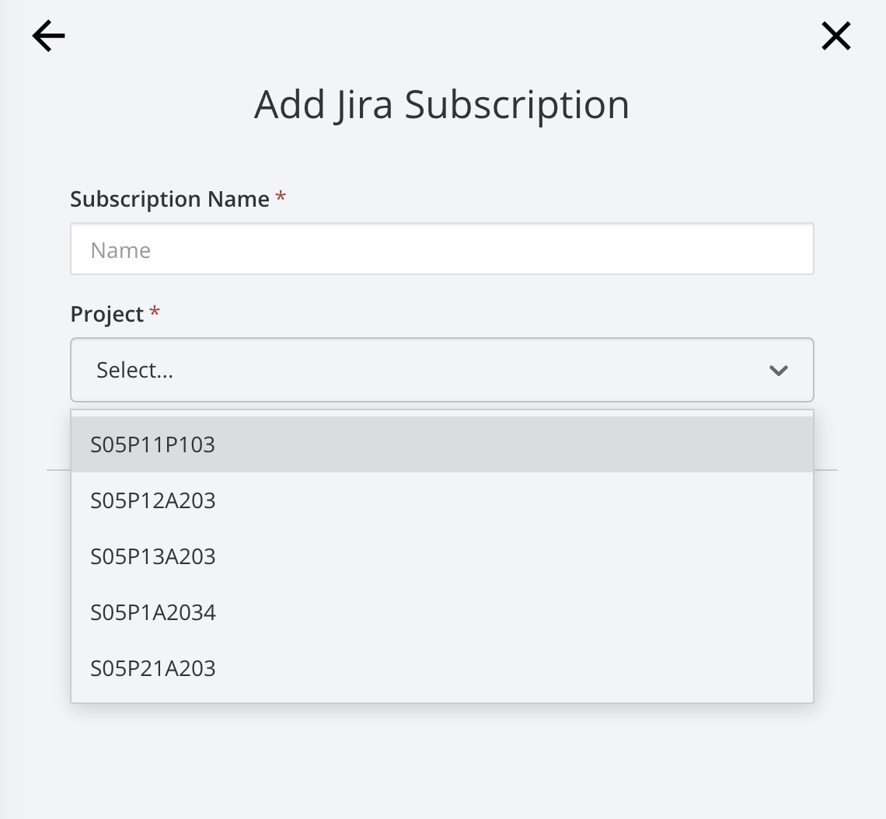

# [A203] Mattermost Jira Plugin

## Jira Connect

내  Jira 로그인 화면이 뜨며 Allow / Deny 선택이 주어진다.

Allow로 진행.

## Jira Subscribe

이제 여기서 Project를 선택한다. 나는 특화 프로젝트 Sub PJT I을 선택한다. (S05P21A203)

간략하게 Name, Filter 등을 지정해주고 넘어가면 저장이 된다.

연결 중에서 가장 간편했다.