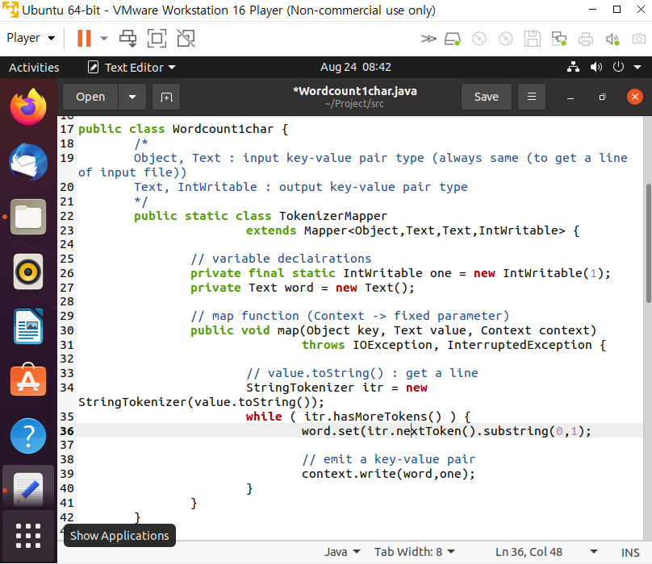
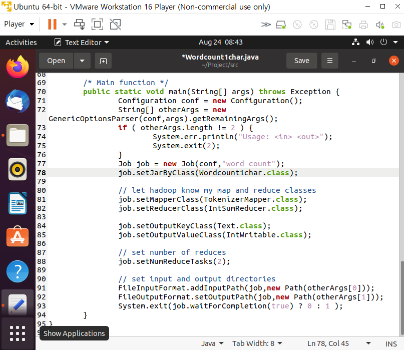
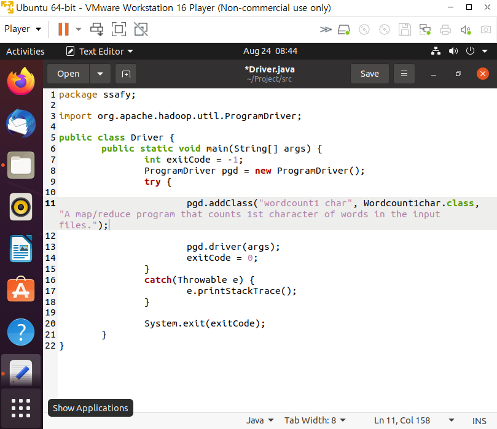

# 04_MapReduce 구현

>  자바 프로그래밍 언어로 맵리듀스 알고리즘을 구현

[TOC]

<br>

**Map 함수**

```
- org.apache.hadoop.marpreduce 패키지의 Mapper 클래스를 상속받아 map 메소드를 수정
- 입력 텍스트 파일에서 라인 단위로 호출, 입력은 (key, value-list) 형태
  - key: 입력 텍스트 파일에서 맨 앞 문자를 기준으로 Map 함수가 호출된 해당 라인의 첫 번째 문자까지 오프셋
  - value: 텍스트의 해당 라인 전체가 들어있다
```

**Reduce 함수**

```
- org.apache.hadoop.marpreduce 패키지의 Reducer 클래스를 상속받아 reduce 메소드를 수정
- 셔플링 페이즈의 출력을 입력으로 (key, value-list)
```

**Combine 함수**

```
- 각 머신에서 Map Phase에서 Map 함수의 출력 크기를 줄여준다
- 각 머신에서 Reduce 함수를 이용하는 것처럼 수행
- Shuffling 비용과 Reduce 비용, 네트워크 트래픽을 감소
- 맵리듀스 알고리즘 디자인에서 사용하는 것이 좋다
- 한개의 MapReduce Job을 수행할 때 Map 페이즈만 수행하고 중단할 수 있다
```

**Mapper and Reducer**

```
- 각 머신에서 독립적으로 수행
- 각각 Map 함수, Reduce 함수 수행
```

**setup() 함수**

```
- 첫 Map 함수나 Reduce 함수가 호출되기 전에 맨 먼저 수행
- 모든 Map 함수들에게 Broadcast해서 전달해야할 파라미터 정보를 Main 함수에서 받아온다
- 모든 Map 함수들이 공유하는 자료구조를 초기화
```

**cleanup() 함수**

```
- 마지막 Map 함수나 Reduce 함수가 끝나고 나서 수행
- 모든 Map 함수들이 공유하는 자료구조의 결과를 출력한다
```

<br>

---

<br>

## 1. VMware 설치

[VMware download](https://www.vmware.com/products/workstation-player.html)

<br>

## 2. Ubuntu 설치

[Ubuntu download](https://ubuntu.com/download/desktop)

> VMware에 Ubuntu 설치 가장 많이 사용하는 리눅스 OS CD image (iso file)을 다운로드

1. VMware 실행 후 새로운 가상머신 생성
2. 운영체제 이미지는 다운 받은 Ubuntu 선택
3. hadoop 계정 생성

<br>

## 3. Hadoop 설치

> Standalnoe 모드: 머신 하나에 설치해서 하둡을 돌리고 코딩 및 디버깅

1. console terminal 실행: Application > Accessories > Terminal
2. 패키징된 파일 다운로드

```bash
# home/hadoop에서 (폴더 이동하지 말고 바로 시작)
$ wget <http://kdd.snu.ac.kr/~kddlab/Project.tar.gz>
```

3. 설치

```bash
$ tar zxf Project.tar.gz

$ sudo chown -R hadoop:hadoop Project

$ cd Project

$ sudo mv hadoop-3.2.2 /usr/local/hadoop

$ sudo apt update

$ sudo apt install ssh openjdk-8-jdk ant -y

$ ./set_hadoop_env.sh

# Path 지정: /home/hadoop에서 source .bashrc 실행
$ source ~/.bashrc
```

<br>

## 4. Hadoop 실행을 위한 준비

Hadoop 계정으로 실행: root계정에서 `ctrl + d`

```bash
# password를 안치고도 맵리듀스 등을 돌릴 수 있도록 설정

$ ssh-keygen -t rsa -P ""
$ cat $HOME/.ssh/id_rsa.pub >> $HOME/.ssh/authorized_keys
$ ssh localhost
# Name Node format (Disk Format과 같은 개념): 하둡 파일 시스템을 포맷하는 것
$ hadoop namenode -format

# Dfs daemon start: 분산 파일 시스템 데몬 띄우기
$ start-dfs.sh

# MapReduce daemon start (standalone 모드에서는 불필요): 맵리듀스 데몬 띄우기
# $ start-mapred.sh

# 수행 중인 java 프로세스 리스트 확인 
# NameNode, SecondaryNameNode, DataNode 등 
$ jps
```

- Linux: 데이터 생성이나 코딩

  - Linux 디렉토리: src/ (맵리듀스코드: 실제 코드를 넣는 디렉토리)

    - [Driver.java](http://driver.java) (맵리듀스 코드 컴파일을 위한 파일)
    - Wordcount.java

    - template/ (과제를 위한 template) datagen/ (과제 데이터를 생성하기 위한 코드) data/ (과제를 위한 데이터) build.xml (맵리듀스 코드 컴파일을 위한 파일)

- HDFS: 입력데이터 옮겨서 MapReduce 코드 수행

  - Hadoop 디렉토리: wordcount_test/ (맵리듀스 코드 실행을 위한 데이터 디렉토리) wordcount_test_out/ (맵리듀스 코드 실행 결과를 저장하는 디렉토리)

<br>

## 5. Word Count MapReduce 예제 코드 실행

```bash
# 실습 소스코드
$ cd /home/hadoop/Project

# Project/src/Driver.java 파일 수정
# src 디렉토리에 새로운 코드를 만들때마다 src 디렉토리에 있는 
# Driver.java 파일에 pdg.addClass를 새로 하나 넣어주어야한다
# ""안에 있는 이름으로 수행시켜야한다
pgd.addClass("wordcount", Wordcount.class, "A map/reduce program that perform word counting.");

# Driver.java 파일이 바뀌면 반드시 ant를 다시 수행해야한다
# ssafy.jar 패키지 안에 있는 wordcount 코드를 수행해줘
# wordcount_test (입력) wordcount_test_out (출력)
# hadoop jar ssafy.jar wordcount wordcount_test wordcount_test_out

# 맵리듀스 코드 컴파일
# $ cd /home/hadoop/Project
# $ cd /home/Project

$ ant
```

```bash
# 테스트데이터를 HDFS에 넣는다: cd /home/hadoop/Project

# 하둡의 HDFS에 wordcount_test 디렉토리 생성
# $ hdfs dfs -mkdir wordcount_test
# hadoop 계정의 HDFS 상에 아무 디렉토리나 파일이 없으므로 맨 위에 user/hadoop 디렉토리를 생성한 후 진행
$ hdfs dfs -mkdir -p /user/hadoop/wordcount_test

# Linux의 data 디렉토리에 있는 wordcount-data.txt 파일을
# 하둡의 HDFS의 wordcount_test 디렉토리에 보낸다
$ hdfs dfs -put data/wordcount-data.txt wordcount_test

# 맵리듀스 프로그램이 결과를 저장할 디렉토리를 삭제한 후 프로그램을 실행해야한다
$ hdfs dfs -rm -r wordcount_test_out
# Wordcount MapReduce 알고리즘 코드 실행: cd /home/hadoop/Project

# Drvier.java에 표시한대로 wordcount를 써서 Wordcount 맵 리듀스 코드를 수행
# Wordcount_test 디렉토리에 들어있는 모든 파일을 맵 함수의 입력으로 사용
$ hadoop jar ssafy.jar wordcount wordcount_test wordcount_test_out

# Hadoop의 실행 방법
# $ hadoop jar [jar file][program name] <input arguments ...>

# 결과 확인: reducer 개수를 2개 사용하려면 아래와 같은 출력 파일 2개 생성
# 0번 reducer가 출력한 파일 내용을 보여준다
$ hdfs dfs -cat wordcount_test_out/part-r-00000|more
# 0번 reducer가 출력한 파일 내용을 보여준다
$ hdfs dfs -cat wordcount_test_out/part-r-00001|more
```

<br>

## 6. Wordcount1char.java 만들고 실행

[Wordcount.java](http://wordcount.java) 수정하여 각 단어의 첫 글자만을 카운트하는 프로그램 작성하기

| wordcount1char                                   | main function                                  | driver                           |
| ------------------------------------------------ | ---------------------------------------------- | -------------------------------- |
|  |  |  |

```bash
# Project/src/Driver.java 파일 수정
pgd.addClass("wordcount1 char", Wordcount1char.class, "A map/reduce program that counts 1st character of words in the input files.");

$ cd /home/hadoop/Project
$ ant
$ hdfs dfs -rm -r wordcount_test_out

$ hadoop jar ssafy.jar wordcount1char wordcount_test wordcount1char_test_out
$ hdfs dfs -cat wordcount1char_test_out/part-r-00000|more
$ hdfs dfs -cat wordcount1char_test_out/part-r-00001|more
```

