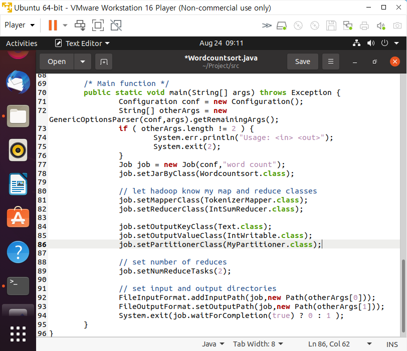
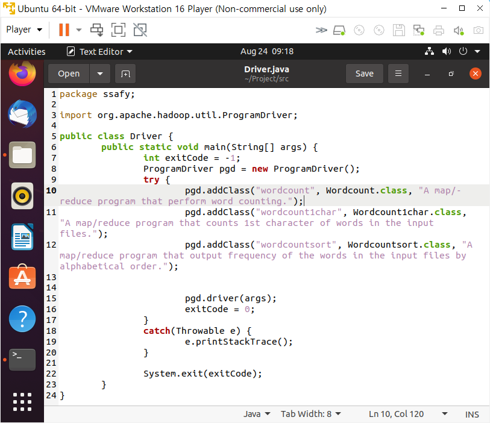

# 01_Partitioner Class

Map 함수의 출력인 (key, value) 쌍이 key에 의해 어느 Reducer 머신으로 보내질 것인지를 정의하는 Class

- key에 대한 해시 값에 따라 결정
- key값이 같으면 항상 같은 reducer로 보내져야한다

<br>

## Wordcountsort.java 만들고 실행

| partitioner                                                 | main_function                                                | driver                                             |
| ----------------------------------------------------------- | ------------------------------------------------------------ | -------------------------------------------------- |
|  |  |  |

```bash
# Project/src/Driver.java 파일 수정
pgd.addClass("wordcountsort", Wordcountsort.class, "A map/reduce program that output frequency of the words in the input files by alphabetical order.");

$ cd /home/hadoop/Project
$ ant
$ hdfs dfs -rm -r wordcount1char_test_out

$ hadoop jar ssafy.jar wordcount wordcount_test wordcountsort_test_out
$ hdfs dfs -cat wordcountsort_test_out/part-r-00000|more
$ hdfs dfs -cat wordcountsort_test_out/part-r-00001|more
```

