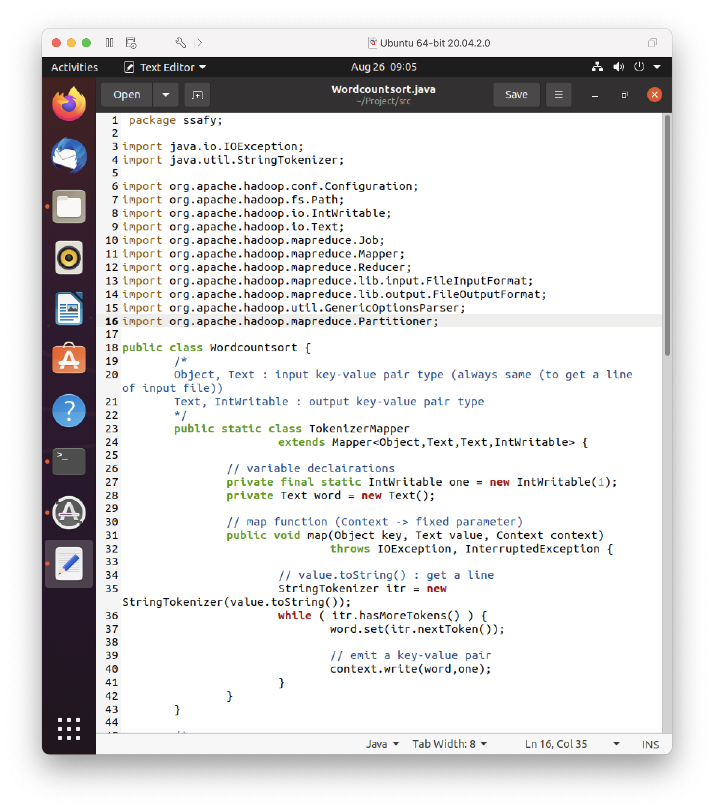
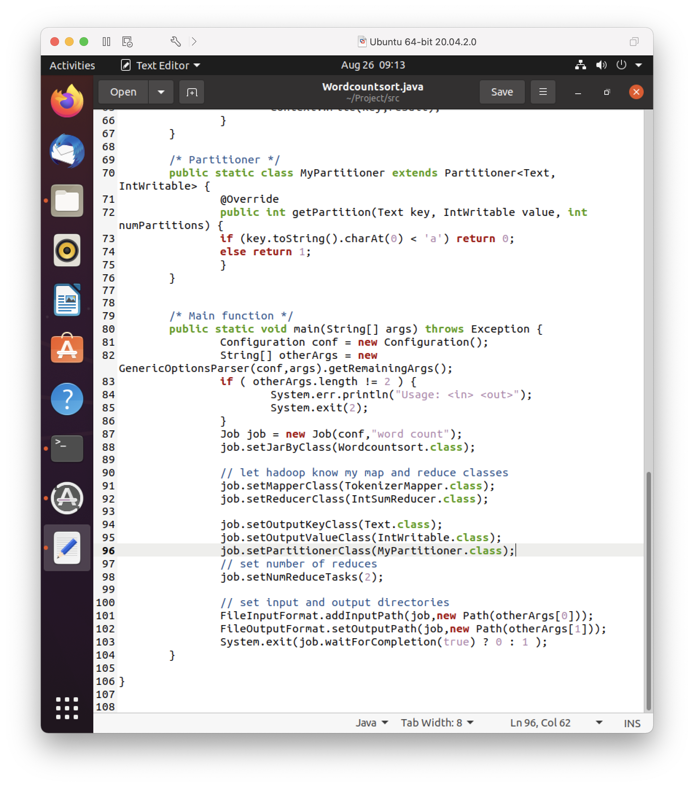
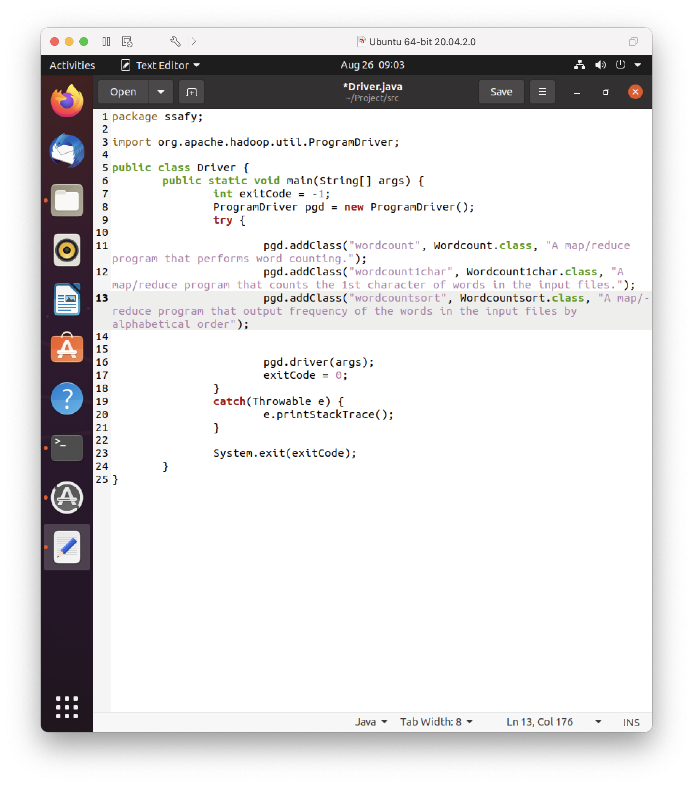
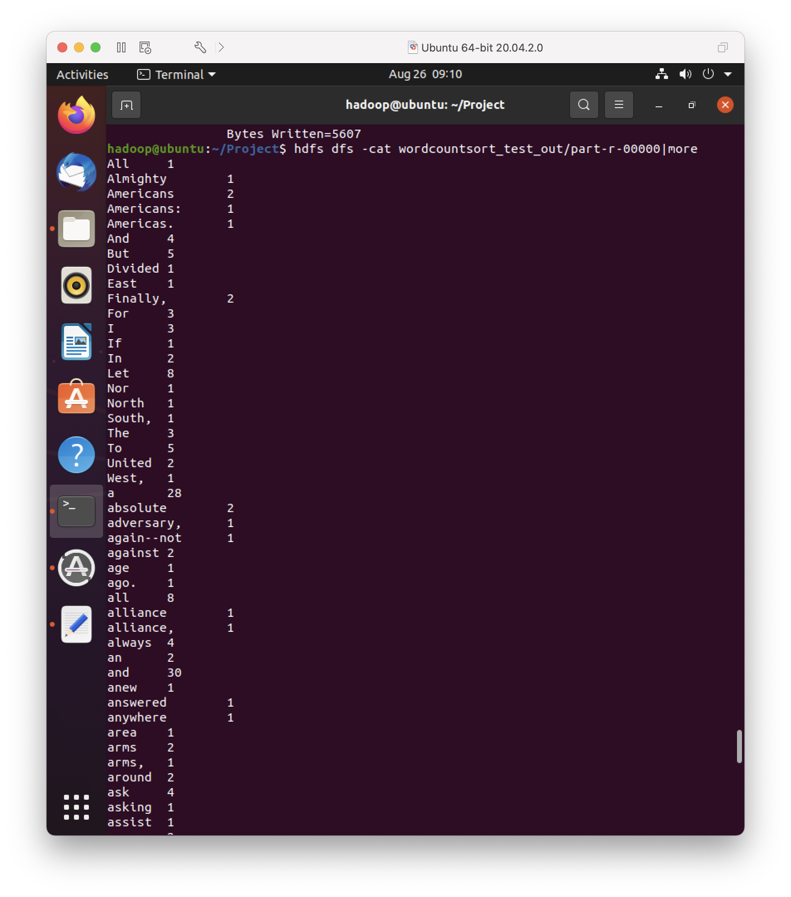
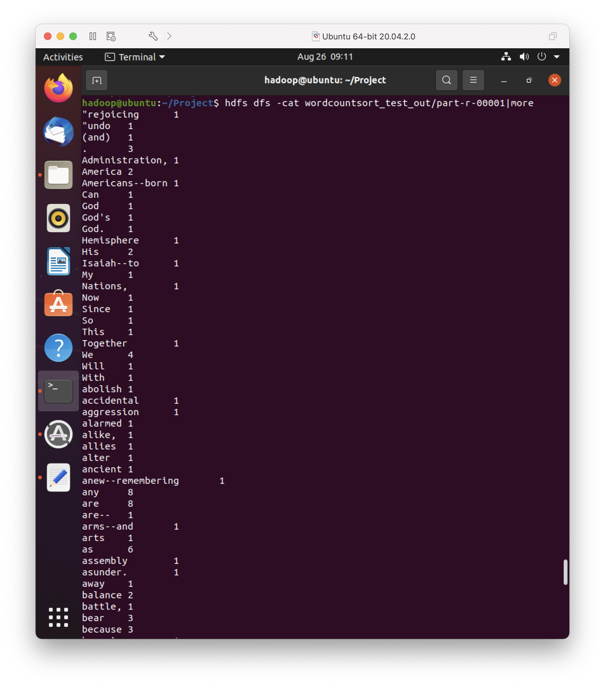

# day2

> 특화 PJT 빅데이터(분석) 사전학습 
>
> 2강 과제 제출

 

### ✅ Partitioner Class

|       Wordcountsort.java 코드 수정 1        |     Wordcountsort.java 코드 수정 2     |
| :-----------------------------------------: | :------------------------------------: |
|  |    |
|          **Driver.java 코드 수정**          |            **과제 결과 1**             |
|  |  |
|               **과제 결과 2**               |                   -                    |
|       |                   -                    |
