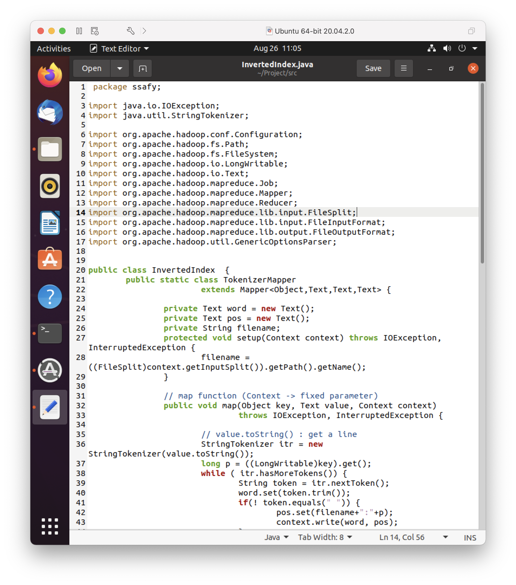
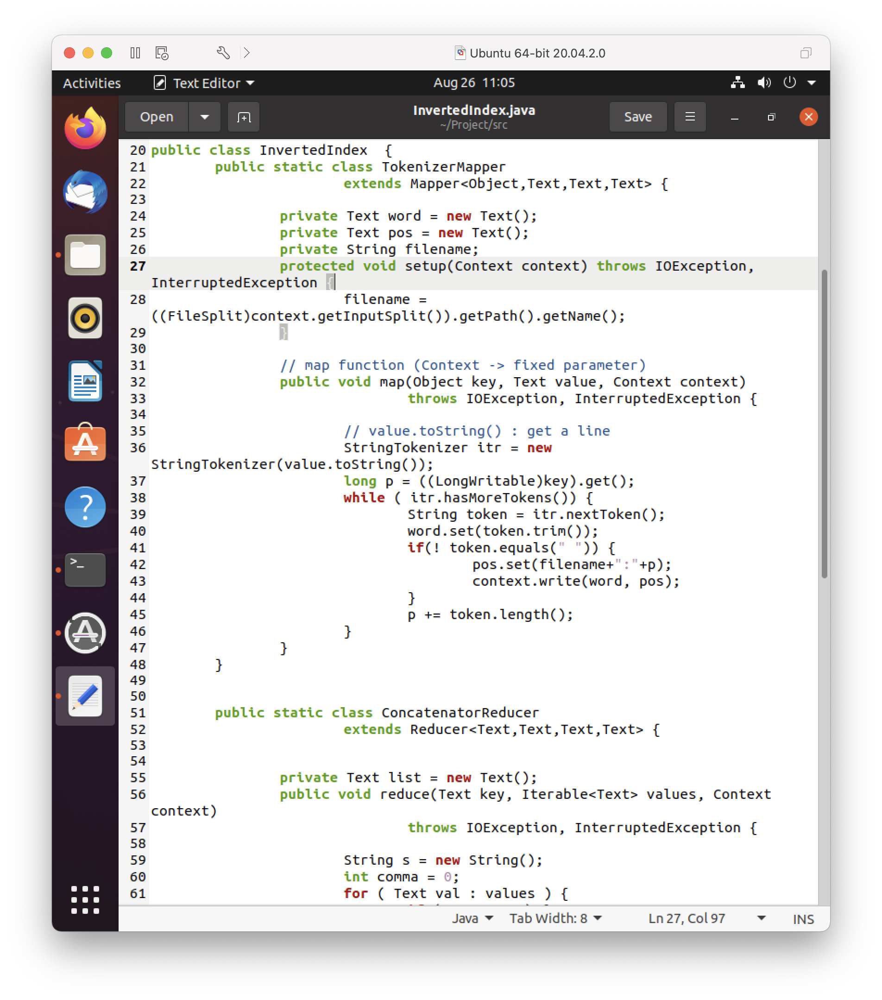
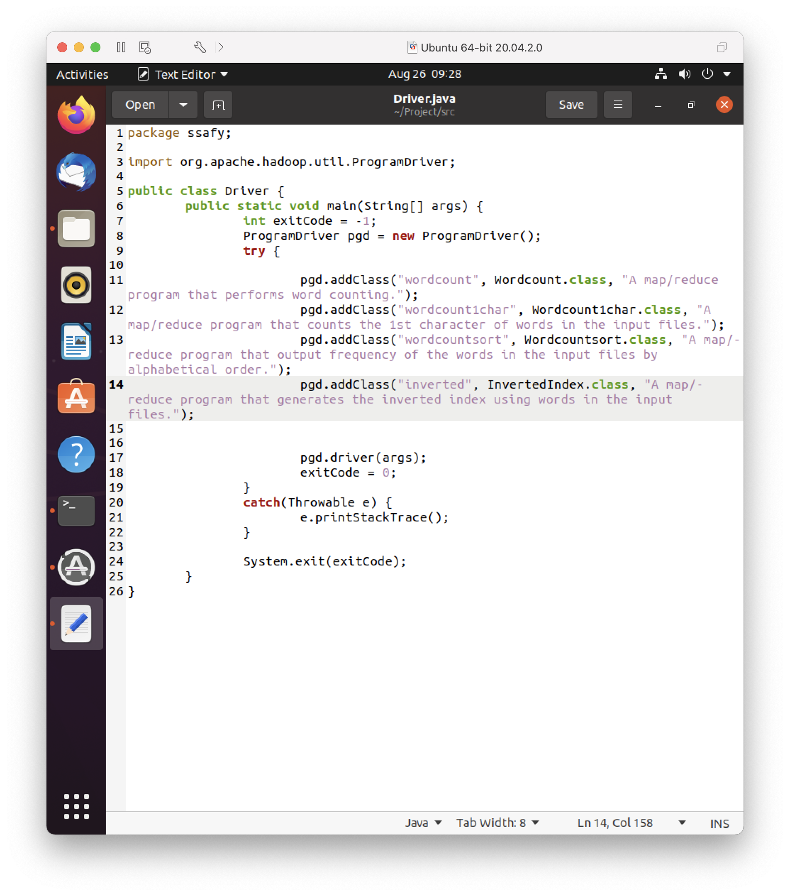
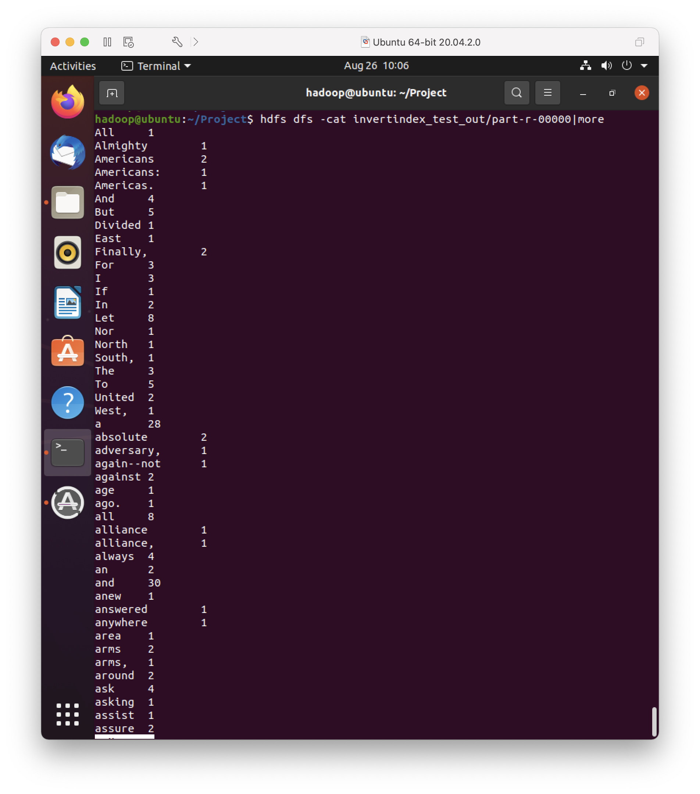
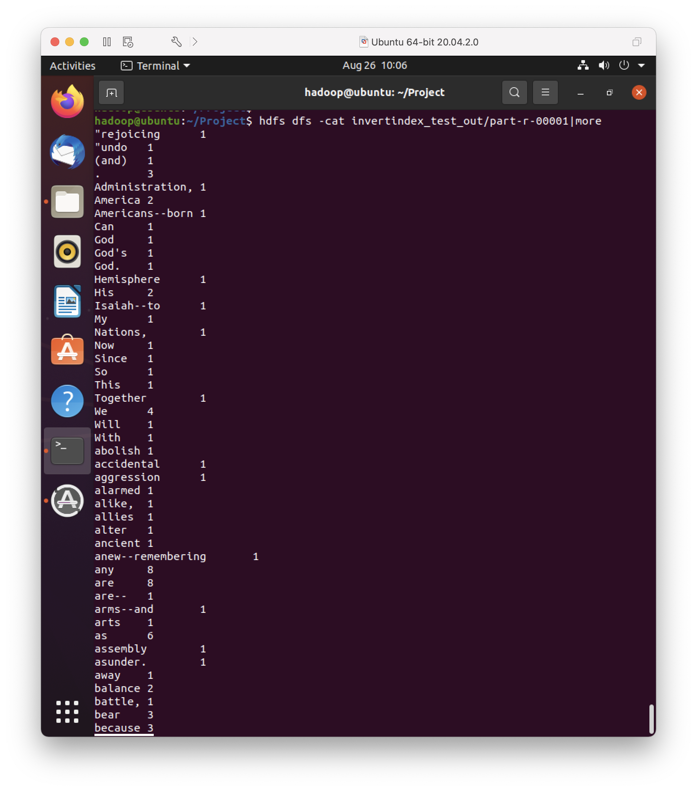

# day2

> 특화 PJT 빅데이터(분석) 사전학습 
>
> 2강 과제 제출

 

### ✅ Partitioner Class

|       Wordcountsort.java 코드 수정 1        |     Wordcountsort.java 코드 수정 2     |
| :-----------------------------------------: | :------------------------------------: |
|  |    |
|          **Driver.java 코드 수정**          |            **과제 결과 1**             |
|  |  |
|               **과제 결과 2**               |                   -                    |
|       |                   -                    |

 

### ✅ Inverted Index

|         InvertedIndex.java 코드 수정 1         |       InvertedIndex.java 코드 수정 2        |
| :--------------------------------------------: | :-----------------------------------------: |
|   |       |
|       **InvertedIndex.java 코드 수정 3**       |     **InvertedIndex.java 코드 수정 4**      |
|  |  |
|           **Driver.java 코드 수정**            |               **과제 결과 1**               |
|   |           |
|                 **과제 결과2**                 |                      -                      |
|              |                      -                      |

 
