# 빅데이터 하둡 1

> 병렬 분산 알고리즘 구현이 가능한 맵리듀스 프레임워크를 이해한다.
>
> 맵리듀스 프레임워크를 사용할 수 있는 Hadoop설치 및 맵리듀스 알고리즘 코드를 실행한다.
>
> 하둡을 이용하여 빅데이터 분석 및 처리용 맵리듀스 알고리즘을 구현하는데 필요한 지식과 코딩 능력을 배양한다.

 

 

## 왜 병렬 분산 알고리즘?

### Scale-out

아주 많은 값싼 서버들을 이용한다.

 

### Scale-up

적은 수의 값비싼 서버들을 이용한다.

 
데이터 중심(data-intensive) 어플리케이션 분야에서는 아주 많은 값싼 서버들을 많이 이용하는 것을 선호한다.

고가의 서버들은 가격의 관점에서는 선형으로 성능이 증가하지 않음

+ 두 배의 성능의 프로세서 한 개를 가진 컴퓨터의 가격이 일반적인 프로세서 한 개를 가진 컴퓨터 가격의 두 배보다 훨씬 비쌈

 

### 왜 MapReduce?

데이터 중심 프로세싱(Data-intensive processing)

+ 한 대의 컴퓨터 능력으로 처리가 어려움
+ 근본적으로 수 십대, 수 백대 혹은 수 천대의 컴퓨터를 묶어서 처리해야 함
+ 맵리듀스 프레임워크가 하는 것이 바로 이 역할

 

맵리듀스는 빅데이터를 이용한 효율적인 계산이 가능한 첫 번째 프로그래밍 모델

+ 기존에 존재하는 여러 가지 다른 병렬 컴퓨팅 방법에서는 프로그래머가 낮은 레벨의 시스템 세부 내용까지 아주 잘 알고 많은 시간을 쏟아야만 한다.

 

 

## MapReduce Framework

빅 데이터를 이용하는 응용분야에서 최근에 주목받고 있다.

값싼 컴퓨터들을 모아서 클러스터를 만들고 여기에서 빅데이터를 처리하기 위한 **스케일러블(scalable) 병렬 소프트웨어**의 구현을 쉽게 할 수 있도록 도와주는 간단한 프로그래밍 모델이다.

+ 'scalable'이라는 말은 사용자 수가 급증하거나 데이터가 급증해도 프로그램이 멈추거나 성능이 크게 떨어지는 일이 없다는 뜻

구글의 맵리듀스 또는 오픈소스인 하둡은 맵리듀스 프레임워크의 우수한 구현 형태다.

드라이버에 해당하는 메인 함수가 **맵(map)** 함수와 **리듀스(reduce)** 함수를 호출해서 처리한다.

 

 

## MapReduce Programming Model

함수형 프로그래밍 언어의 형태

유저는 아래 3가지 함수를 구현해서 제공해야 한다. (인자) - > 출력 (`[]`는 0개, 1개, 혹은 여러 개가 있을 수 있다는 뜻)

+ **Main 함수**
+ **Map 함수**: (key1, val1) -> [(key2, val2)]
+ **Reduce 함수** : (key2, [val2]) -> [(key3, val3)]

 
맵리듀스 프레임워크에서는 **각각의 레코드 또는 튜플은 key-value 쌍**으로 표현된다.

맵리듀스 프레임워크는 **메인 함수를 한 개의 마스터 머신(master machine)에서 수행**하는데, 이 머신은 맵 함수를 수행하기 전에 전처리를 하거나 리듀스 함수의 결과를 후처리 하는 데에 사용될 수 있다.

컴퓨팅은 **맵과 리듀스라는 유저가 정의한 함수 한 쌍**으로 이루어진 **맵리듀스 페이즈(phase)**를 한 번 수행하거나 여러 번 반복해서 수행할 수 있다.

한 번의 맵리듀스 페이즈는 맵 함수를 먼저 호출하고 그 다음에 리듀스 함수를 호출하는데, 때에 따라서는 맵 함수가 끝난 후에 **컴바인(combine)** 함수를 중간에 수행할 수 있다.

드라이버에 해당하는 메인 프로그램에서 맵리듀스 페이즈를 수행시킨다.

 

 

## MapReduce Phase(3단계)

### 맵(Map) 페이즈

+ 제일 먼저 수행되며 데이터의 여러 파티션에 병렬 분산으로 호출되어 수행된다.
+ 각 머신마다 수행된 Mapper는 맵 함수가 입력 데이터의 한 줄마다 맵 함수를 호출한다.
+ Map 함수는 (key, value)쌍 형태로 결과를 출력하고 여러 머신에 나누어 보내며 같은 key를 가진 (key, value) 쌍은 같은 머신으로 보낸다.

 

### 셔플링(Shuffling) 페이즈

+ 모든 머신에서 맵 페이즈가 다 끝나면 시작된다.
+ 맵 페이즈에서 각각의 머신으로 보내진 (key, value) 쌍을 ket를 이용해서 정렬을 한 후에 각각의 key마다 같은 key를 가진 (key, value) 쌍을 모아서 value-list를 만든 다음에 (key, value-list) 형태로 key에 따라서 여러 머신에 분산해서 보낸다.

 

### 리듀스(Reduce) 페이즈

+ 모든 머신에서 셔플링 페이즈가 다 끝나면 각 머신마다 리듀스 페이즈가 시작된다.
+ 각각의 머신에서는 셔플링 페이즈에서 해당 머신으로 보내진 각각의 (key, value-list) 쌍 마다 리듀스 함수가 호출되며 하나의 리듀스 함수가 끝나면 다음 (key, value-list) 쌍에 리듀스 함수가 호출된다.
+ 출력이 있다면 (key, value) 쌍 형태로 출력한다.

 
 

## Hadoop

Apache 프로젝트의 맵리듀스 프레임워크의 오픈 소스

하둡 분산 파일 시스템(Hadoop Distributed File System - HDFS)

+ 빅데이터 파일을 여러 대의 컴퓨터에 나누어서 저장함
+ 각 파일은 **여러 개의 순차적인 블록**으로 저장함
+ 하나의 파일의 각각의 블록은 **폴트 톨러런스**(fault tolerance)를 위해서 **여러 개로 복사되어 여러 머신의 여기저기 저장**됨
  + 폴트 톨러런스
    + 시스템을 구성하는 부품의 일부에서 결함 또는 고장이 발생하여도 정상적 혹은 부분적으로 기능을 수행할 수 있는 것
+ 빅데이터를 수천 대의 값싼 컴퓨터에 병렬 처리하기 위해 분산함
+ 자바 프로그래밍 언어로 맵리듀스 알고리즘 구현

 

### 주요 구성 요소들

+ MapReduce - 소프트웨어의 수행을 분산함

+ HDFS - 데이터를 분산함

 

### 한 개의 NameNode(master)와 여러 개의 Datanode(slaves)

+ Namenode
  + 파일 시스템을 관리하고 클라이언트가 파일에 접근할 수 있게 함
+ Datanode
  + 컴퓨터에 들어있는 데이터를 접근할 수 있게 함

 

 

## MapReduce의 함수

### 맵 함수

org.apache.hadoop.mapreduce라는 패키지에 있는 Mapper 클래스를 상속받아서 map 메소드를 수정한다.

입력 텍스트 파일에서 라인 단위로 호출되고 입력은 키-밸류의 형태다.

key는 입력 텍스트 파일에서 맨 앞 문자(character)를 기준으로 맵 함수가 호출된 해당 라인의 첫 번째 문자까지 오프셋(offset)

value는 텍스트의 해당 라인 전체가 들어있다.

 

### 리듀스 함수

org.apache.hadoop.mapreduce라는 패키지에 있는 Reducer 클래스를 상속받아서 reduce 메소드를 수정한다.

셔플링 페이즈의 풀력을 입력으로 받는데 키-밸류 리스트의 형태다.

value-list는 맵 함수의 출력에서 같은 key를 갖는 (key, value) 쌍들의 value들의 리스트이다.

 

### 컴바인 함수

리듀스 함수와 유사한 함수인데, 각 머신의 맵 페이즈에서 맵 함수의 출력 크기를 줄여서 셔플링 페이즈와 리듀스 페이즈의 비용을 줄여주는 데 사용된다.

 

 

## MapReduce Word Counting 알고리즘

1. 두 개의 머신 M1과 M2가 있고 각 여러 문서들은 라인이 한 개만 있다고 가정한다. 머신마다 mapper가 하나씩 수행되고, mapper는 map 함수를 각 라인 하나 마다 차례로 호출한다.
2. 텍스트 문서의 각 라인마다 map 함수가 호출되고 문서를 스캔하면서 각 단어마다 그 단어를 key로 하고 값 1을 value로 해서 (key, value) 쌍을 출력한다.

3. 출력한 (key, value) 쌍의 key에 따라서 해시 함수를 이용해 여러 머신에 분산시켜서 보낸다.

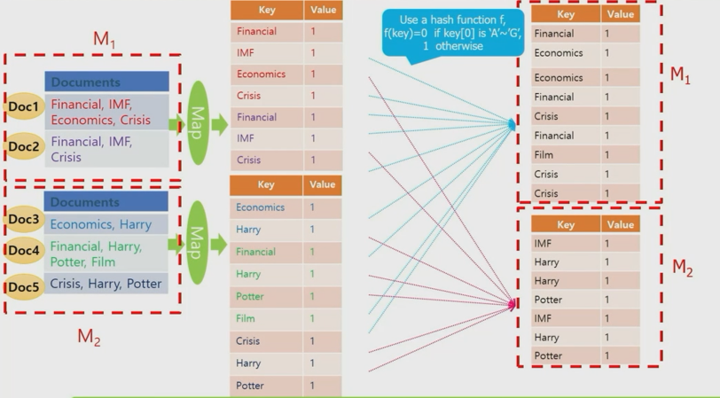

4. 셔플링 페이즈로, 각 key마다key를 가진 value들을 모아서 value-list를 만들어 (key, value-list) 형태를 출력한다.

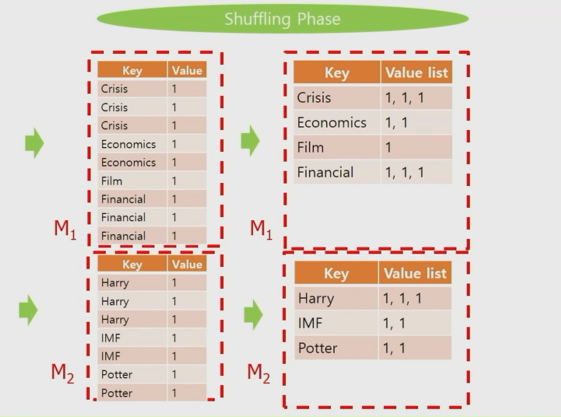

5. 머신마다 Reducer가 하나씩 수행되고, Reducer는 Reduce 함수를 (key, value-list) 쌍마다 차례대로 호출한다. value-list에 있는 것을 더해서 key와 value 형태로 출력한다.

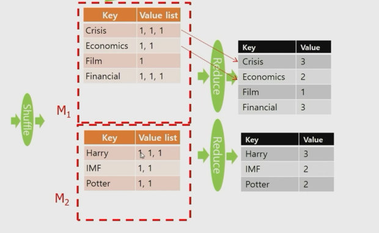

 

 

## Combine 함수

map 함수의 결과 크기를 줄여준다. 

각각의 머신에서 Reduce 함수를 이용한 것처럼 수행된다.

셔플링 비용과 네트웍 트래픽을 줄여준다.

따라서, 맵리듀스 알고리즘 디자인에서 사용하는 것이 좋다.

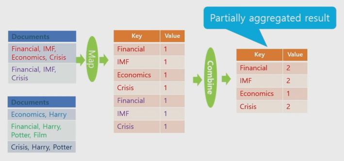

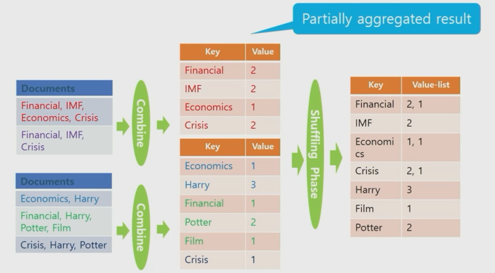

 

 

## setup(), cleanup()

Mapper와 Reducer는 필요하다면 `setup()`과 `cleanup()`을 수행할 수 있다.

### setup()

첫 Map함수나 Reduce 함수가 호출되기 전에 먼저 수행된다.

+ 모든 Map 함수들에게 Broadcast해서 전달해야 할 파라미터 정보를 main 함수에서 받아오는 데 사용
+ 모든 Map 함수들이 공유하는 자료구조를 초기화 하는 데 사용

 

### cleanup()

마지막 Map 함수나 Reduce 함수가 끝나고 나면 수행한다.

+ 모든 Map 함수들이 공유하는 자료구조의 결과를 출력하는 데 사용

 

한 개의 MapReduce job을 수행할 때에 Map 페이즈만 수행하고 중단할 수도 있다.

 

 

## Hadoop의 설치, MapReduce 알고리즘의 수행

>  VMware, Ubuntu, Hadoop 설치 (Windows)

1. VMware 설치

   https://www.vmware.com/products/workstation-player.html

   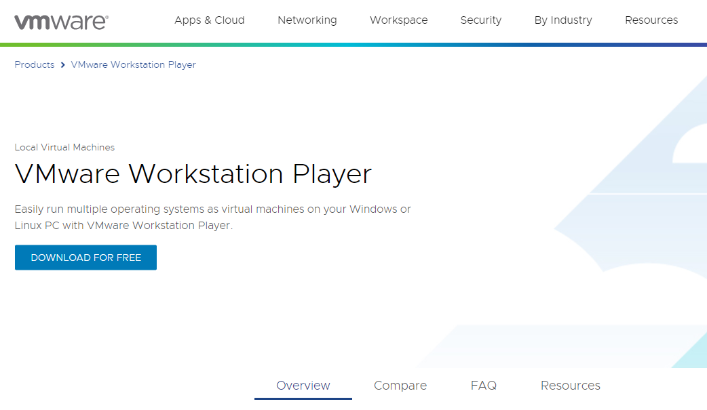

   DOWNLOAD FOR FREE -> GO TO DOWNLOAD -> VMware ~ for Windows 64-bit Operating Systems DOWNLOAD NOW

   설치 과정에서 Install Windows Hypervisor Platform automatically 체크

   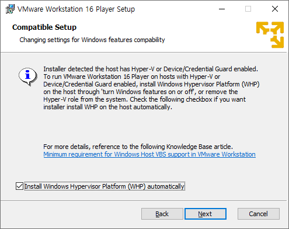

   이후 기본 설정대로 쭉 설치

 

2. VMware에 Ubuntu 설치

   https://ubuntu.com/download/desktop 에서 우분투 LTS 버전 다운로드

   VMware 실행 후 새로운 가상머신 생성 (Create a New Virtual Machine)

   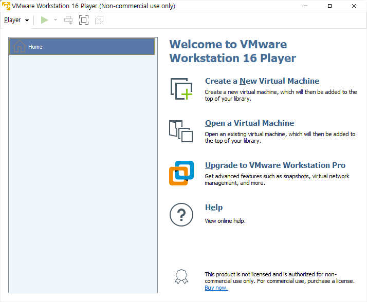

   다운로드 받은 Ubuntu 파일을 불러오기

   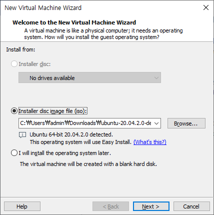

   계정 설정(user name은 나중에 hadoop으로 다시 했다.)

   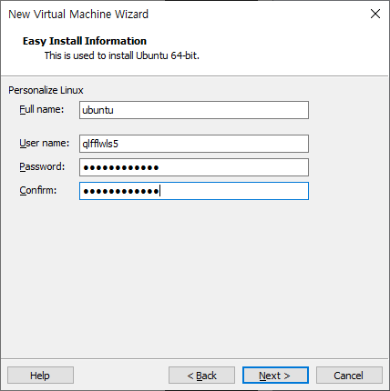

   이후 기본 설정으로 쭉 설치

   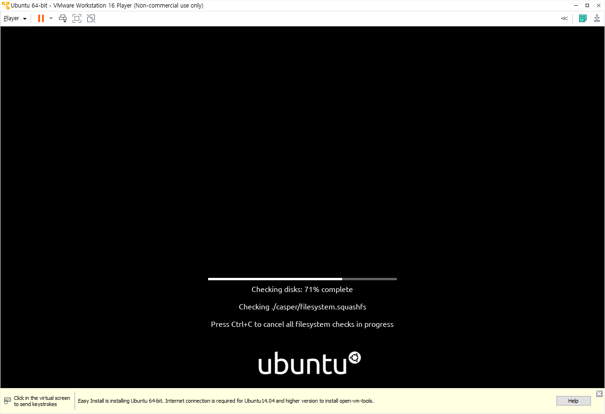

   

 

3. hadoop 설치(Standalone 모드 - 코딩 및 디버깅용)

   Console terminal 실행

   + Applications > Accesories > Terminal (Ctrl + Alt + t)

   패키징된 파일 다운로드

   + $ wget http://kdd.snu.ac.kr/~kddlab/Project.tar.gz

   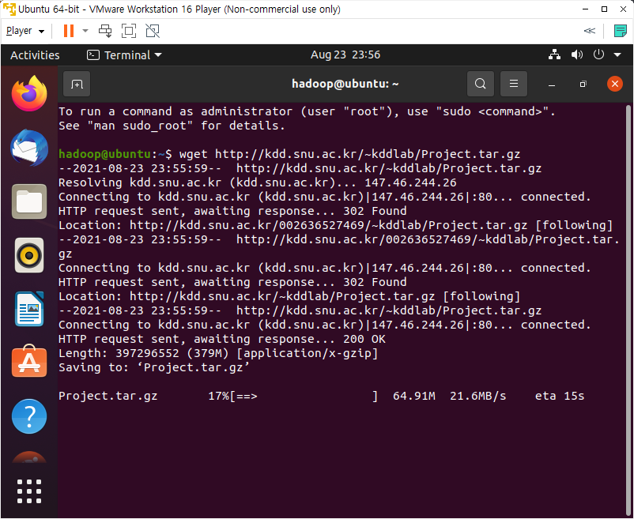

   이후 명령어

   + $ tar zxf Project.tar.gz

   + $ sudo chown -R hadoop:hadoop Project

   + $ cd Project

   + $ sudo mv hadoop-3.2.2 /usr/local/hadoop

   + $ sudo apt update

   + $ sudo apt install ssh openjdk-8-jdk ant -y

   + $ ./set_hadoop_env.sh

   + $ source ~/.bashrc (터미널 종료 없이 .bashrc 파일 수정사항 적용)

 

 

## Hadoop 실행을 위한 준비

Root 계정에 있다면 Ctrl + d로 나온다.

빈 'ssh key'를 만들어줄 것이다. (패스워드를 안쳐도 하둡을 계속 돌릴 수 있도록)

+ $ ssh-keygen -t rsa -P ""
  - 저장할 파일을 물어보면 default로 계속 진행
+ $ cat $HOME/.ssh/id_rsa.pub >> $HOME/.ssh/authorized_keys
+ 제대로 생성되었는지 확인
  + $ ssh localhost
  + 질문이 뜨면 yes를 입력하고 그 다음 비밀번호를 물어보지 않고 prompt가 뜨면 성공

 

모든 명령은 hadoop이 있는 계정에서 한다.

+ Path를 지정하기 위해 /home/hadoop에서 source .bashrc를 실행한다.

 

Name node format

+ Disk 포맷과 같은 개념이다.
+ $ hadoop namenode -format

 

DFS daemon start (분산 파일 시스템에 대한 데몬을 띄우기 위함)

+ $ start-dfs.sh

 

MapReduce daemon start (Standalone 모드에서는 불필요)

+ $ start-mapred.sh

 

### 확인

수행중인 java 프로세스 리스트를 확인한다.

+ $ jps
  + NameNode
  + SecondaryNameNode
  + DataNode
  + TaskTracker (Standalone 모드에서는 불필요)
  + JobTracker (Standalone 모드에서는 불필요)

 

 

## Linux와 HDFS

데이터 생성이나 코딩은 Linux에서 하고 MapReduce 코드와 입력 데이터는 HDFS에 옮겨서 MapReduce 알고리즘을 수행한다.

Linux 디렉토리

+ src/ (맵리듀스 코드)
  + Driver.java (맵리듀스 코드 컴파일을 위한 파일)
  + Wordcount.java
+ template/ (과제를 위한 template)
+ datagen/ (과제 데이터를 생성하기 위한 코드)
+ data/ (과제를 위한 데이터)
+ build.xml (맵리듀스 코드 컴파일을 위한 파일)

 

Hadoop 디렉토리

+ wordcount_test/ (맵리듀스 코드 실행을 위한 데이터 디렉토리)
+ wordcount_test_out/ (맵리듀스 코드 실행 결과를 저장하는 디렉토리)

 

 

## Word Count MapReduce 예제 실행

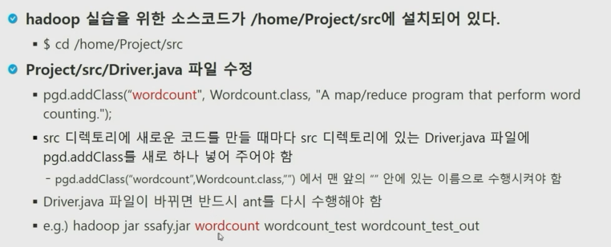

+ Driver.java가 바뀌면 부모 디렉토리(Project 디렉토리)로 가서 ant를 수행해야 함

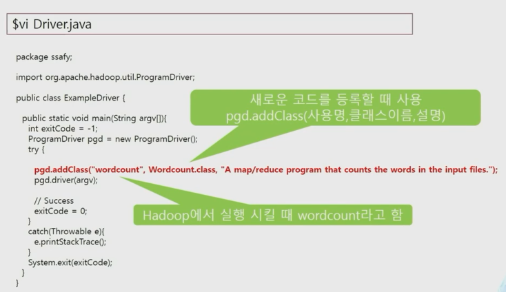

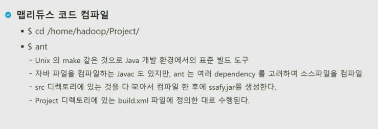

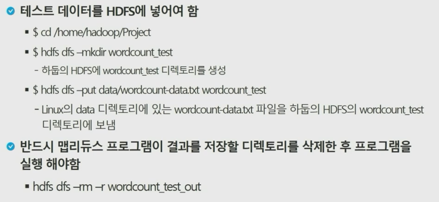

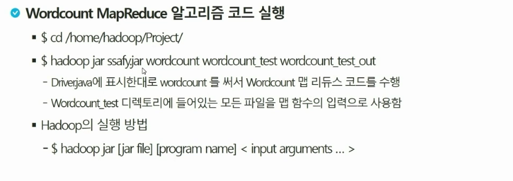

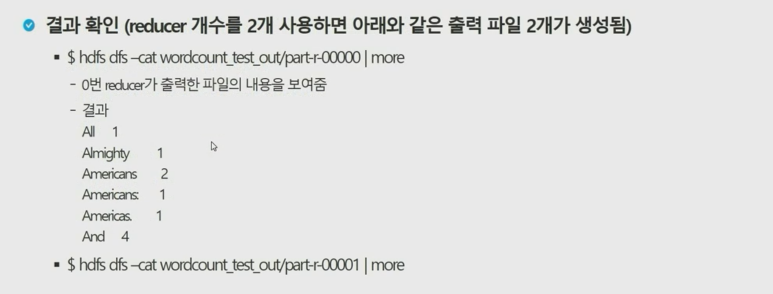

 

 

## 새로운 파일을 맵리듀스 하려면

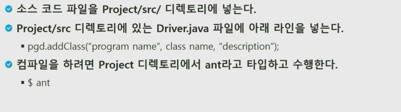

 

 

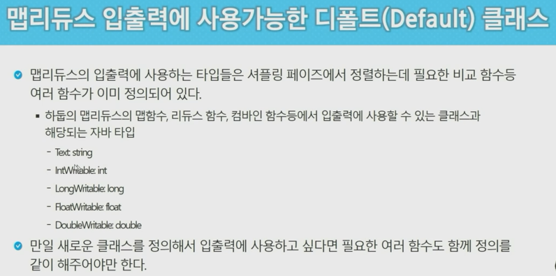

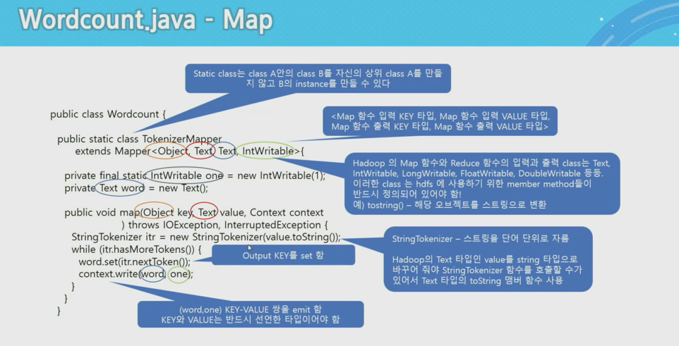

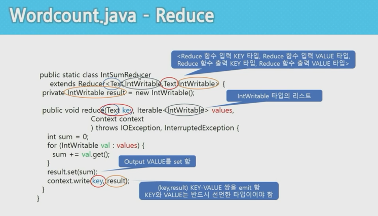

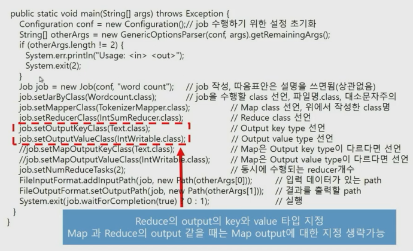

+ Combiner가 있는 main 함수

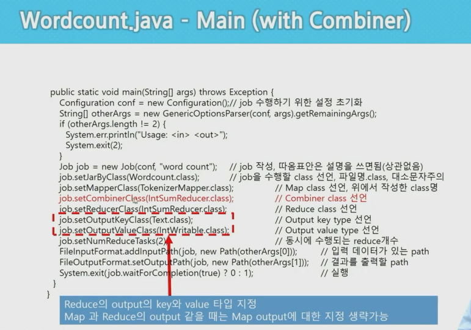

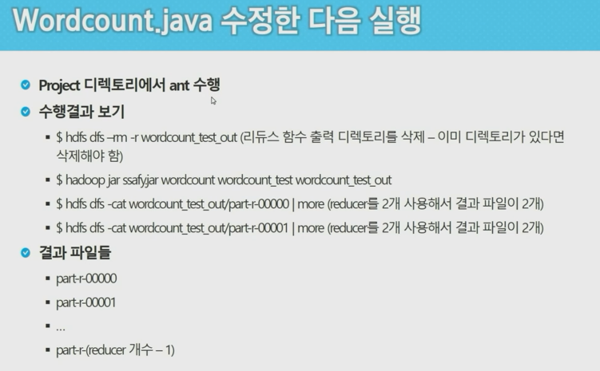

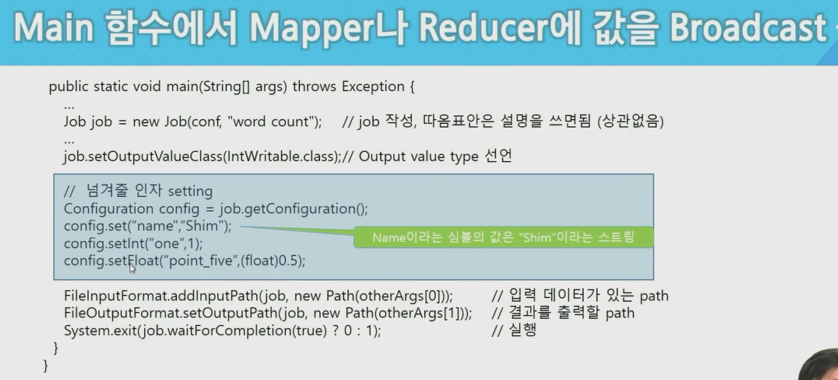

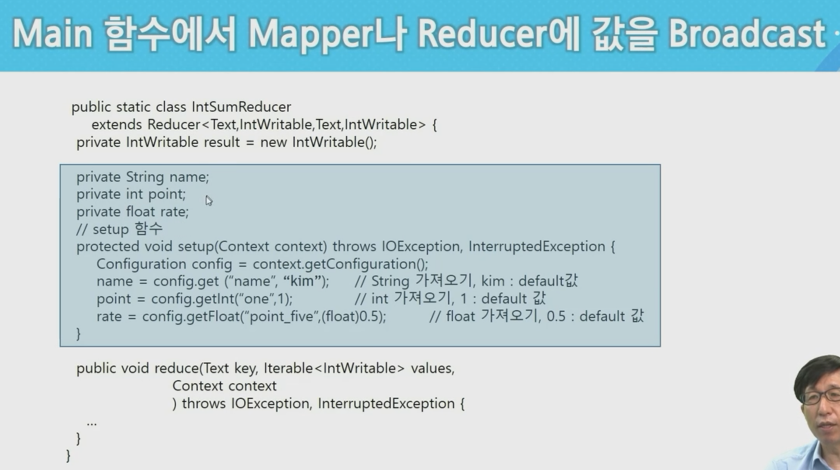

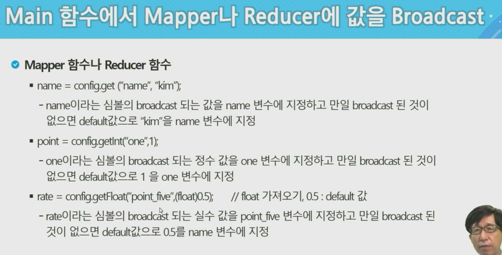

+ 첫 문자로 나누고 싶다면 subString()을 사용한다.
