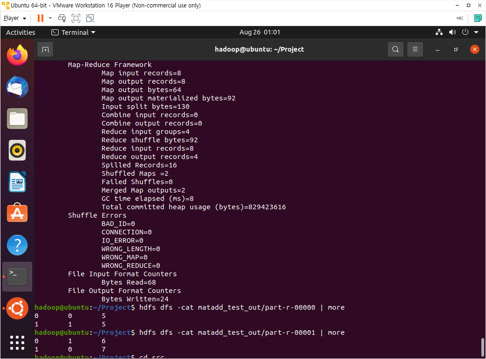

## 빅데이터(분석) 사전학습 과제 2

> Partition Class 변경 코딩, Inverted Index, Matrix addtion

## Partition Class 변경 코딩

+ Wordcountsort.java
  + import org.apache.hadoop.mapreduce.Partitioner 추가
  + Partition 클래스를 상속받은 MyPartition 클래스 추가
  + Main 함수에 job.setPartitionClass(MyPartition.Class) 추가

 

+ 결과

 

 

## Inverted Index

+ InvertedIndex.java
  + import org.apache.hadoop.io.LongWritable;
    import org.apache.hadoop.mapreduce.lib.input.FileSplit;
    import org.apache.hadoop.fs.FileSystem;

 

+ 결과

 

 

## Matrix addition

+ MatrixAdd.java
  + import org.apache.hadoop.fs.FileSystem

 

+ 실행
  + Project에서 ant
  + hdfs dfs -mkdir matadd_test
  + hdfs dfs -put data/matadd-data-2x2.txt matadd_test
  + hadoop jar ssafy.jar matadd matadd_test matadd_test_out

 

+ 결과

