# 빅데이터 하둡 4

> 병렬 분산 알고리즘 구현이 가능한 맵리듀스 프레임워크를 이해한다.
>
> 맵리듀스 프레임워크를 사용할 수 있는 Hadoop설치 및 맵리듀스 알고리즘 코드를 실행한다.
>
> 하둡을 이용하여 빅데이터 분석 및 처리용 맵리듀스 알고리즘을 구현하는데 필요한 지식과 코딩 능력을 배양한다.

 

 

## Theta-Join Algorithm

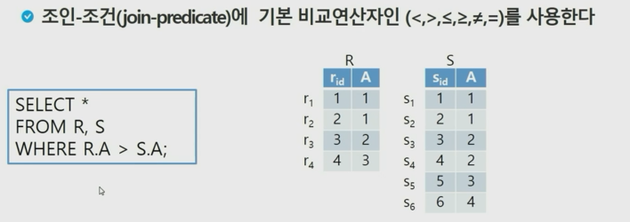

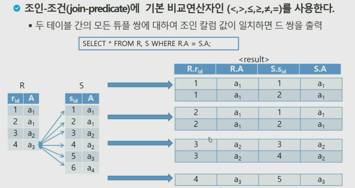

 

 

 

## 모든 쌍 분할(All Pair Partition) 알고리즘

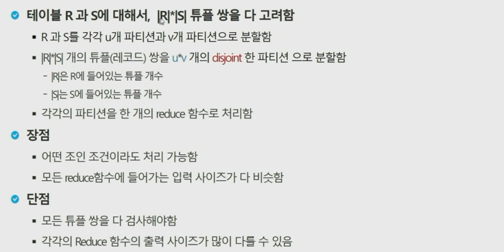

+ Brute force한 방법으로 모두 다 본다.
  + 가지치기를 할 수 있지만 하지는 않는다.

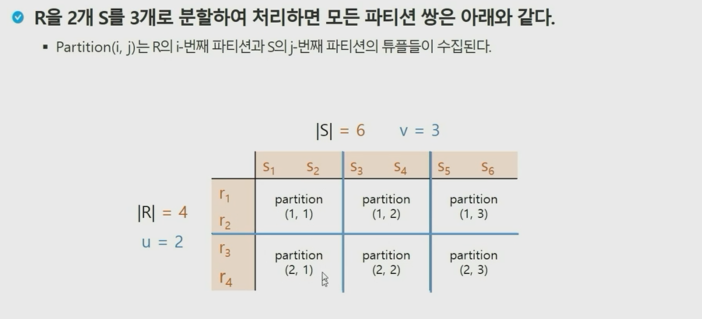

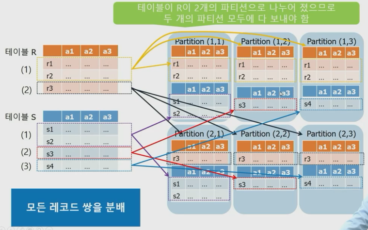

 

 

### Equi-Join

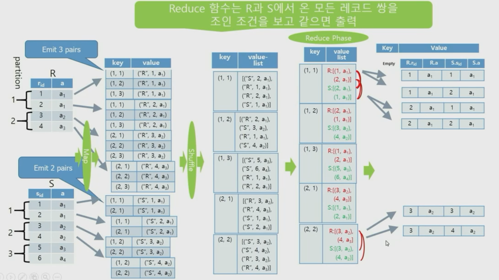

+ Shuffling 페이즈의 value-list는 무작위의 순서임
+ 각 R, S에 대해 key는 모두(rid, sid)를 나타낸다.
+ Reduce의 과정에서 value(a의 값)가 같아야만 equi-join이 되어 출력된다.

 

 

### 우리는 Equi-Join까지는 안하고 셔플링된 것을 펼쳐보기만 할 것

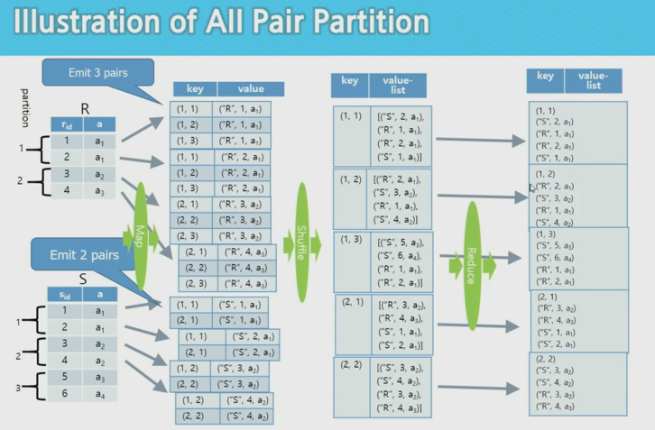

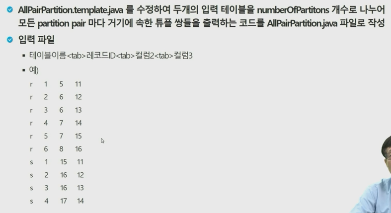

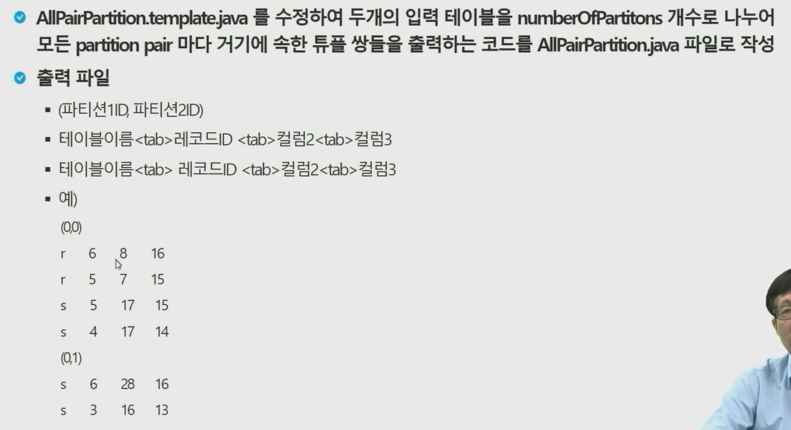

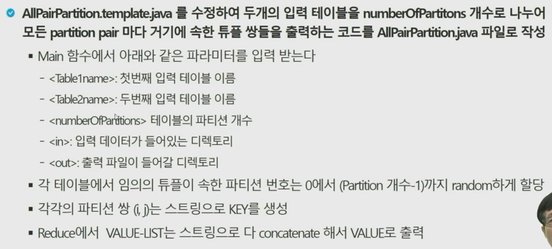

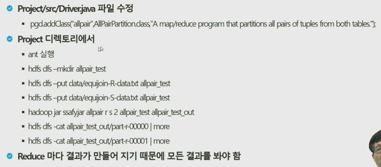

 

 

 

## 셀프-조인을 위한 모든 쌍 분할 알고리즘

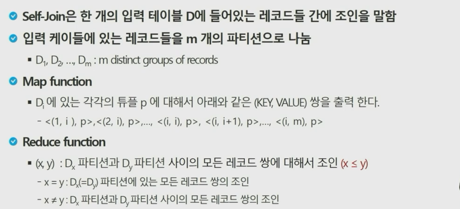

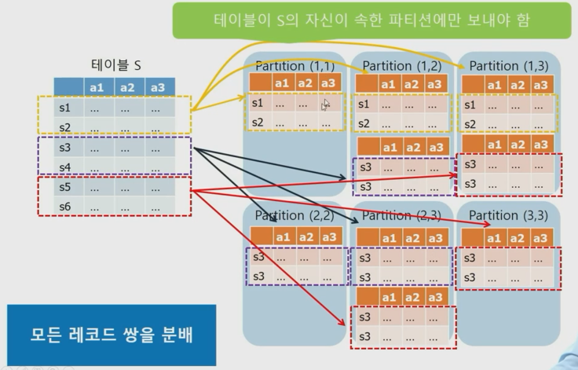

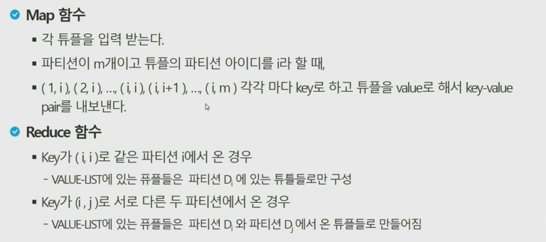

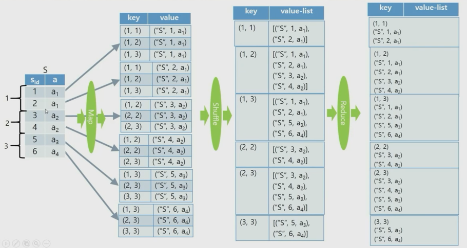

+ 실제로 할 때는 같은 파티션에 속하는 튜플들을 알아야 하므로 위처럼 1, 2, 3, 4, 5, 6으로 보내는 것이 아니라, 나머지 연산을 통해서 1, 2는 1로, 3, 4는 2로, 5, 6은 3으로 파티션 별로 구분을 해준다.

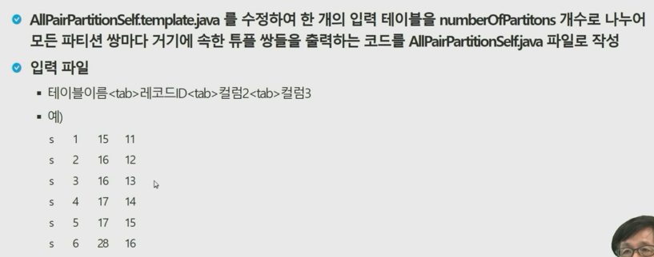

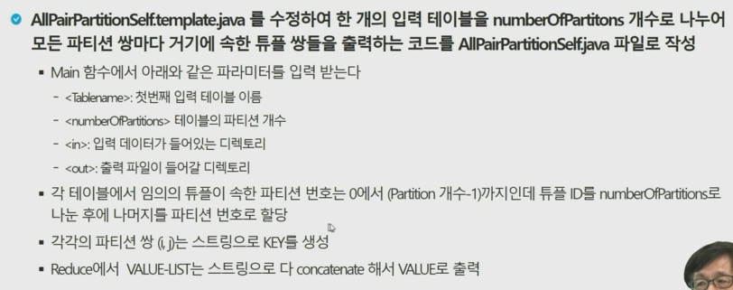

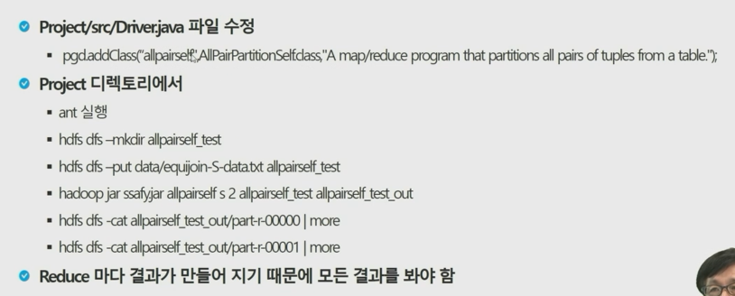

