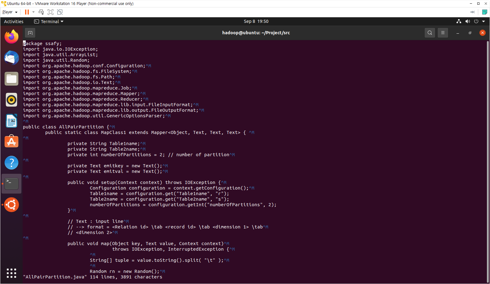
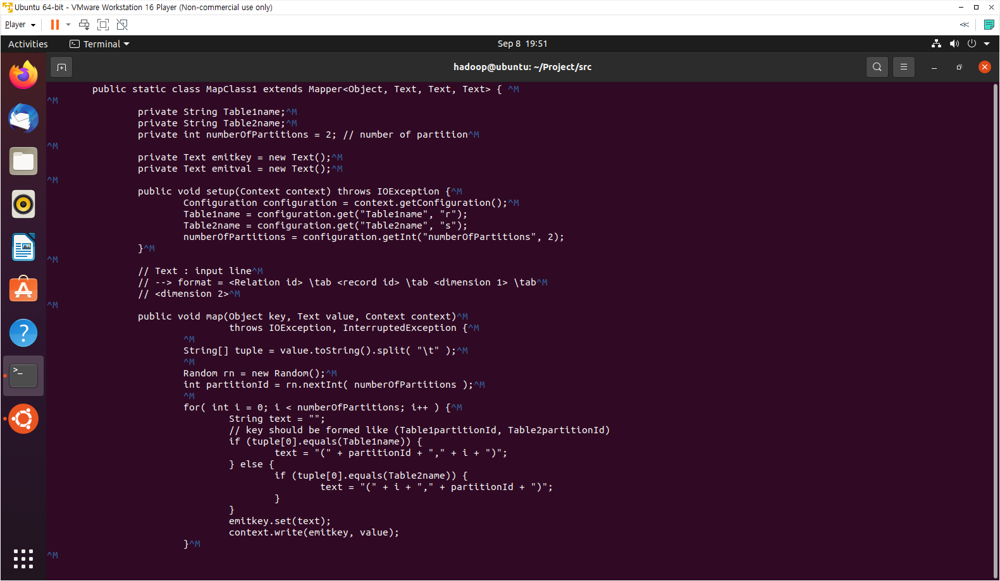
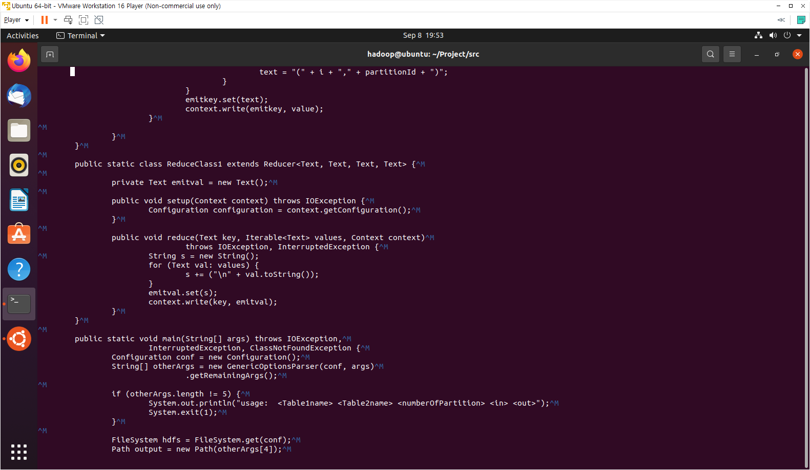
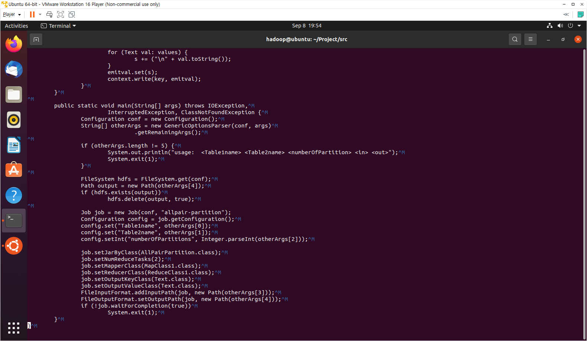
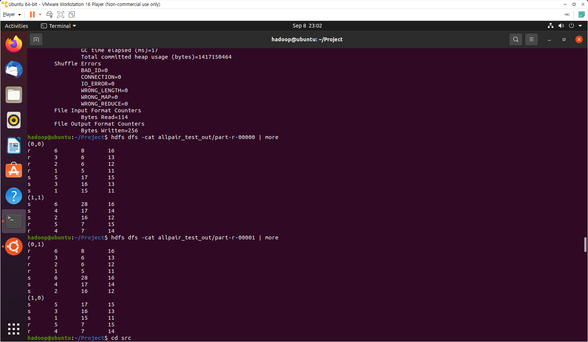
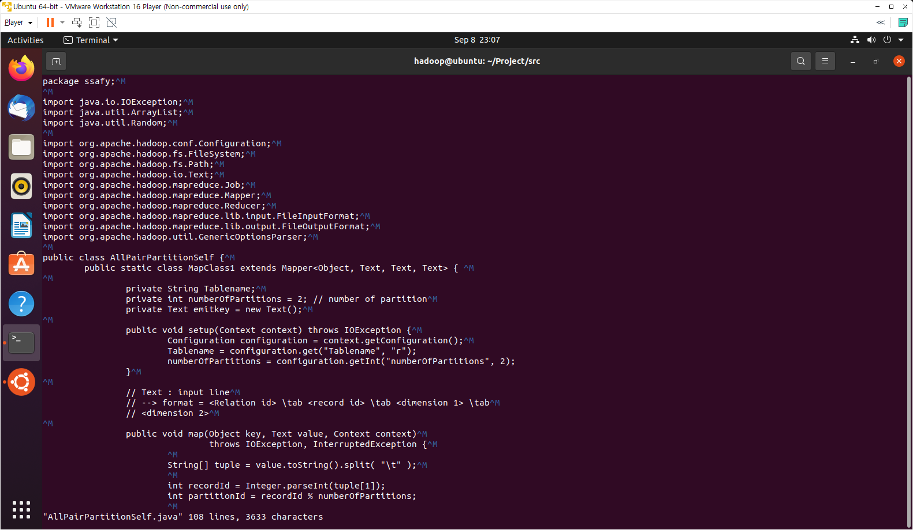
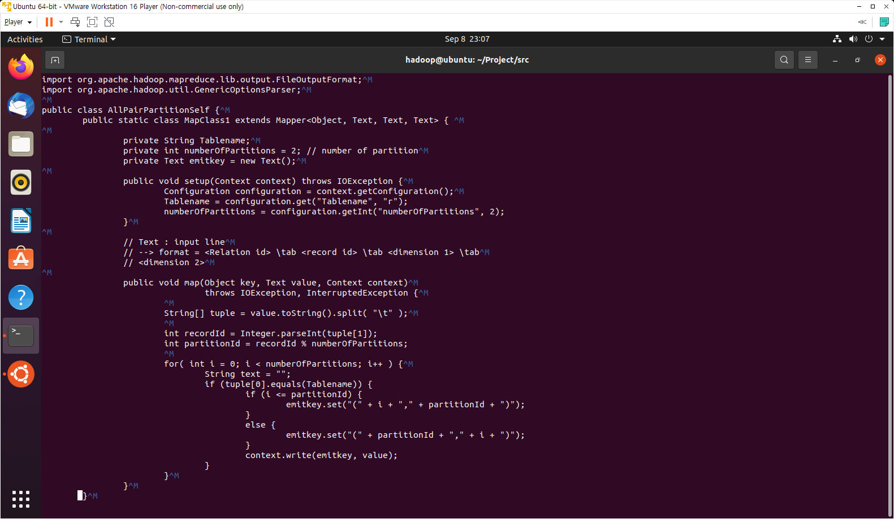
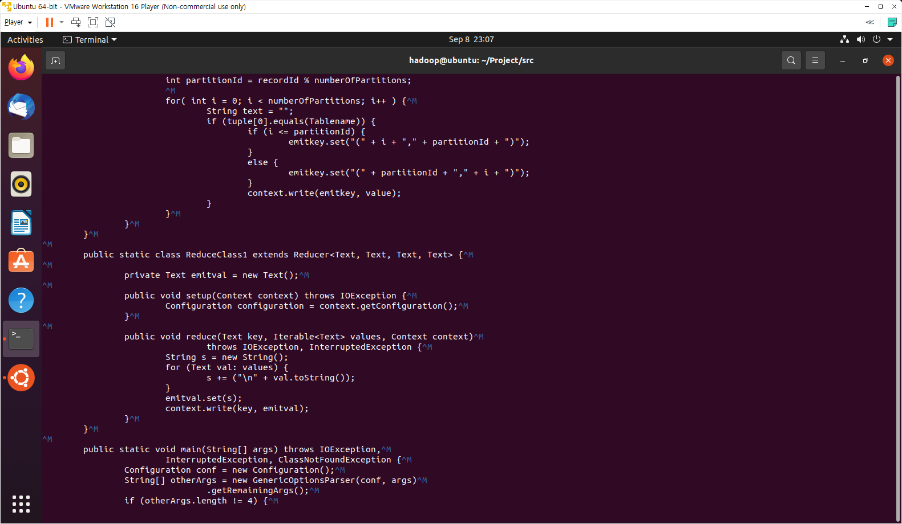
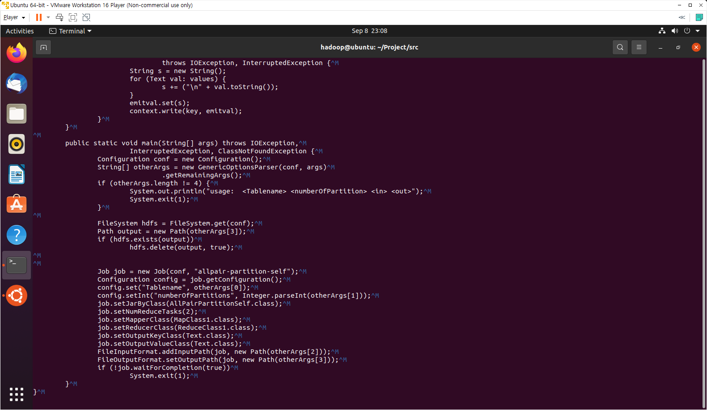
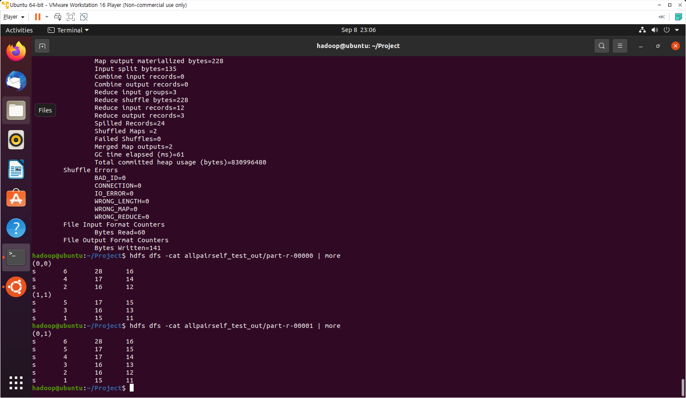

## 빅데이터(분석) 사전학습 과제 3

> All Pair Partition, All Pair Partition Self

## All Pair Partition

+ AllPairPartition.java

### Mapper 부분

+ mapper부분은 key를 (table1 partitionId, table2 partitionId) 형태로 만들기 위해서 table1에 대한 튜플일 때는 partitionId를 앞쪽, 각 table2의 파티션 넘버에 대한 i를 뒤쪽에 두고 / table2에 대한 튜플일 때는 그 반대로 하는 것

### Reducer 부분

+ 실제로 All Pair Partition에서 진행하는 reduce 로직은 아니고, 우리는 단순히 출력만 하였다.

### Main 부분

 

+ Driver.java
  + `pgd.addClass("allpairpartition", AllPairPartition.class, "All Pair Partition");` 추가

 

+ 결과

 

 

 

## All Pair Partition Self

+ AllPairPartitionSelf.java

### Mapper 부분

### Reducer 부분

+ 마찬가지로, 실제 reducer의 내용이 아닌, 그저 셔플링된 결과를 출력하는 역할이다.

### Main 부분

 

+ Driver.java
  + `pgd.addClass("allpairpartitionself", AllPairPartitionSelf.class, "All Pair Partition Self");` 추가

 

+ 결과

