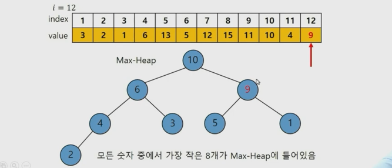

# 빅데이터 하둡 5

> 병렬 분산 알고리즘 구현이 가능한 맵리듀스 프레임워크를 이해한다.
>
> 맵리듀스 프레임워크를 사용할 수 있는 Hadoop설치 및 맵리듀스 알고리즘 코드를 실행한다.
>
> 하둡을 이용하여 빅데이터 분석 및 처리용 맵리듀스 알고리즘을 구현하는데 필요한 지식과 코딩 능력을 배양한다.

 

 

## Common Item Counting for Every Pair of Sets

Set 데이터에 있는 모든 튜플 간에 중복된 Item의 개수를 카운트 한다.

All Pair Partition 방법을 쓰면 데이터에 있는 모든 튜플 쌍을 다 살펴 봐야 하는데 Inverted Index를 이용하면 한 개 item이라도 중복되는 튜플 쌍만 살펴보아 빠르게 할 수 있다.

 

 

### MapReduce Algorithm for Common Item Counting

+ 여기서 유의해야 할 것은 전 단계의 output인 (R1, R2)   1과 같은 값들이 다시 **value**로써 tab으로 구분되어 (R1, R2)\tab1과 같이 들어온다는 것이다. 즉, key는 또 어떠한 입력값을 통해서 들어오고 value자체에 모든 정보가 들어오므로 value를 쪼개서 key value로 나눠줘야 한다.

 

 

 

## Tok-K Closet Point Search Algorithm

질의 포인트와 점들로 구성된 데이터 셋이 있을 때에 질의 포인트로부터 가장 가까운 K개 포인트를 뽑느다.

Max-Heap 자료 구조를 이용한다.

+ 즉, Max-heap을 이용해서 가장 큰 루트 노드만 계속 delete를 하고 더 작은 새로운 데이터들을 Max-heap에 넣으면서 Max-heap에 있는 숫자들이 가장 작은 숫자들만 남게 하는 것이다.
  + 헷갈리지 않게 조심해야 한다. 가장 작은 숫자들을 구해내기 위해서 그들 중 가장 큰 숫자를 계속 제거하는 방법을 쓰기 위해 Max-heap을 사용하는 것이다.

+ 두 번째 페이즈에서는 reducer를 한 개만 씀

### 템플릿 코드

+ Java에서 heap을 쓰기 위해서 compareTo를 정의하는 과정
+ dist는 질의 포인트로부터의 거리

+ str은 포인트에 대한 정보(좌표나 id)

+ mapper에서는 key를 rid % numberOfPartitions로 하는 key, value를 내보낼 것

+ reducer에서는 거리 계산, 그 거리에 대해서 Max-heap처리, heap에 남아있는 것만 출력

+ 거리를 구하는 메서드는 주어진다.

+ 2번째 페이즈에서는 Mapper에서 모두 같은 키를 갖게 된다. value는 그대로

+ 같은 키로 모여진 value-list에서 Max-heap을 써서 Top K개를 뽑는다.

+ 메인에서는 들어온 질의 포인트를 전처리하고, 뒤에서 Mapper와 Reducer를 잘 부르는 역할
