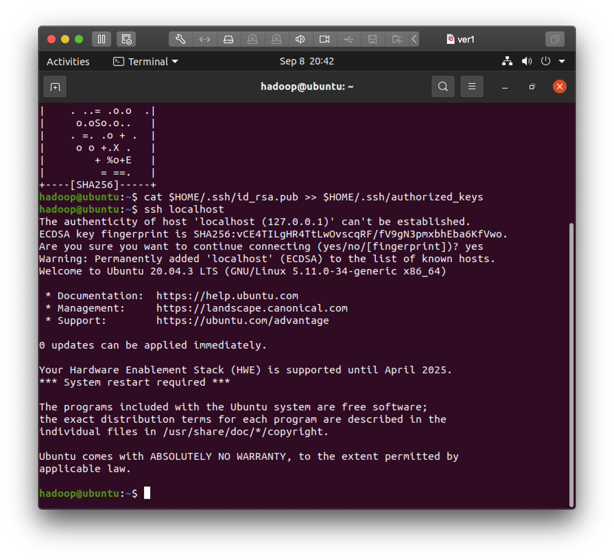
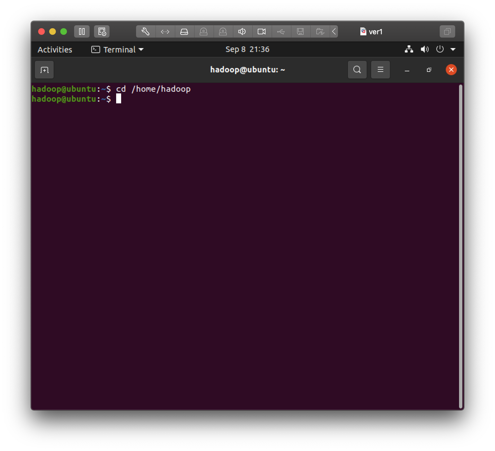
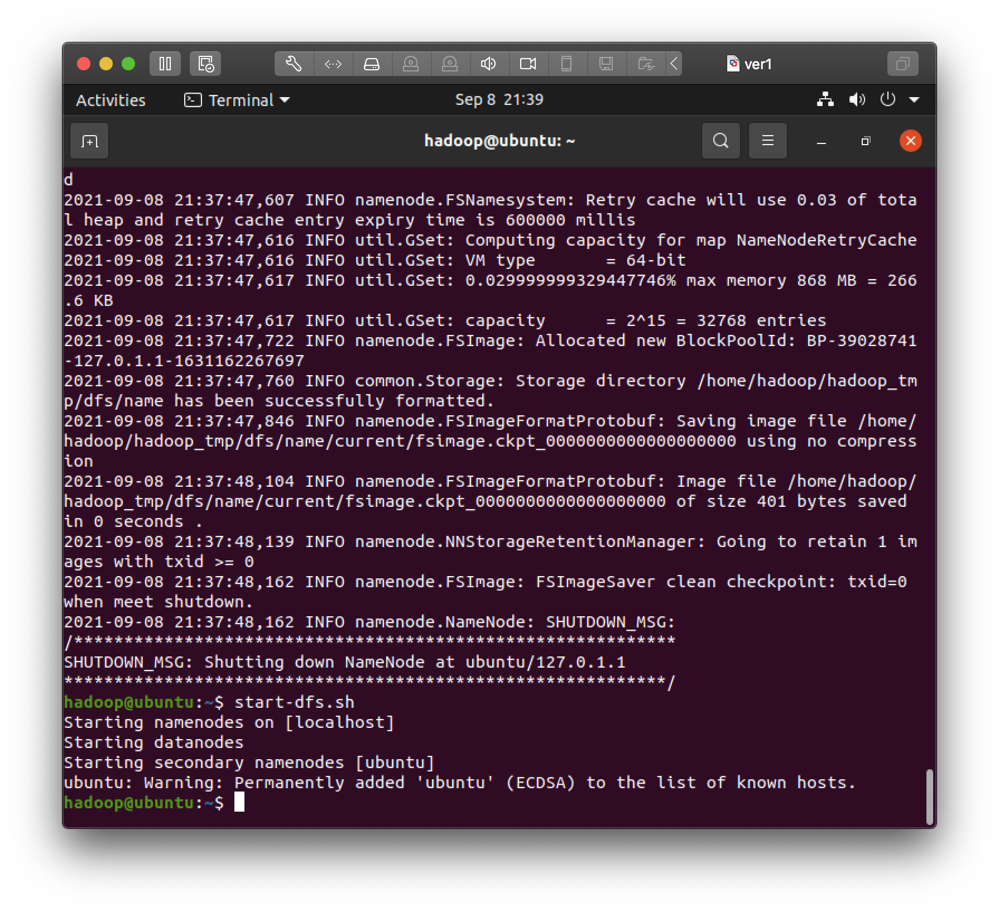
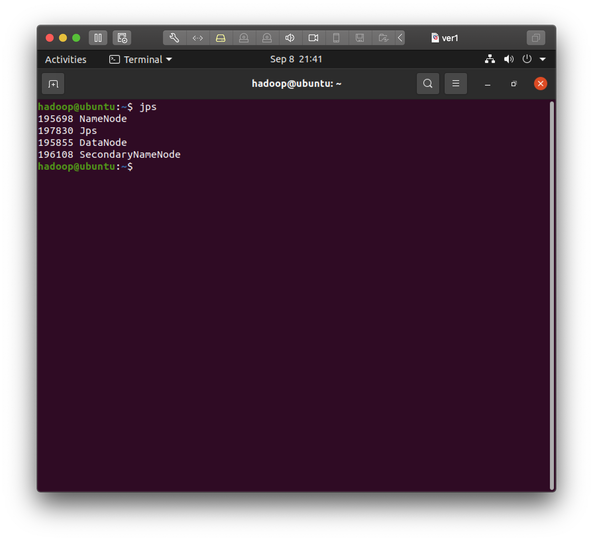
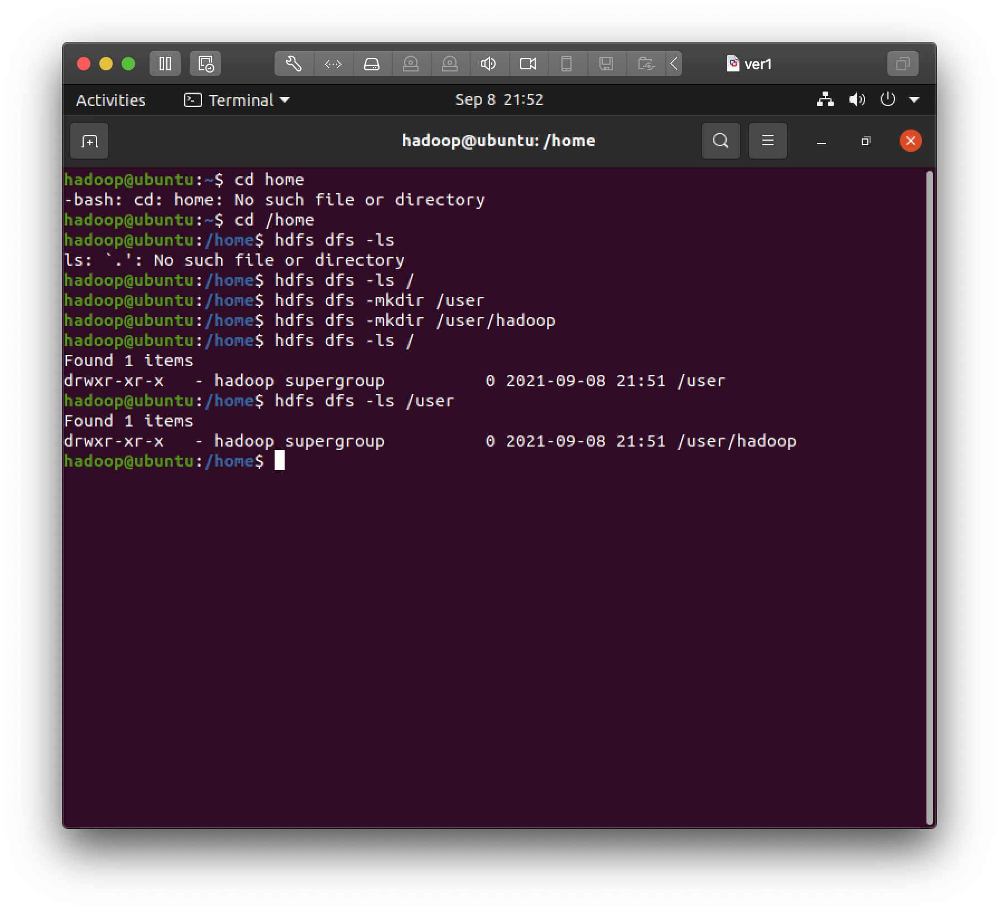
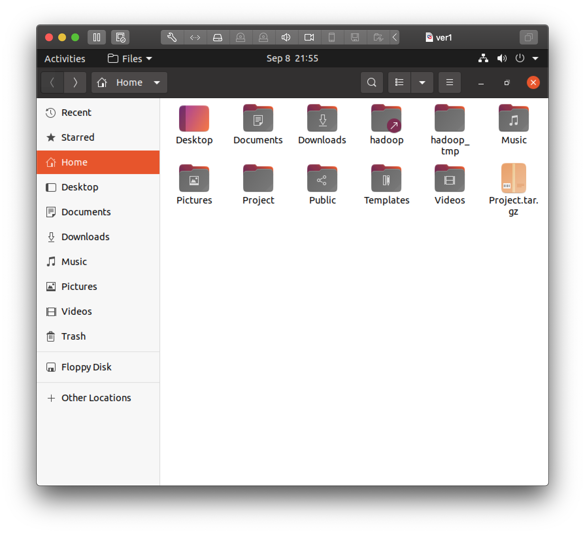
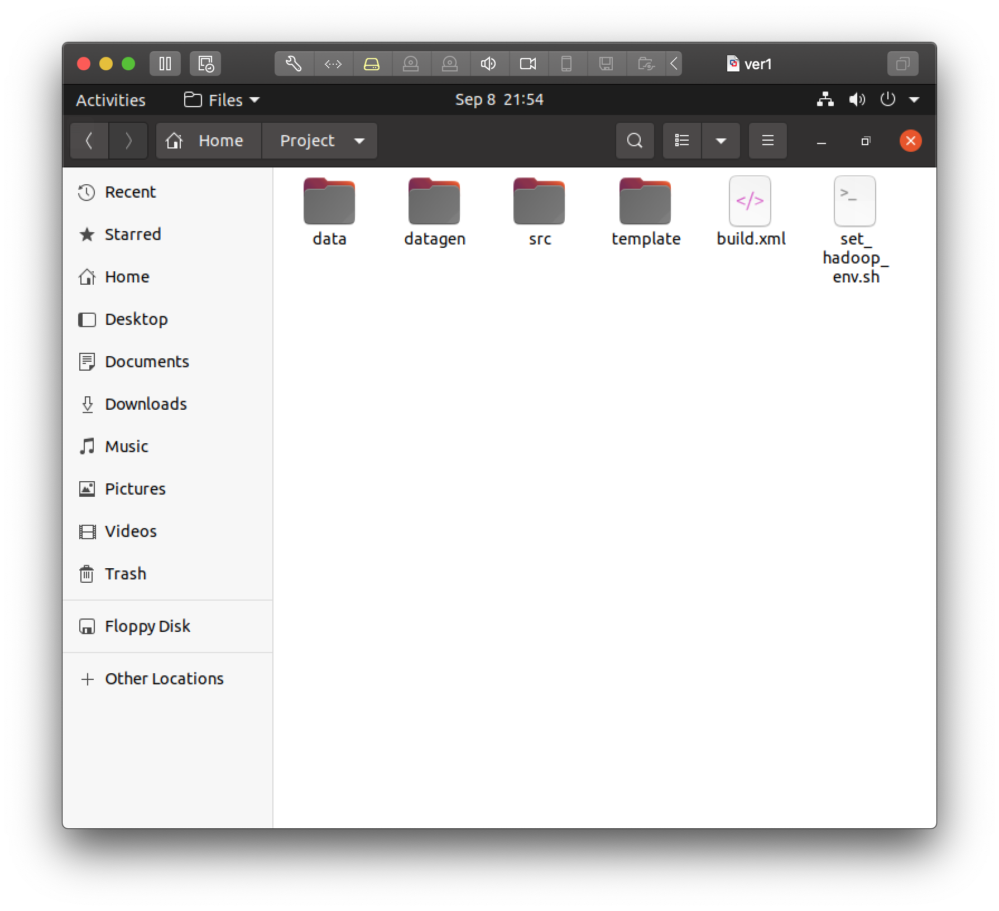
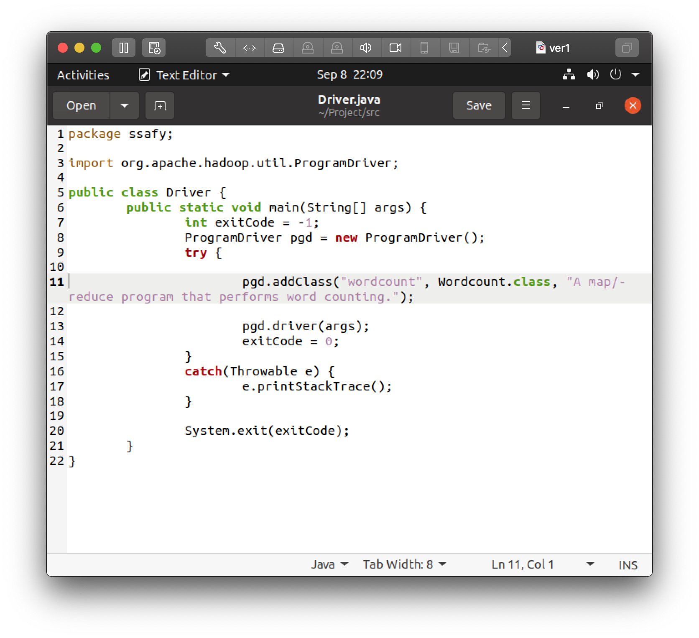
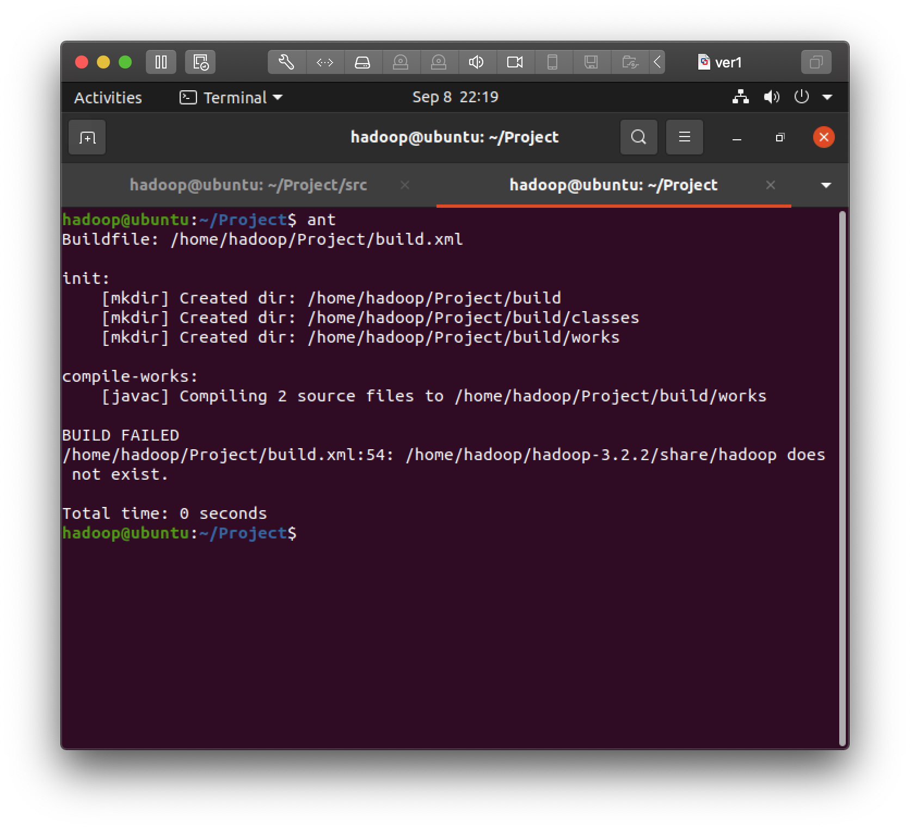
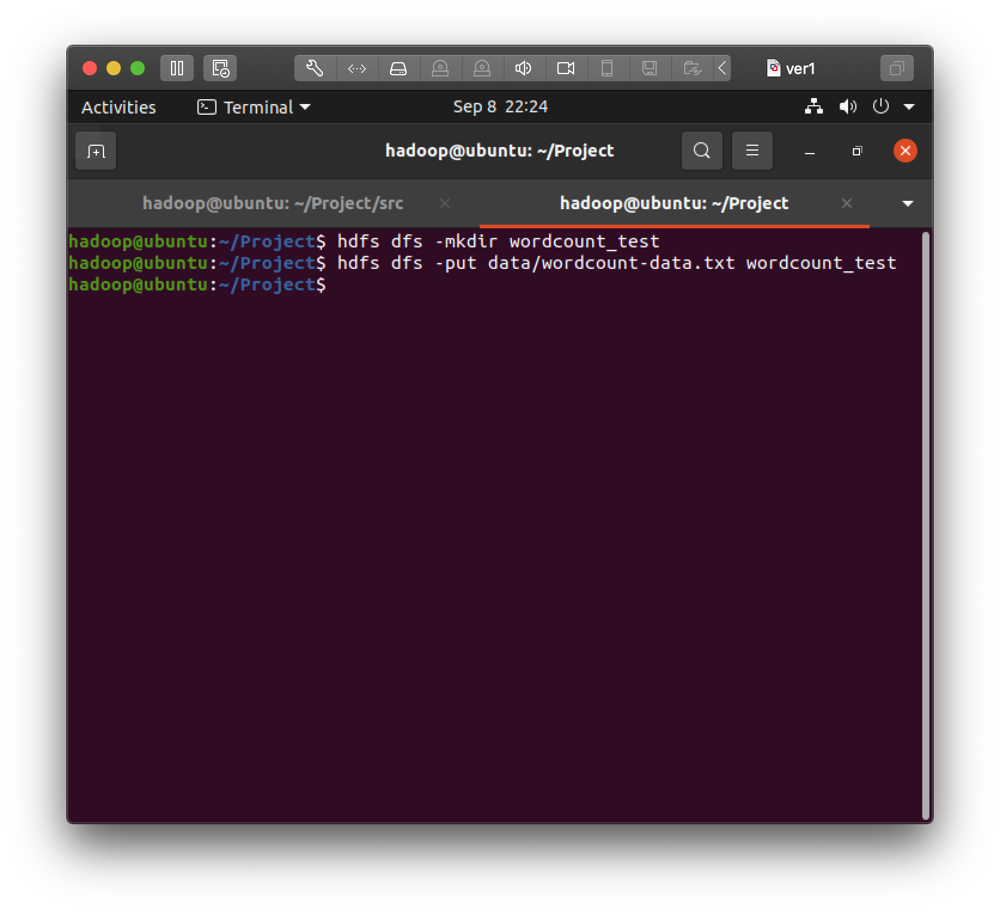

# [1강] MapReduce Intro & 기본 알고리즘(1)

## 목차

[요약](#요약)

[설치과정](#설치과정)

[Linux와 HDFS](#Linux와 HDFS)

[예제 코드 실행](#예제 코드 실행)

## 요약

- 병렬 분산 시스템이란?

  - Scale-out: 값싼 서버를 많이 배치함으로써 성능이 선형에 가깝게 증가하도록 함

  -> 이러한 값싼 서버(컴퓨터)를 묶어서 처리하는 것이 병렬 분산 시스템, 즉 MapReduce 프레임워크가 하는 일

- 맵리듀스 프레임워크란?

  - 병렬 분산 알고리즘 구현을 위한 프레임워크
  - 빅데이터를 이용한 효율적인 계산이 가능한 첫번째 프로그래밍 모델
  - 값싼 컴퓨터들을 모아서 클러스터를 만들고 빅데이터를 처리하기 위한 scalable(사용자 또는 데이터가 급증하여도 프로그램이 멈추거나 성능이 크게 떨어지지 않는) 병렬 소프트웨어의 구현을 쉽게 할 수 있도록 도와주는 간단한 프로그래밍 모델

- Hadoop이란?

  - 구글이 개발한 Apache Project의 맵리듀스 프레임워크 오픈소스
  - 드라이버(`Driver.java`)에 해당하는 메인 함수가 맵(`map`) 함수와 리듀스(`reduce`) 함수를 호출해 처리한다. (소프트웨어 수행 분산)
  - 하둡 분산 파일 시스템 (Hadoop Distributed File System - HDFS) (데이터 분산)
    - 각 파일을 여러 개의 순차적인 블록으로 저장함
    - 하나의 파일의 각 블록은 여러 머신 여기 저기에 저장된다. (fault tolerance)
  - Namenode(master) & Datanode(slaves)

- 맵리듀스 프로그래밍 언어의 형태

  - Main 함수
    - master machine에서 수행
    - map 함수 수행 전에 전처리를 하거나 리듀스 함수의 결과를 후처리 하는데 사용할 수 있다.
  - MapReduce Phase 
    - Map Phase
      - Map 함수: key, value의 형태, 라인 단위로 호출
      - 데이터의 여러 파티션에 병렬 분산으로 호출되어 수행된다.
    - Combine 함수: Reduce 함수와 유사, Map 함수의 출력 크기를 줄여서 Shuffling, Reduce 페이즈의 비용을 줄여준다. (수행하지 않을 수 있다.)
    - Shuffling Phase
      - Map Phase가 다 끝나면 시작된다.
      - Key로 Sorting -> Value-list 만들어 분산하여 보낸다.
    - Reduce Phase
      - Shuffling Phase가 다 끝나면 시작된다.
      - 각 (key, value-list) 쌍 마다 함수 호출
      - Reduce 함수: key, value의 형태 (수행하지 않을 수 있다.)

## 설치과정

1. VMware 설치 및 실행 후 새로운 가상머신 생성
2. Ubuntu iso 다운 후 불러오기
3. hadoop 계정 생성
4. default 설정으로 가상 머신 생성

#### ubuntu 에서 hadoop 실행을 위한 준비

|                    과정                     |                             결과                             |
| :-----------------------------------------: | :----------------------------------------------------------: |
|            1. ssh key 까지 생성             |  |
| 2. 모든 명령은 hadoop 계정에서 하도록 한다. |  |
|       3. Namenode 포맷 후 Daemon 시작       |  |
|                   4. 확인                   |  |
|     5. hadoop 계정의 HDFS 디렉토리 생성     |  |

## Linux와 HDFS

데이터 생성이나 코딩은 Linux에서 하고 MapReduce 코드와 입력 데이터는 HDFS에 옮겨서 MapReduce알고리즘을 수행한다.

#### Linux 폴더 구조

|                        전체 폴더 구조                        |                         Project 폴더                         |
| :----------------------------------------------------------: | :----------------------------------------------------------: |
|  |  |

#### HDFS 구조

- wordcount_test/
- wordcount_test_out/

## 예제 코드 실행

|                             과정                             |                             내용                             |
| :----------------------------------------------------------: | :----------------------------------------------------------: |
| 1. src 디렉토리에 새로운 코드를 만들 때마다 src 디렉토리에 있는 Driver.java 파일에 pgd.addClass를 새로 하나 넣어 주어야 함 |  |
| 2. 수정 후 빌드 (자바 표준 빌드 도구. `Javac`도 있지만 `ant`는 여러 dependency를 고려하여 소스파일을 컴파일, `src`디렉토리에 있는 것을 다 모아서 컴파일한 후에 `ssafy.jar`를 생성한다. Project 디렉토리에 있는 `build.xml` 파일에 정의한 대로 수행된다.) |  |
| 3. 반드시 맵리듀스 프로그램이 결과를 저장할 디렉토리를 삭제한 후 프로그램을 실행한다. | 아직 아무것도 만든 것이 없으므로 생략하고 진행 `hdfs dfs -rm -r <directory name>` |
|                4. 테스트 데이터를 HDFS에 넣음                |  |
| 5. 알고리즘 코드 실행 (`Driver.java`에 표시한대로 wordcount를 써서 맵리듀스 코드를 실행) | `hadoop jar [jar file] [program name] <input arguments ...>`  |
|                                                              |                                                              |

