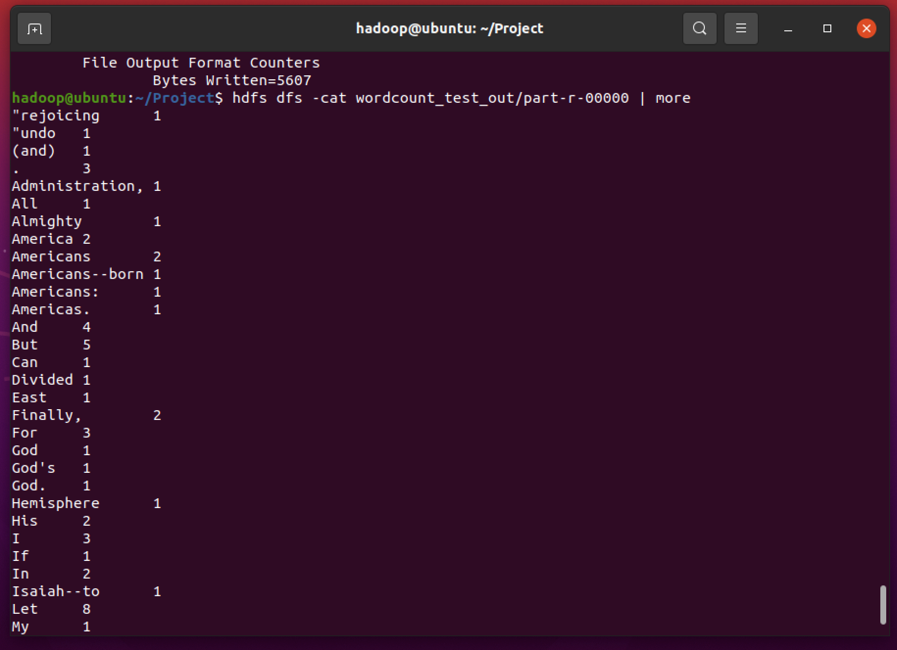
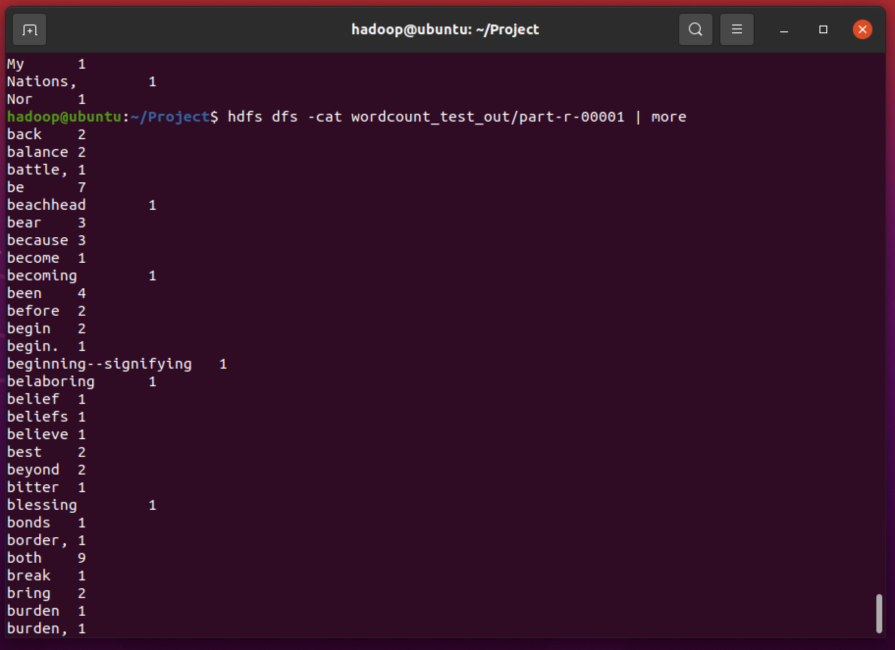

# 과제

> src 파일 수정할 때 항상 Driver.java 파일도 수정하였음.

### Wordcountsort.java

```
	public static class MyPartitioner extends Partitioner<Text, IntWritable> {
		@Override
		public int getPartition(Text key, IntWritable value, int numPartitions) {
		/* Pretty ugly hard coded partitioning function. Don't do this in practice,
		   it is just for the sake of understanding */
			// int nbOccurences = key.get();
			if( key.toString().charAt(0) <= 'a' ) return 0;
			else return 1;
		}
	}
```






### InvertedIndex.java

```
public class InvertedIndex {
	/* 
	Object, Text : input key-value pair type (always same (to get a line of input file))
	Text, IntWritable : output key-value pair type
	*/
	public static class TokenizerMapper
			extends Mapper<Object,Text,Text,Text> {

		// variable declairations
		private final static IntWritable one = new IntWritable(1);
		private Text word = new Text();
		private Text pos = new Text();
		private String filename;
		protected void setup(Context context) throws IOException, InterruptedException {
			filename = ((FileSplit)context.getInputSplit()).getPath().getName();
		}

		// map function (Context -> fixed parameter)
		public void map(Object key, Text value, Context context)
				throws IOException, InterruptedException {

			// value.toString() : get a line
			StringTokenizer itr = new StringTokenizer(value.toString(), " ", true);
			long p = ((LongWritable)key).get();
			while ( itr.hasMoreTokens() ) {
				word.set(token.trim());
				if (! token.equals(" ")) {
					pos.set(filename + ":" + p);
					context.write(word, pos);
				}
				p += token.length();
			}
		}
	}
```

```
	public static class ConcatenatorReducer
			extends Reducer<Text,Text,Text,Text> {

		private Text list = new Text();

		public void reduce(Text key, Iterable<Text> values, Context context) 
				throws IOException, InterruptedException {

			String s = new String();
			int comma = 0;
			for (Text val : values) {
				if (comma == 0) {
					comma = 1;
					s += (":" + val.toString());
				} else {
					s += (", " + val.toString());
				}
			} 

			list.set(s);
			context.write(key,list);
		}
	}
```


```
FileSystem hdfs = FileSystem.get(conf);
		Path output = new Path(otherArgs[1]);
		if (hdfs.exists(output)) {
			hdfs.delete(output, true);
		}
```


