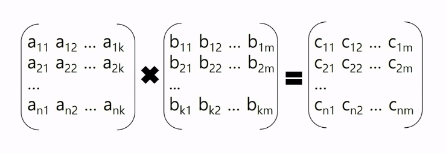

# Matrix Multiplication

> C 행렬 i행 j열 원소 계산에 필요한 쌍 = (A 행렬의 i행 p열 원소) * (B 행렬 p행 j열 원소)

- 두 개의 행렬 A와 B가 compatible 하다는 뜻은 행렬 A의 열의 개수와 행렬 B의 행의 개수가 일치한다는 뜻이다.
- 두 개의 행렬 A와 B의 행렬 곱을 하기 위해서는 compatible해야 가능하다.

## 1. 1-Phase Matrix Multiplication

- Reduce 함수마다 Value-List가 메인 메모리에 다 들어갈 수 있어야 한다.
- 메인 메모리에 다 들어갈 수 있다면 속도가 더 빠르다.

## 2. 2-Phase Matrix Multiplication

- p값을 value에다가 넣는 것이 아니라 key 값에다가 넣는다.
- 1-phase 알고리즘에 비해서 메인 메모리가 거의 필요없다.

