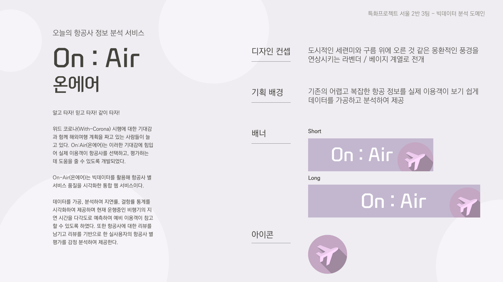
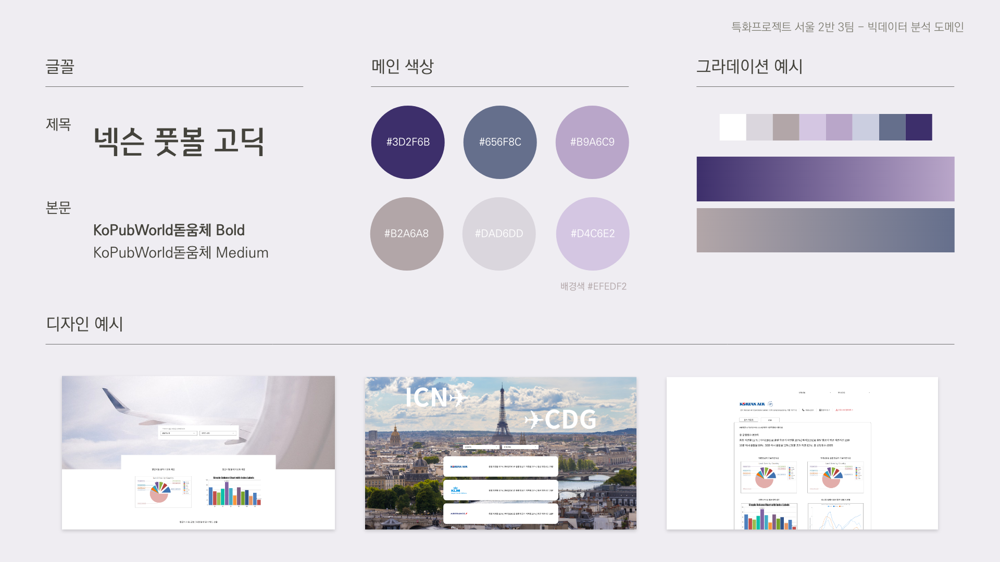

# On : Air 오늘의 항공 정보 분석 서비스 ✈️ 

<center></center>


#### 알고 타자! 믿고 타자! 같이 타자!

> 위드 코로나(With-Corona) 시행에 대한 기대감과 함께 해외여행 계획을 짜고 있는 사람들이 늘고 있다. On:Air(온에어)는 이러한 기대감에 힘입어 실제 이용객이 항공사를 선택하고, 평가하는 데 도움을 줄 수 있도록 개발되었다.
>
> 
>
> On-Air(온에어)는 빅데이터를 활용하여 소비자가 항공사 별 서비스 품질을 시각화한 통합 웹 서비스이다. 데이터를 가공, 분석하여 지연률, 결항률 통계를 시각화하여 제공하며 현재 운행중인 비행기의 지연 시간을 다각도로 예측하여 예비 이용객이 참고할 수 있도록 하였다. 또한 항공사에 대한 리뷰를 남기고 리뷰를 기반으로 한 실사용자의 항공사 별 평가를 감정 분석하여 제공한다.

<br>

## Getting Started 

#### Prerequisites

    npm install -g @vue/cli


#### Installation

1. Get a free API Key at openweathers.com

2. Create Mysql DB

3. Create `.env` for Django (at 'Project/server') like this:

   ```
   SECRET_KEY=<YOUR_DJANGO_KEY>
   MYSQL_USER=<YOUR_MYSQL_USERNAME>
   MYSQL_PASSWORD=<YOUR_MYSQL_PASSWORD>
   JWT_SECRET_KEY=<YOUR_JWT_SECRET_KEY>
   WEATHER_API_KEY=<YOUR_WEATHER_API_KEY>
   ```

4. Clone the repo

    ```bash
    git clone https://lab.ssafy.com/s05-bigdata-dist/S05P21A203.git
    ```
5. Install NPM packages

    ```bash
    npm install
    ```

6. Activate virtual environment and install pip 

   ```bash
   python -m venv venv
   ```

   ```bash
   source venv/Scripts/activate
   source venv/bin/activate
   ```

   ```bash
   pip install -r requirements.txt
   ```

   ```bash
   python manage.py migrate
   ```

   ```bash
   python manage.py runserver
   ```

   <br>

## 프로젝트 목차

- [1️⃣ 프로젝트 소개](#1️⃣-프로젝트-소개)
  
  - [기술 스택](#기술-스택)
  - [컨셉 디자인](#컨셉-디자인)
  
  <br>
  
- [2️⃣ 프로젝트 구조](#2️⃣-프로젝트-구조)
  
  - [Backend](#Back)
  - [Frontend](#Front)
  
  <br>
  
- [3️⃣ 프로젝트 산출물](#3️⃣-프로젝트-산출물)

  <br>

- [4️⃣ 프로젝트 결과물](#4️⃣-프로젝트-결과물)

<br>

## 1️⃣ 프로젝트 소개

1. 일정 : 2021-08-30 ~ 2021-10-08 (총 6주)

- Sub1 : 2021-08-30 ~ 2021-09-03 (1주)

- Sub2 : 2021-09-06 ~ 2021-09-17 (2주)

- Sub3 : 2021-09-20 ~ 2021-10-08 (3주)

  

2. 팀원

|                             팀장                             |                             팀원                             |                             팀원                             |                             팀원                             |                             팀원                             |
| :----------------------------------------------------------: | :----------------------------------------------------------: | :----------------------------------------------------------: | :----------------------------------------------------------: | :----------------------------------------------------------: |
|                          **박지우**                          |                          **김채은**                          |                          **김현욱**                          |                          **나승호**                          |                          **안수빈**                          |
| [](https://github.com/nu1997) | [](https://github.com/chenni0531) | [](https://github.com/hyeonuk27) | [](https://github.com/qlfflwls5) | [](https://github.com/axxsxbxx) |
| 기획: 주제, 컨셉, 와이어프레임, 아이콘 디자인<br />프론트엔드: 이미지 수집, 항공사 조회 페이지, `Highchart.js`, 세부 CSS<br />백엔드: 항공사 정보 및 분석 API<br />Data: 항공사 데이터 전처리 및 통계함수 로직<br />문서: README, 데이터 활용 현황, 발표 |                                                              |                                                              | 기획: 주제, UI<br> DevOps: EC2 설정, HTTPS설정, MySQL설정, CI/CD(Jenkins) 구축<br/>프론트엔드: 기본 설정, 메인 페이지, 검색 페이지, 프로필 페이지, 네비게이션 바, 푸터<br/>  백엔드: 머신러닝 모델 사용 및 API 작성<br/> Data: 데이터 전처리 및 머신러닝<br/> 문서: 개발 과정 문서화, 포팅매뉴얼 |                                                              |

<br/>

### 기술 스택

1. 이슈관리 : Jira
2. 형상관리 : Gitlab
3. 커뮤니케이션 : Webex, Mattetmost, Notion, Slack
4. 개발 환경
   - OS : Windows 10
   - IDE
     - Visual Studio Code 1.60.2
     - UI/UX : Adobe XD
   - Database : MySQL Workbench 8.0.22
   - Server : AWS EC2 (MobaXterm)
     - Ubuntu 20.04.2 LTS
     - Docker 20.10.7
     - Jenkins 2.303.1
5. 상세 사용
   - Backend
     - Django 3.2.7, Django Rest Framework 3.12.4
     - pandas 1.3.3, scikit-learn 1.0, statsmodels 0.12.2, pykomoran 0.1.6.post1
   - Frontend
     - HTML5, CSS3, JavaScript(ES6)
     - Vue 2.6.11, Vuex 3.4.0
     - Node.js 14.16.1, NPM 6.14.12
     - Vuesax 3.12.2, Highcharts 9.2.2

<br/>

### 컨셉 디자인



<br>

## 2️⃣ 프로젝트 구조

#### - Back

```
server
  ├── accounts
  │   ├── models
  │   ├── views
  │   ├── serializers
  │   └── urls
  │
  ├── airlines
  │   ├── models
  │   ├── views
  │   ├── serializers
  │   └── urls
  │
  └── server 
  ├── statistics
  ├── predict_models
  └── npl
```

#### - Front

```
client
├── node_modules
├── public
└── src
   ├── assets
   │
   ├── common
   │ 	└── modules
   ├── components
   │   ├── airline
   │   ├── auth
   │   ├── main
   │   ├── page
   │   │   ├── Footer
   │   │   └── Navbar
   │   └── profile
   │    
   └── views
      ├── airline
      ├── login
      ├── main
      └── profile

```

<br>

## 3️⃣ 프로젝트 산출물

> 기술  및 운영 관련 문서

0. [PreRequisites (사전학습)](Document/0_Prerequisites)
1. [Concept (기획)](Document/1_Concept)
2. [Definition (정의)](Document/2_Definition)
   1. [Architecture (아키텍처)](Document/2_Definition/1_Architecture)
      - [MySQL 연결](Document/2_Definition/1_Architecture/[MySQL]MySQL 연결.md)
      - [EC2 시간 설정](Document/2_Definition/1_Architecture/[AWS]EC2 시간 설정)
      - [AWS EC2에 Spark 설치](Document/2_Definition/1_Architecture/[Spark]AWS EC2에 Spark 설치하기)
   2. [Requirements (요구사항)](Document/2_Definition/2_Requirements)
      - [예측 분석 계획](Document/2_Definition/2_Requirements/감성 분석 계획.md)
      - [감성 분석 계획](Document/2_Definition/2_Requirements/예측 분석 계획.md)
   3. [Design](Document/3_Design)
      - [Art](Document/3_Design/1_Art)
      - [Wireframe](Document/3_Design/2_Wireframe)
3. [Developtment (개발)](Document/3_Development)
   1. [Convention](Document/3_Development/1_Convention/Git_convention.md)
      - [Git](Document/3_Development/1_Convention/Git_convention.md)
      - [Jira](Document/3_Development/1_Convention/Jira_convention.md)
   2. [Data Analysis (데이터 분석)](Document/3_Development/2_Data_Analysis)
      - [예측분석](Document/3_Development/2_Data_Analysis/AirlineAnalysis)
      - [크롤링](Document/3_Development/2_Data_Analysis/DataCrawling)
      - [감성분석](Document/3_Development/2_Data_Analysis/ReviewAnalysis)
   3. [ML (Machine Learning)](Document/3_Development/3_ML)
4. [Testing (테스트 시나리오)](Document/4_Testing)
5. [Deployment (배포)](Document/5_Deployment)
   - [Auto Deploy (자동 배포)](Document/5_Deployment/1_AutoDeploy)
6. [Operations (운영)](Document/6_Operations)
   1. [Git - Jira Integrations](Document/6_Operations/1_Integrations/Jira_Integration.md)
   2. [Plugins](Document/6_Operations/2_Plugins)
      - [Gitlab - Mattermost Connect Plugin](Document/6_Operations/2_Plugins/Gitlab.md)
      - [Jira - Mattermost Connect Plugin](Document/6_Operations/2_Plugins/Jira.md)

<br>

## 4️⃣ 프로젝트 결과물

[기획 발표](Document/1_Concept/Presentation)

[최종 발표](Document/8_Preview/Presentation)


<br>

### Contact

##### via [Notion](https://jiu-park.notion.site/8d8a98436ed448d38bc4381f707df3b5)

##### via [Email](jiwooapark@gmail.com)
