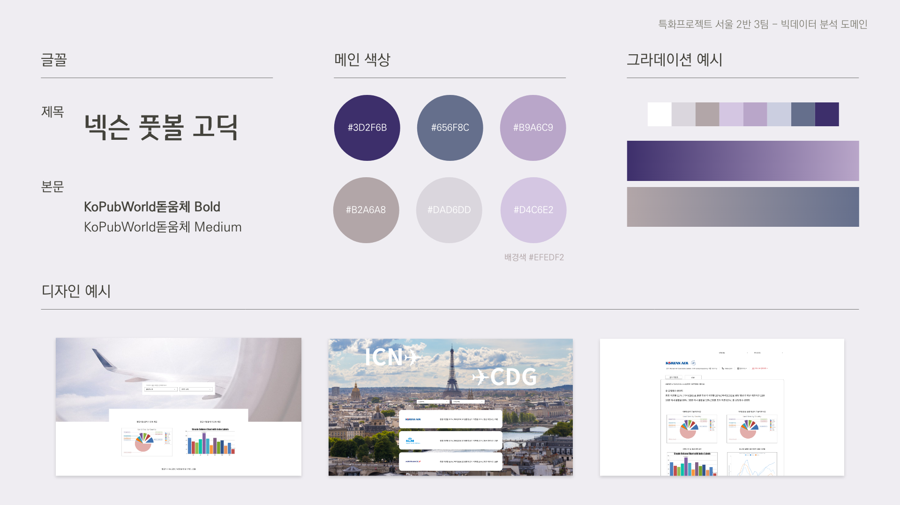

# [A203] 분산 처리 시스템 이해 및 활용

## 👥 팀원 소개

### 
[💫Team Notion](https://jiu-park.notion.site/8d8a98436ed448d38bc4381f707df3b5)

|                                                              |                                                              |                                                              |                                                              |                                                              |
| :----------------------------------------------------------: | :----------------------------------------------------------: | :----------------------------------------------------------: | :----------------------------------------------------------: | :----------------------------------------------------------: |
|                          **박지우**                          |                          **김채은**                          |                          **김현욱**                          |                          **나승호**                          |                          **안수빈**                          |
|  |  |  |  |  |
|                       기획 디자인                       |                   기획 머신러닝(분석)                   |                   기획 머신러닝(분석)                   |                   기획 머신러닝(예측)                   |                       기획 크롤링                       |

## ✈️ 프로젝트 소개

- #### 기획배경

  ##### 알고 타자! 믿고 타자! 같이 타자!

  위드 코로나(With-Corona) 시행에 대한 기대감과 함께 해외여행 계획을 짜고 있는 사람들이 늘고 있다. On:Air(온에어)는 이러한 기대감에 힘입어 실제 이용객이 항공사를 선택하고, 평가하는 데 도움을 줄 수 있도록 개발되었다.

  

  On-Air(온에어)는 빅데이터를 활용하여 소비자가 항공사 별 서비스 품질을 시각화한 통합 웹 서비스이다. 데이터를 가공, 분석하여 지연률, 결항률 통계를 시각화하여 제공하며 현재 운행중인 비행기의 지연 시간을 다각도로 예측하여 예비 이용객이 참고할 수 있도록 하였다. 또한 항공사에 대한 리뷰를 남기고 리뷰를 기반으로 한 실사용자의 항공사 별 평가를 감정 분석하여 제공한다.

  

- #### 디자인 컨셉

## 🧩 프로젝트 구조

- #### Documents

  > 사전학습 클론코딩 및 주제 기획 문서

  - ##### [기술지원](./Document/기술지원)

    > 원활한 프로젝트 진행을 위한 모든 기술 솔루션 마크다운

    | Integrations (프로젝트 형상관리 통합)                        | Plugins (매터모스트 플러그인)                                |
    | ------------------------------------------------------------ | ------------------------------------------------------------ |
    | [깃 - 지라 통합 문서](./Document/기술지원/Integrations/Jira_Integration.md) | [매터모스트 - Gitlab 플러그인](./Document/기술지원/Plugins/Gitlab.md) [매터모스트 - Jira 플러그인](./Document/기술지원/Plugins/Jira.md) |
  
    - ##### [사전학습](./Document/사전학습)
  
      > 사전학습 내용 요약 및 과제
  
      |      | 박지우 | 김채은 | 김현욱 | 나승호 | 안수빈 |
      | :--: | :----: | :----: | :----: | :----: | :----: |
      | 1강  |   ✅    |   ✅    |   ✅    |   ✅    |   ✅    |
      | 2강  |   ✅    |   ✅    |   ✅    |   ✅    |   ✅    |
      | 3강  |   ✅    |   ✅    |   ✅    |   ✅    |   ✅    |
      | 4강  |   ✅    |   ✅    |   ✅    |   ✅    |   ✅    |
      | 5강  |   ✅    |   ✅    |   ✅    |   ✅    |   ✅    |
  
      
  
    - ##### [주제기획](./Document/주제기획)
  
      > 아이디어 회의 내용 및 피드백
      
      [항공사별 통계 및 리뷰 분석을 통한 서비스 평가](https://jiu-park.notion.site/bfcc7248ca1844deb2bcdb2f16a9178f)
  
  - ##### [디자인](./Document/디자인)
  
    > 디자인 회의내용과 산출물
    
    
  
- #### Project

  > 프로젝트 파일 폴더

  |                           backend                            |                           frontend                           |                            server                            |                          data tool                           |
  | :----------------------------------------------------------: | :----------------------------------------------------------: | :----------------------------------------------------------: | :----------------------------------------------------------: |
  |  |  |  |  |
  |                         `Django 3.2`                         |                         `Vue.js 2.0`                         |                          `AWS EC2`                           |                      `Apache Hadoop 3`                       |
  

